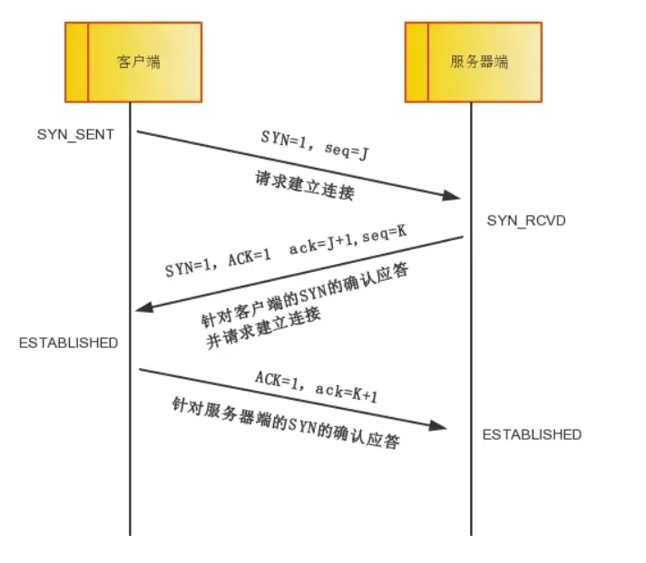
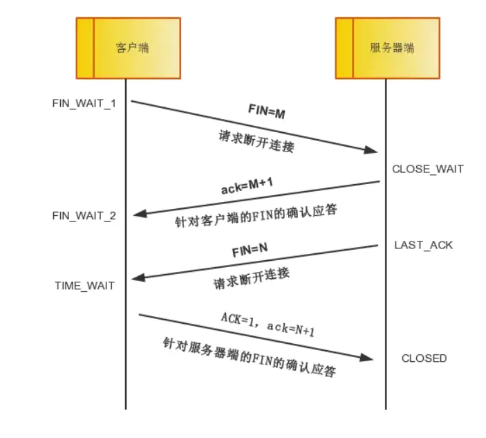

# 常见问题

## 1、计算机网络的各层协议及作用

---

### OSI 七层模型：一个理论上完整的参考模型

开放式系统互联模型 (OSI Model) 是一个由国际标准化组织 (ISO) 制定的概念性框架，旨在使各种计算机在世界范围内能够相互连接。它将网络通信划分为七个独立的层次，逻辑上非常清晰和完整，但由于其复杂性，在实际中并未被广泛采用，主要作为学习和理解网络通信的理论模型。

| 层次 | 名称 | 主要功能和作用 | 常见协议/设备 |
| :--- | :--- | :--- | :--- |
| **第 7 层** | **应用层 (Application Layer)** | 直接面向用户，为应用程序提供网络服务，是用户与网络的接口。 | HTTP, HTTPS, FTP, SMTP, POP3, Telnet, DNS |
| **第 6 层** | **表示层 (Presentation Layer)** | 负责数据的格式化、加密解密和数据压缩，确保一个系统的应用层所发送的信息可以被另一个系统的应用层读取。 | JPEG, ASCII, EBCDIC, SSL/TLS (部分功能) |
| **第 5 层** | **会话层 (Session Layer)** | 建立、管理和终止不同计算机之间的会话连接，负责通信的同步和检查点。 | NFS (网络文件系统), RPC (远程过程调用) |
| **第 4 层** | **传输层 (Transport Layer)** | 负责提供端到端的可靠或不可靠数据传输服务，进行流量控制和差错校验。 | **TCP (传输控制协议)**: 提供可靠的、面向连接的传输。<br>**UDP (用户数据报协议)**: 提供不可靠的、无连接的传输。 |
| **第 3 层** | **网络层 (Network Layer)** | 负责数据包的路由选择和转发，实现在不同网络之间的路径选择，将数据从源主机传送到目的主机。 | **IP (互联网协议)**, ICMP, IGMP, RIP, OSPF<br>设备: **路由器** |
| **第 2 层** | **数据链路层 (Data Link Layer)** | 在物理链路上提供可靠的数据传输，将比特流组织成“帧”，并进行差错控制和流量控制。 | Ethernet (以太网), PPP, ARP (地址解析协议)<br>设备: **交换机**、网桥、网卡 |
| **第 1 层** | **物理层 (Physical Layer)** | 负责在物理媒介上传输原始的比特流 (0和1)，定义了接口和介质的物理特性，如电压、针脚、线缆规范等。 | IEEE 802 系列标准<br>设备: **集线器**、中继器、网线 |

### TCP/IP 五层参考模型：事实上的工业标准

TCP/IP 模型是当前互联网实际使用的协议簇和分层模型。它比 OSI 模型更为简洁，将 OSI 模型的上三层（应用层、表示层、会话层）合并为了一个应用层。

| 层次 | 名称 | 对应 OSI 模型层次 | 主要功能和作用 | 常见协议 |
| :--- | :--- | :--- | :--- | :--- |
| **第 5 层** | **应用层 (Application Layer)** | 应用层, 表示层, 会话层 | 为用户提供网络应用程序，处理特定的应用程序细节。 | HTTP, FTP, SMTP, DNS, Telnet |
| **第 4 层** | **传输层 (Transport Layer)** | 传输层 | 负责应用程序之间的端到端通信，提供可靠 (TCP) 或不可靠 (UDP) 的数据传输。 | TCP, UDP |
| **第 3 层** | **网络层 (Internet Layer)** | 网络层 | 负责数据在网络中的路由和寻址，使数据包能够跨越多个网络到达目的地。 | IP, ICMP, ARP |
| **第 2 层** | **数据链路层 (Data Link Layer)** | 数据链路层 | 负责在同一网络中的设备之间传输数据帧。 | Ethernet, Wi-Fi |
| **第 1 层** | **物理层 (Physical Layer)** | 物理层 | 负责物理信号（比特流）的传输。 | 各种物理介质和接口标准 |

### 总结与对比

*   **理论 vs 实践**: OSI 是一个理论上完美的参考模型，而 TCP/IP 是在实践中发展起来并成为互联网事实标准的模型。
*   **层次数量**: OSI 有七层，结构复杂；TCP/IP 通常被描述为四层或五层（将数据链路层和物理层合并为网络接口层），更为简洁。
*   **核心思想**: 两者都采用了分层的思想，将复杂问题分解，实现了层间的解耦，使得任何一层的改变都不会影响到其他层。
*   **通信方式**: 在发送数据时，数据从高层向下层传递，每层都会加上自己的头部信息（封装）；在接收数据时，则从底层向高层传递，每层解析并移除对应的头部信息（解封装）。

理解这两个模型对于学习和排查计算机网络问题至关重要，例如，“路由器是三层设备”指的是它工作在网络层，“七层负载均衡”则意味着该设备能理解并基于应用层的数据（如 HTTP 请求的 URL）来进行流量分发。"}


## 2、URI和URL的区别

---

### 定义

#### 1. URI (Uniform Resource Identifier) - 统一资源**标识符**

*   **核心概念**：**标识符**。
*   **作用**：URI 的唯一目的是**识别**一个资源，无论这个资源是什么（网页、文档、图片、人名等），无论它在哪里，甚至它是否存在。它提供了一个独一无二的“名字”或“身份ID”。
*   **形式**：URI 有两种主要形式：URL 和 URN。

#### 2. URL (Uniform Resource Locator) - 统一资源**定位符**

*   **核心概念**：**定位符**或**地址**。
*   **作用**：URL 不仅**识别**一个资源，还提供了找到该资源的**方法和位置**（即“如何”以及“在哪里”获取它）。它包含了访问资源所需的协议（如 `http`）和具体的网络地址。
*   **形式**：`https://www.example.com/path/to/file` 是一个典型的 URL。

#### 3. URN (Uniform Resource Name) - 统一资源**名称**

*   **核心概念**：**名称**。
*   **作用**：URN 也是 URI 的一种，它通过一个持久的、与位置无关的**名称**来**识别**资源。即使资源的位置移动了，它的 URN 仍然不变。
*   **举例**：最常见的例子是书籍的 ISBN 号。`urn:isbn:0451450523` 唯一地标识了一本书，但它不告诉你去哪个书店或图书馆可以找到它。
*   **现状**：URN 在理论上很重要，但在日常的互联网浏览中非常少见。

### 绝佳的比喻：识别一个人

想象一下，我们要识别“张三”这个人（他就是“资源”）：

*   **URI (标识符)**：任何能唯一指向张三的信息都是一个 URI。
    *   他的身份证号 `"urn:id-card:110101..."` 是一个 URI。
    *   他的家庭住址 `"北京市朝阳区建国路1号院"` 也是一个 URI。

*   **URN (名称)**：他的身份证号 `"urn:id-card:110101..."` 就是一个 URN。这个号码是全球唯一的，与他住在哪里无关。它只负责**命名**，不负责**定位**。

*   **URL (定位符/地址)**：他的家庭住址 `"北京市朝阳区建国路1号院"` 就是一个 URL。它不仅识别了张三（通过住址），更重要的是，它告诉了你**如何找到他**。

### 总结与对比

| 特性 | URI (统一资源标识符) | URL (统一资源定位符) |
| :--- | :--- | :--- |
| **核心概念** | **身份** (Identifier) | **地址** (Locator) |
| **目的** | 唯一地**识别**一个资源。 | **定位**并提供访问机制。 |
| **包含信息** | 可能包含访问方式和位置，也可能不包含。 | **必须**包含访问方式（协议）和位置（地址）。 |
| **例子** | `https://example.com/page.html`<br>`urn:isbn:0451450523` | `https://example.com/page.html`<br>`ftp://server/file.zip` |
| **关系** | **超集** (Superset) | **子集** (Subset)，是 URI 最常见的一种。 |

### 实践中的经验法则

在今天的互联网上，我们几乎所有时间接触到的都是 URL。当你看到一个以 `http://`、`https://`、`ftp://` 或 `mailto:` 开头的地址时，它**既是一个 URL，也是一个 URI**。

由于 URN 的使用非常有限，在日常交流和开发中，人们经常会混用 URI 和 URL 这两个词，通常指的都是 URL。但从技术上严格区分，理解它们之间的层级关系非常重要。

## 3、DNS的工作流程

---

### 参与角色 (The Cast of Characters)

在解释流程之前，先认识一下几个关键角色：

1.  **客户端 (Client)**：你的浏览器或操作系统。
2.  **本地域名服务器 (Local DNS Server / Recursive Resolver)**：通常由你的网络服务提供商（ISP，如电信、联通）提供。它不直接拥有域名信息，但会不知疲倦地帮你去问其他服务器。
3.  **根域名服务器 (Root Name Server)**：全球只有 13 组，是 DNS 查询的最高层和起点。它不知道 `www.google.com` 的 IP，但它知道谁管理 `.com` 域名。
4.  **顶级域名服务器 (Top-Level Domain / TLD Name Server)**：负责管理特定顶级域名，如 `.com`, `.org`, `.cn` 等。它不知道 `www.google.com` 的 IP，但它知道谁管理 `google.com`。
5.  **权威域名服务器 (Authoritative Name Server)**：最终负责特定域名的服务器。它拥有 `google.com` 下所有记录的最终解释权，知道 `www.google.com` 对应的确切 IP 地址。

### 详细工作流程 (The Step-by-Step Workflow)

假设你在浏览器中输入 `www.google.com` 并按下回车，以下是 DNS 的完整解析流程：

#### 第 1 步：检查本地缓存 (Caching is King)

为了提高效率，计算机会在多个地方缓存 DNS 记录。查询会自上而下地进行：

* **浏览器缓存**：浏览器会先检查自己的缓存里有没有 `www.google.com` 的记录。如果有且没过期，就直接使用，流程结束。
* **操作系统 (OS) 缓存**：如果浏览器缓存没有，计算机会检查操作系统的缓存。这包括一个叫做 `hosts` 的本地文件和系统的 DNS 解析器缓存。如果找到，就直接使用，流程结束。
* **路由器缓存**：有些路由器也会缓存 DNS 记录。

#### 第 2 步：发起查询 (如果缓存中没有)

如果所有本地缓存都没有找到记录，查询将正式开始。

* **客户端 -> 本地域名服务器 (发起递归查询)**
    *   你的计算机会向配置好的**本地域名服务器**发送一个 DNS 查询请求。
    *   这个请求是**递归查询 (Recursive Query)**。意思是：“嗨，本地 DNS 服务器，请帮我找到 `www.google.com` 的 IP 地址，并把最终结果给我。中间的过程你来处理，我只等你的答案。”

#### 第 3 步：本地服务器的迭代查询之旅

现在，**本地域名服务器**接下了这个任务。它会开启一个**迭代查询 (Iterative Query)** 的过程，像侦探一样一步步找到答案。

* **本地 DNS -> 根域名服务器**
    *   本地 DNS 服务器先去问一位**根域名服务器**：“你好，你知道 `www.google.com` 的 IP 地址吗？”
    *   根服务器回答：“我不知道它的具体 IP，但我知道 `.com` 归谁管。这是 `.com` **顶级域名服务器**的地址列表，你去问他们吧。”

* **本地 DNS -> 顶级域名服务器 (TLD Server)**
    *   本地 DNS 服务器根据根服务器的指引，去问一台 **.com 顶级域名服务器**：“你好，你知道 `www.google.com` 的 IP 地址吗？”
    *   .com TLD 服务器回答：“我也不直接知道，但我知道 `google.com` 这个域名归谁管。这是 `google.com` 的**权威域名服务器**的地址列表，你去问他们吧。”
* **本地 DNS -> 权威域名服务器**
    *   本地 DNS 服务器再根据 TLD 服务器的指引，去问一台 `google.com` 的**权威域名服务器**：“你好，请问 `www.google.com` 的 IP 地址是什么？”
    *   权威域名服务器拥有最终记录，它查询自己的区域文件后，给出最终答案：“你好，`www.google.com` 对应的 IP 地址是 `172.217.160.68`。”

#### 第 4 步：返回结果并缓存

* **本地 DNS 缓存并返回结果**
    *   **本地域名服务器**终于得到了最终的 IP 地址。
    *   它会将这个“IP 地址 <-> 域名”的对应关系**缓存**起来（并遵循一个叫做 TTL - Time To Live 的过期时间）。这样，下次再有其他人问同一个域名，它就可以直接从缓存作答，无需重复整个查询过程。
    *   然后，它将这个 IP 地址返回给你的计算机。

* **客户端接收并访问**
    *   你的计算机收到了 IP 地址，并将其缓存起来。
    *   浏览器最终获得了 `www.google.com` 的 IP 地址，于是它向 `172.217.160.68` 这个地址发起 HTTP 请求，开始加载网页。

### 两种查询方式的总结

*   **递归查询 (Recursive Query)**：发生在 **客户端** 和 **本地域名服务器** 之间。是一种“你办事，我放心”的模式，客户端只问一次，然后等待最终答案。
*   **迭代查询 (Iterative Query)**：发生在 **本地域名服务器** 和 **其他各级域名服务器** 之间。是一种“我自己动手，丰衣足食”的模式，本地服务器作为“奔跑者”，一次次地去问不同的服务器，直到找到答案。

## 4、http DNS的作用，什么是 http DNS？

---

这是一个非常重要且在现代应用（尤其是移动端 App）中越来越普及的技术。

简单来说，HTTP DNS 是一种**绕过传统 DNS 解析流程，直接通过 HTTP/HTTPS 协议向一个可信的 DNS 服务器发起域名解析请求**的技术。

让我们用一个比喻来理解它：

*   **传统 DNS**：就像你向你所在小区的**物业（本地域名服务器）**打听某个人的住址。物业可能会告诉你，也可能会告诉你一个错误的地址（被劫持），或者他自己也不知道，要去问别人，速度很慢。
*   **HTTP DNS**：你不信任物业了，而是直接**打开一个官方的地图 App（HTTP DNS 服务器）**，输入名字，App 直接告诉你最精确的地址。这个过程是加密的，中间没人能偷看或篡改。

### 什么是 HTTP DNS？

从技术上讲，HTTP DNS 的核心是将 DNS 查询的“载体”从传统的 DNS 协议（基于 UDP，端口 53）换成了 HTTP/HTTPS 协议（基于 TCP，端口 80/443）。

*   **传统 DNS 请求**：`客户端 --(DNS协议, UDP/53)--> 本地域名服务器`
*   **HTTP DNS 请求**：`客户端 --(HTTP/HTTPS协议, TCP/80/443)--> HTTP DNS 服务器`

一个 HTTP DNS 请求看起来可能像这样（一个简单的 HTTP GET 请求）：
`http://dns.server.com/d?dn=www.example.com&ip=客户端IP`

服务器会返回一个 JSON 格式的响应，里面包含了域名对应的 IP 地址列表和 TTL（缓存时间）：
```json
{
  "ip": ["192.0.2.1", "192.0.2.2"],
  "ttl": 300
}
```

### HTTP DNS 的主要作用（为什么要用它？）

HTTP DNS 的出现主要是为了解决传统 DNS 在移动互联网时代暴露出的**三大核心痛点**：

#### 1. 解决“DNS 劫持”与“DNS 污染”问题 (Security & Accuracy)

*   **痛点**：传统 DNS 查询是明文的（基于 UDP），很容易在网络传输的中间环节被**篡改（劫持）**或**投毒（污染）**。这会导致：
    *   用户被重定向到钓鱼网站或广告页面。
    *   域名无法访问，因为被解析到了一个错误的、不存在的 IP。
*   **HTTP DNS 的解决方案**：
    *   **绕过 Local DNS**：它不经过运营商的 Local DNS 服务器，从根源上避免了被运营商劫持的可能。
    *   **HTTPS 加密**：如果使用 HTTPS（这种模式也常被称为 **DoH - DNS over HTTPS**），整个查询过程是端到端加密的。中间的任何网络设备都无法偷窥或篡改请求内容，保证了结果的准确性和安全性。

#### 2. 降低“DNS 解析延迟”，提升访问速度 (Performance)

*   **痛点**：
    *   **Local DNS 性能不一**：运营商提供的 Local DNS 服务器质量参差不齐，有些可能响应缓慢，甚至宕机。
    *   **递归查询耗时**：传统 DNS 的递归查询过程链条长，每一步都有可能产生延迟。
*   **HTTP DNS 的解决方案**：
    *   **专业服务器**：HTTP DNS 服务商（如腾讯的 DNSPod、阿里的 AliDNS）会部署大量高性能的服务器节点，并使用 Anycast 等技术确保用户能连接到最近、最快的服务器。
    *   **连接复用**：HTTP 协议可以复用现有连接，减少了为 DNS 查询建立新连接的开销。
    *   **客户端智能优化**：App 客户端可以内置更智能的缓存、预解析、失败重试等策略，进一步优化解析速度。

#### 3. 避免“域名调度不准”，实现精准 CDN 加速 (Intelligent Routing)

*   **这是 HTTP DNS 最重要的商业价值之一。**
*   **痛点**：大型应用通常使用 CDN（内容分发网络）来加速访问。CDN 的原理是根据用户的地理位置，返回一个离用户最近的服务器 IP。传统 DNS 在这里有个致命缺陷：**权威域名服务器只能看到 Local DNS 服务器的 IP，而不是用户真实的出口 IP**。如果一个北京的用户，使用了位于上海的 Local DNS，CDN 很可能会误判，给他分配一个上海的节点，导致访问变慢（跨网访问）。
*   **HTTP DNS 的解决方案**：
    *   **携带真实用户 IP**：客户端在发起 HTTP DNS 请求时，可以直接将自己真实的出口 IP 地址（或由服务器在 HTTP 头中获取）作为参数传递给 HTTP DNS 服务器。
    *   **精准调度**：HTTP DNS 服务器拿到了用户的真实 IP，就可以进行最精准的智能调度，返回一个对该用户最优、延迟最低的 CDN 节点 IP。这对于视频播放、游戏等对延迟敏感的应用至关重要。

### 总结对比

| 特性 | 传统 DNS (Local DNS) | HTTP DNS |
| :--- | :--- | :--- |
| **协议** | UDP/TCP | HTTP/HTTPS |
| **端口** | 53 | 80/443 |
| **安全性** | 明文传输，易被劫持和污染 | **HTTPS 加密，防劫持防篡改** |
| **准确性** | 结果可能被运营商篡改 | **绕过运营商，结果准确可靠** |
| **智能调度** | 基于 Local DNS 的 IP，**调度不精准** | 基于客户端真实 IP，**实现精准调度** |
| **稳定性** | 依赖运营商服务器，质量不可控 | 专业服务商，高可用、低延迟 |
| **主要用户** | 操作系统、浏览器默认 | **大型 App、游戏、视频应用** |

总而言之，HTTP DNS 是一种以应用层协议解决网络底层问题的“降维打击”，它牺牲了一点协议上的“纯粹性”，但换来了在安全性、速度和智能调度上的巨大优势，因此成为了现代高性能网络应用（尤其是移动 App）的标准配置。

## 5、DNS是集群式的工作方式还是单点式的，为什么？

---

### 为什么 DNS 必须是“集群式”/分布式的？

我们可以通过一个思想实验来理解：**如果 DNS 是一个单点式的系统，会发生什么？**

假设全世界只有一个（或一组集中在同一地点的）巨大的 DNS 服务器，负责解析所有域名。这将导致灾难性的后果：

1.  **毁灭性的单点故障 (Single Point of Failure)**
    *   **如果这台服务器宕机了会怎样？** 无论是硬件故障、断电、还是网络中断，只要它一出问题，**全球互联网就会瞬间瘫痪**。所有人都无法通过域名访问任何网站、发送邮件或使用任何网络服务。整个互联网的“地址簿”消失了。
    *   **如果它被攻击了会怎样？** 这台服务器将成为全世界黑客最想攻击的目标。一次成功的 DDoS 攻击就能让整个互联网陷入黑暗。

2.  **无法承受的性能瓶颈 (Performance Bottleneck)**
    *   **地理延迟**：如果这台服务器在美国，那么澳大利亚、欧洲、亚洲的用户每次解析域名都需要跨越半个地球去请求，延迟会高得令人无法接受。网页加载会变得极其缓慢。
    *   **负载压力**：全球每秒有数百万甚至更多的 DNS 查询请求。没有任何一台单独的服务器或一个数据中心能够处理如此巨大的请求量。请求会大量超时、失败。

3.  **无法管理的行政难题 (Administrative Nightmare)**
    *   **谁来管理？** 哪个国家、哪个组织有权管理这个“中央服务器”？这会引发无尽的政治和商业纠纷。
    *   **更新效率**：全世界数以亿计的域名记录需要更新。一个中心化的系统无法高效、安全地处理来自全球的更新请求。

### DNS 的实际工作方式：分布式与层次化

为了避免上述所有问题，DNS 被设计成一个 brilliantly（绝妙的）的**分布式、分层**的系统。

#### 1. 层次化结构 (Hierarchy)

DNS 像一棵倒置的树，从根部分散开来，管理权被逐级**委托（Delegate）**下去。

*   **根域名服务器 (Root Servers)**：位于树的顶端。全球只有 13 组根服务器（不是 13 台，每组由大量服务器构成），由不同组织在世界各地管理。它们不负责具体域名的解析，只负责指引下一级（如告诉查询者去哪里找 `.com` 的服务器）。
*   **顶级域名服务器 (TLD Servers)**：负责管理 `.com`, `.org`, `.cn` 等顶级域名。它们同样是全球分布的集群。
*   **权威域名服务器 (Authoritative Servers)**：负责管理具体的域名，如 `google.com`。Google 公司自己管理着多台权威服务器，分布在全球，负责解析所有 `*.google.com` 的域名。

这种分层结构，使得域名的管理权可以分散给全世界数百万个组织和个人，解决了行政管理难题。

#### 2. 分布式与冗余 (Distribution & Redundancy)

DNS 的每一层都通过分布式部署和冗余来保证高可用性和高性能。

*   **Anycast 技术**：这是实现分布式的关键技术。根服务器和许多 TLD 服务器都使用 Anycast。这意味着，一个 IP 地址背后对应着全球多个地理位置的服务器。当用户查询时，网络会自动将请求路由到**离他最近**的那个服务器上。这**同时解决了地理延迟和负载均衡**的问题。即使一个节点被攻击或故障，流量也会自动流向其他健康的节点。
*   **多服务器部署**：任何一个重要的域名（比如 `google.com`）都会配置**至少两台**权威域名服务器，并且它们通常位于不同的地理位置、连接到不同的网络，以防止单点故障。
*   **缓存机制**：遍布全球的**本地域名服务器 (Local DNS)** 形成了一个巨大的分布式缓存层。它们缓存了大量的查询结果。90% 以上的 DNS 查询都被这些缓存直接响应了，根本不需要去麻烦根服务器，极大地减轻了上层服务器的压力。

### 总结

| 特性 | 单点式系统 (假设) | DNS 的分布式系统 (现实) |
| :--- | :--- | :--- |
| **可靠性** | **极低**，存在单点故障 | **极高**，通过分层、冗余和 Anycast 避免了单点故障 |
| **性能** | **极差**，延迟高，易拥塞 | **极高**，通过 Anycast 和全球缓存实现低延迟和高并发 |
| **扩展性** | **差**，无法扩展以应对全球流量 | **极好**，可以轻松地在全球增加更多服务器节点 |
| **管理** | **中心化**，管理混乱且困难 | **分布式**，管理权逐级下放，清晰高效 |


## 6、IP 地址和 MAC 地址是什么

---

*   **IP 地址**：告诉你设备在**网络中的位置**，像你家的**邮寄地址**。它是会变的。
*   **MAC 地址**：是设备**自身的身份**，像你的**身份证号**。它是固定不变的。

### MAC 地址 (Media Access Control Address)

MAC 地址，也称为**物理地址**或**硬件地址**。

*   **作用：唯一的设备标识符**
    它的核心作用是在一个**本地网络**（例如你家的 Wi-Fi、公司的局域网）中，唯一地识别一个网络设备（如你的电脑、手机、路由器）。

*   **特性：**
    *   **全球唯一**：理论上，任何一个网络设备的 MAC 地址都是独一无二的。
    *   **永久固定**：它在设备出厂时就被“烧录”到网络接口卡（NIC）中，通常不会改变。
    *   **格式**：它是一个 48 位的数字，通常表示为 12 个十六进制数，每两个之间用冒号（`:`）或短横线（`-`）分隔。
        *   **示例**：`00:1A:2B:3C:4D:5E`
        *   前 6 位（`00:1A:2B`）是**组织唯一标识符 (OUI)**，由 IEEE 分配给硬件制造商（如苹果、英特尔）。
        *   后 6 位（`3C:4D:5E`）由制造商自行分配，确保其产品唯一。

*   **工作范围：数据链路层 (Layer 2)**
    MAC 地址只在**同一个局域网内部**有效。它就像一个小区里的门牌号，出了这个小区就没人认识了。路由器是不同局域网的边界，它会隔绝 MAC 地址的广播。

*   **比喻：身份证号**
    你的身份证号是唯一的，伴随你一生，不会因为你搬家而改变。但只靠身份证号，邮递员无法给你送信。

### IP 地址 (Internet Protocol Address)

IP 地址，也称为**逻辑地址**。

*   **作用：网络定位符**
    它的核心作用是在**广阔的互联网**中标记一个设备的位置，让数据包（信息）知道应该被发送到哪里。

*   **特性：**
    *   **非唯一/可变**：IP 地址通常是由你所连接的网络的路由器（通过 DHCP 协议）**动态分配**的。当你断开 Wi-Fi 再重连，或者去到咖啡馆连接新的网络时，你的 IP 地址就会改变。
    *   **格式**：
        *   **IPv4**：最常见的形式，由 4 个 0-255 之间的数字组成，用点（`.`）分隔。
            *   **示例**：`192.168.1.101` (局域网私有地址) 或 `8.8.8.8` (公网地址)
        *   **IPv6**：为了解决 IPv4 地址耗尽的问题而产生，地址空间更大，格式更复杂。

*   **工作范围：网络层 (Layer 3)**
    IP 地址是**全球可见**的（公网 IP），负责在不同的网络之间进行路由和寻址。

*   **比喻：邮寄地址**
    你家的邮寄地址告诉邮递员把信送到哪个城市、哪条街道、哪个门牌号。如果你搬家了，你的邮寄地址就会改变，但你还是你（身份证号不变）。

### 两者如何协同工作？一个绝佳的比喻

想象一下，你要从**北京的家**（电脑 A）给住在**上海某个小区**的朋友**张三**（电脑 B）寄一个包裹。

1.  **你知道最终目的地（IP 地址）**
    你知道包裹的最终地址是“上海市 XX 区 XX 小区 18 号楼 302 室”（电脑 B 的公网 IP 地址）。你把这个地址写在包裹的收件人栏上。

2.  **包裹的第一站（MAC 地址的作用）**
    你不可能自己开车把包裹送到上海。你得先把包裹交给**离你最近的快递站**（你家的路由器）。
    *   在这个过程中，你的电脑需要知道你家路由器的 MAC 地址。它会在你家的局域网里喊一嗓子（发送一个 **ARP 请求**）：“谁是 IP 地址为 `192.168.1.1`（路由器的 IP）的设备？请告诉我你的 MAC 地址！”
    *   路由器听到后回答：“是我是我，我的 MAC 地址是 `E0:4F:43:8A:1B:C2`。”
    *   于是，你的电脑把包裹（数据帧）打包，写上**收件人 MAC 地址**为路由器的 MAC 地址，然后发出去。

3.  **包裹的旅程（IP 地址的作用）**
    *   快递站（路由器）收到包裹后，拆开外层的本地包装（数据链路层头部），看到最终收件地址是“上海”（目标 IP 地址）。
    *   于是，路由器通过它的路由表，决定把这个包裹发往下一个**更大的分拣中心**（互联网上的下一个路由器）。这个过程会重复很多次，包裹在互联网的各个路由器之间不断被转发，离上海越来越近。

4.  **包裹的最后一公里（MAC 地址再次发挥作用）**
    *   包裹最终到达了上海的那个小区的**快递站**（张三家所在的局域网的路由器）。
    *   这个快递站知道要送到 18 号楼 302 室（电脑 B 的局域网 IP），但它需要知道张三这个“人”是谁。于是它也在小区里喊一嗓子（发送 ARP 请求）：“谁是 IP 地址为 `192.168.31.150` 的设备？告诉我你的 MAC 地址！”
    *   张三的电脑回答：“是我，我的 MAC 地址是 `A1:B2:C3:D4:E5:F6`。”
    *   快递站就把包裹最终交给了张三的电脑。

### 总结表格

| 特性 | MAC 地址 | IP 地址 |
| :--- | :--- | :--- |
| **名称** | 物理地址、硬件地址 | 逻辑地址 |
| **作用** | 在**本地网络**中识别设备 | 在**全球网络**中定位设备 |
| **工作层级** | 数据链路层 (Layer 2) | 网络层 (Layer 3) |
| **格式** | `00:1A:2B:3C:4D:5E` (十六进制) | `192.168.1.101` (IPv4, 十进制) |
| **变化性** | **永久固定** (出厂烧录) | **动态可变** (网络分配) |
| **范围** | 局域网内部，不能跨路由器 | 全球互联网，可路由 |
| **比喻** | **身份证号** | **邮寄地址** |

## 7、什么是ARP协议

---

ARP 协议是理解 IP 地址和 MAC 地址如何协同工作的关键，它是网络通信的“幕后英雄”。

**ARP (Address Resolution Protocol)**，即**地址解析协议**，是计算机网络中的一个核心协议。

它的唯一、具体且重要的作用是：**在一个局域网（LAN）内部，将一个已知的 IP 地址（网络层地址）解析（翻译）成其对应的 MAC 地址（数据链路层地址）。**

### 为什么需要 ARP？

我们回顾一下 IP 地址和 MAC 地址的分工：

*   **IP 地址**负责在**不同网络间**的路由，是“全局地址”。
*   **MAC 地址**负责在**同一个局域网内**的设备间进行数据帧的传送，是“本地地址”。

数据包在网络层（Layer 3）使用 IP 地址进行路由，但在数据链路层（Layer 2）最终传输时，需要封装成“帧”（Frame）。而以太网帧的头部必须包含**目标的 MAC 地址**才能被正确投递。

**这就产生了一个问题**：当我的电脑（A）想给同一个 Wi-Fi 下的另一台电脑（B）发送数据时，我知道 B 的 IP 地址（比如 `192.168.1.101`），但我不知道它的 MAC 地址。没有 MAC 地址，数据帧就无法在本地网络中发送。

**ARP 就是解决这个“最后一公里”问题的协议。**

**比喻**：你知道你要寄信给“张三”（IP 地址），但你不知道张三住在这个小区的具体哪个门牌号（MAC 地址）。ARP 就是你在小区门口大喊一声：“谁是张三？请告诉我你的门牌号！”的过程。

### ARP 的工作流程

ARP 的工作过程非常经典，包含一个“广播询问”和一个“单播应答”。

假设**电脑 A (IP: 192.168.1.100)** 想给 **电脑 B (IP: 192.168.1.101)** 发送数据。

1.  **检查 ARP 缓存 (Check Cache)**
    *   电脑 A 会首先查看自己的 **ARP 缓存表**。这个表存储了近期查询过的 IP 地址与 MAC 地址的对应关系。
    *   如果缓存中**有** `192.168.1.101` 对应的 MAC 地址，就直接使用该 MAC 地址封装数据帧并发送，流程结束。
    *   如果缓存中**没有**，则进入下一步。

2.  **发送 ARP 请求 (Send ARP Request)**
    *   电脑 A 会在局域网内发送一个 **ARP 请求**广播包。
    *   这个广播包的内容可以通俗地理解为：“**大家好，我的 IP 是 192.168.1.100，我的 MAC 是 A1:B1:C1:D1:E1:F1。请问谁的 IP 地址是 192.168.1.101？请把你的 MAC 地址告诉我。**”
    *   技术上，这是一个以太网广播帧，其目标 MAC 地址是特殊的 `FF:FF:FF:FF:FF:FF`，这意味着局域网内的**每一台设备**都会收到这个请求。

3.  **网络设备处理请求 (Process Request)**
    *   局域网内的所有设备（电脑 B、电脑 C、路由器等）都收到了这个广播。
    *   它们会检查 ARP 请求中的目标 IP 地址 (`192.168.1.101`) 是否是自己的。
    *   对于电脑 C、路由器等其他设备，它们发现 IP 地址不匹配，就会**默默地丢弃**这个请求包。
    *   只有**电脑 B** 发现目标 IP 地址就是自己，它才会处理这个请求。

4.  **发送 ARP 应答 (Send ARP Reply)**
    *   电脑 B 准备一个 **ARP 应答**包。
    *   这个应答包的内容可以理解为：“**喂，电脑 A，我就是 192.168.1.101，我的 MAC 地址是 A2:B2:C2:D2:E2:F2。**”
    *   重要的是，这个应答包是**单播**的，它会直接发送给电脑 A（因为 ARP 请求中包含了 A 的 MAC 地址），而不会打扰网络中的其他设备。

5.  **更新缓存并通信 (Update Cache & Communicate)**
    *   电脑 A 收到了来自电脑 B 的 ARP 应答。
    *   它会将 `192.168.1.101` 和 `A2:B2:C2:D2:E2:F2` 这个映射关系**存入自己的 ARP 缓存表**中，并设置一个老化时间（TTL）。
    *   现在，电脑 A 知道了目标 MAC 地址，就可以将数据封装成帧，发送给电脑 B 了。

### ARP 缓存

ARP 缓存是 ARP 协议高效工作的关键。

*   **作用**：避免每次通信都进行一次广播，极大地减少了网络中的广播风暴，提高了网络效率。
*   **查看方式**：在 Windows 或 Linux/macOS 的命令行中，可以使用 `arp -a` 命令来查看当前的 ARP 缓存表。
*   **时效性**：缓存中的条目都有一个生命周期（通常是几分钟）。过期后，如果需要再次通信，会重新发起 ARP 请求，这确保了地址信息的及时更新（例如，某台电脑更换了网卡）。

### 总结

| 特性 | 描述 |
| :--- | :--- |
| **协议名称** | ARP (Address Resolution Protocol) |
| **核心功能** | 将局域网内的 IP 地址解析为 MAC 地址 |
| **工作范围** | **仅在局域网 (LAN) 内有效**，无法跨越路由器 |
| **请求方式** | **广播 (Broadcast)** |
| **应答方式** | **单播 (Unicast)** |
| **关键组件** | ARP 缓存表 (ARP Cache) |

ARP 是网络通信能够顺畅进行的底层基石，它完美地衔接了网络层和数据链路层。

## 8、有了IP地址，为什么还要用MAC地址？

---

**因为它们工作在不同的网络层次，解决的是完全不同尺度的问题。IP 地址负责“宏观”的全局路由，而 MAC 地址负责“微观”的本地投递。**

把它们想象成一个高效的全球物流系统：

*   **IP 地址 = 你家的邮寄地址（例如：北京市朝阳区建国路 1 号院 1 栋 101 室）**
    *   这个地址是**逻辑上**的，有**层级结构**（国家 > 城市 > 区 > ...）。
    *   它告诉快递网络包裹的**最终目的地**在哪里，让包裹可以在全球的路由器之间进行**路由和转发**。
    *   如果你搬家了，这个地址是**可以改变**的。

*   **MAC 地址 = 你的身份证号**
    *   这个号码是**物理上**的，是**全球唯一且固定**的。
    *   它只在**一个非常小的局部范围**内（比如一个小区内）用来**识别你这个人**。
    *   快递员在小区门口，拿着写有“1 栋 101 室”的包裹，但他最终需要找到“张三”这个人（通过门铃或名字确认）才能完成**最后一米的投递**。

### 为什么不能只用其中一个？

#### 1. 为什么不能只用 IP 地址？

想象一下，如果没有 MAC 地址，只有 IP 地址。

*   **本地网络会瘫痪**：你家在一个局域网（比如一个 Wi-Fi 网络），里面有你的电脑、手机、电视。当你的电脑想把数据发给你的手机时，它只知道手机的 IP 地址（比如 `192.168.1.105`）。数据包到达了你家的路由器，路由器如何精确地把这个包只发给手机，而不是广播给电视和其他所有设备呢？**交换机和 Wi-Fi 接入点这些设备（工作在数据链路层）是看不懂 IP 地址的**。它们只认识 MAC 地址。它们通过维护一张“MAC 地址-端口”映射表，来实现局域网内精确、高效的数据帧转发。没有 MAC 地址，局域网内部通信要么无法进行，要么只能通过效率极低的广播，网络会立刻被垃圾流量占满。

*   **灵活性丧失**：IP 协议（网络层）被设计成可以运行在各种不同的物理网络技术之上，比如以太网、Wi-Fi、蓝牙、光纤等。这些技术（数据链路层）都有自己的寻址方式（比如以太网和 Wi-Fi 使用 MAC 地址）。将 IP 地址和物理寻址解耦，是一种非常重要的**分层设计思想**。这使得我们更换底层的物理网络技术时，上层的 IP 协议完全不受影响。如果 IP 地址和物理地址绑定，那么每出现一种新的网络技术，整个 IP 协议都要重写。

#### 2. 为什么不能只用 MAC 地址？

这是一个更关键的问题。假设我们废除 IP 地址，只用 MAC 地址上网。

*   **互联网将彻底崩溃，因为 MAC 地址是不可路由的 (Not Routable)**。
    *   **没有层级结构**：MAC 地址是“扁平”的。`00:1A:2B:3C:4D:5E` 这个地址，你完全看不出它是在北京还是纽约。而 IP 地址 `8.8.8.8`，路由器通过其路由表可以迅速知道它大概在哪个方向。
    *   **路由表会爆炸**：如果全世界的路由器要靠 MAC 地址来规划路径，那么每个路由器都需要一张包含**全球几十亿台设备 MAC 地址**的路由表。这在存储和查询上都是绝对不可能实现的。互联网之所以能工作，就是因为路由器只需要存储去往“某个网段”的路径，而不需要知道每个具体设备的地址。
    *   **无法寻找路径**：当你访问一个网站时，你的请求需要经过十几个路由器才能到达目的地。每个路由器都根据目标 IP 地址，在自己的路由表中查找“下一跳”应该发给谁。如果只有目标 MAC 地址，路由器根本不知道这个 MAC 地址在哪个方向，数据包将无处可去。

### 总结：一个完美的团队合作

IP 地址和 MAC 地址不是竞争关系，而是一个分工明确的完美团队。

1.  **全局规划 (IP 地址)**：当你的电脑要访问 Google 服务器时，它把数据包的目标地址写成 Google 的 IP 地址。这个 IP 地址就像包裹上的最终邮寄地址，指引着数据包在全球的路由器之间穿梭。

2.  **本地执行 (MAC 地址)**：数据包的旅程是“一跳一跳”完成的。
    *   **第一跳**：你的电脑要把包先发给你家的路由器。它使用 ARP 协议找到路由器的 MAC 地址，完成这次**本地投递**。
    *   **中间跳**：路由器收到包，查看目标 IP，决定下一跳要发给 ISP 的另一个路由器。它再通过 ARP 或其他方式找到下一个路由器的 MAC 地址，完成这次**本地投递**。
    *   **最后一跳**：包裹最终到达 Google 数据中心门口的路由器。这个路由器知道服务器的 IP 地址，于是它在数据中心的局域网内，使用 ARP 找到服务器网卡的 MAC 地址，完成**最后一次本地投递**。

**在整个跨越互联网的旅程中，数据包的源/目标 IP 地址始终不变，但每一跳的源/目标 MAC 地址都在不断改变。**

| 特性 | IP 地址 (邮寄地址) | MAC 地址 (身份证号) |
| :--- | :--- | :--- |
| **工作层级** | 网络层 (Layer 3) | 数据链路层 (Layer 2) |
| **作用范围** | 全球互联网，可路由 | 仅本地局域网，不可路由 |
| **设计目的** | **寻址**和**路由** | **识别**和**本地投递** |
| **变化性** | 可变 | 固定 |

## 9、说一下ping的过程

---

当然，`ping` 是网络诊断中最基础也最强大的工具之一。它的过程涉及多个网络协议的协同工作，非常经典。

简单来说，`ping` 就像是网络世界里的**声纳探测**或**回声定位**。你向一个目标（IP 地址或域名）发送一个简短的“呐喊”（ICMP Echo Request），然后等待对方的回应（ICMP Echo Reply）。通过这个过程，你可以判断：

1.  **对方是否“活着”**（网络是否可达）。
2.  **距离有多“远”**（延迟或往返时间 RTT 是多少）。

`ping` 命令主要依赖 **ICMP 协议**（Internet Control Message Protocol，互联网控制报文协议）。ICMP 不是用来传输用户数据的，而是网络设备间用来传递控制信息和错误报告的“信使”。

---

### Ping 的详细工作流程

我们以在命令行中执行 `ping www.google.com` 为例，分解这个过程的每一步：

#### 阶段一：准备工作 (在你的电脑上)

1.  **DNS 解析 (如果目标是域名)**
    *   `ping` 命令首先看到目标是 `www.google.com`，这是一个域名，而网络通信需要 IP 地址。
    *   因此，你的操作系统会启动 **DNS 解析**流程：
        *   检查本地缓存（浏览器、操作系统缓存、hosts 文件）。
        *   如果缓存没有，就向**本地域名服务器**发起递归查询。
        *   本地域名服务器通过一系列迭代查询（根 -> TLD -> 权威服务器），最终获得 `www.google.com` 对应的 IP 地址（例如 `142.250.191.196`）。
    *   **失败点**：如果此时显示 "Ping request could not find host..."，说明是 DNS 解析失败，网络可能通的，但找不到这个域名。

2.  **创建 ICMP Echo Request (回声请求) 包**
    *   `ping` 程序创建了一个 **ICMP** 包。
    *   这个包的类型被设置为 **Type 8 (Echo Request)**。
    *   包里会包含一些数据，比如一个**序列号**（Sequence Number，如 1, 2, 3...），用于匹配后续的应答；以及一个**时间戳**，用于计算往返时间。

#### 阶段二：数据封装与发送 (从你的电脑到路由器)

3.  **封装成 IP 包 (网络层)**
    *   ICMP 包被交给操作系统的网络层。
    *   网络层为其添加一个 **IP 头部**，将其封装成一个 IP 数据包。
    *   IP 头部包含了关键信息：
        *   **源 IP 地址**：你电脑的 IP 地址。
        *   **目标 IP 地址**：`142.250.191.196` (从 DNS 解析得到)。
        *   **协议号**：标记内部数据是 ICMP (协议号为 1)。
        *   **TTL (Time To Live)**：一个初始值（如 64 或 128），每经过一个路由器减 1，为 0 时包被丢弃，防止在网络中无限循环。

4.  **ARP 解析 (数据链路层)**
    *   现在，你的电脑需要把这个 IP 包发送给局域网的**下一跳**，通常是你的**路由器（默认网关）**。
    *   电脑知道路由器的 IP 地址，但需要知道它的 MAC 地址才能在本地网络中发送。
    *   于是触发 **ARP 协议**：
        *   电脑先检查自己的 ARP 缓存。
        *   如果缓存中没有路由器的 MAC 地址，它会发送一个 ARP 广播：“谁是 `192.168.1.1`？请告诉我你的 MAC 地址。”
        *   路由器收到后，单播回应自己的 MAC 地址。

5.  **封装成以太网帧并发送**
    *   电脑获得路由器的 MAC 地址后，将 IP 包封装成一个**以太网帧**。
    *   帧头部包含：
        *   **源 MAC 地址**：你电脑网卡的 MAC 地址。
        *   **目标 MAC 地址**：你家路由器的 MAC 地址。
    *   这个数据帧通过网线或 Wi-Fi 发送出去。

#### 阶段三：互联网之旅 (路由器到目标)

6.  **路由转发**
    *   你的路由器收到数据帧，解开帧头，看到里面的 IP 包。
    *   它查看 IP 包的目标地址 (`142.250.191.196`)，然后查询自己的**路由表**，决定下一跳应该发给谁（通常是你的 ISP 的某个路由器）。
    *   路由器将 **TTL 值减 1**，然后重新封装一个新的数据链路层帧（源 MAC 是它自己，目标 MAC 是下一跳路由器），发送出去。
    *   这个**解包-查路由-减 TTL-重新封包**的过程，在互联网的每一个路由器上重复进行，直到数据包到达最终目的地。

#### 阶段四：目标服务器的响应

7.  **目标服务器处理请求**
    *   Google 的服务器 (`142.250.191.196`) 收到了这个 IP 包。
    *   它解开 IP 包，发现里面是一个 ICMP Type 8 (Echo Request) 的请求。
    *   操作系统的网络协议栈会识别这个请求，并自动进行响应。

8.  **创建 ICMP Echo Reply (回声应答) 包**
    *   服务器创建一个新的 **ICMP** 包。
    *   类型被设置为 **Type 0 (Echo Reply)**。
    *   它会把原始请求中的序列号和数据原封不动地复制到应答包中，以便发送方进行匹配。

#### 阶段五：回归之旅

9.  **应答包的返回**
    *   这个 ICMP 应答包会经历与去程完全相同的封装和路由过程，只是源和目标地址相反。
    *   它被封装在 IP 包里（源 IP 是 Google 服务器，目标 IP 是你的电脑），然后在互联网的路由器间一跳一跳地传回。

#### 阶段六：接收与分析

10. **接收并计算**
    *   你的电脑最终收到了这个 ICMP Echo Reply 包。
    *   `ping` 程序通过**序列号**匹配，确认这是对自己之前某个请求的响应。
    *   它用当前时间减去当初发送时记录的时间戳，计算出**往返时间 (RTT - Round-Trip Time)**。
    *   它还会记录下返回包中的 **TTL** 值。通过初始 TTL（比如 64）减去返回的 TTL，可以大致估算出经过了多少个路由器。

11. **显示结果**
    *   `ping` 程序将结果打印在屏幕上，通常包括：
        *   `Reply from 142.250.191.196`: 表示收到了谁的回复。
        *   `bytes=32`: 包的大小。
        *   `time=15ms`: RTT，网络延迟。
        *   `TTL=58`: 返回的 TTL 值。

这个过程会重复进行（通常是 4 次），直到 `ping` 结束。

### 涉及的核心协议总结

| 协议 | 在 Ping 过程中的作用 |
| :--- | :--- |
| **DNS** | (如果目标是域名) 将域名解析为 IP 地址。 |
| **ICMP** | **核心协议**，用于创建 Echo Request 和 Echo Reply 报文。 |
| **IP** | 负责在广域网上进行**路由和寻址**，让数据包知道去哪里。 |
| **ARP** | 负责在**局域网**内，将 IP 地址解析为 MAC 地址，完成本地投递。 |

## 10、路由器和交换机的区别？

---

简单来说，最核心的区别是：

*   **交换机 (Switch)**：用于**组建一个局域网 (LAN)**，将网络内的设备（电脑、打印机等）连接在一起。它的工作是**本地通信**。
*   **路由器 (Router)**：用于**连接不同的网络**，最常见的就是将你的局域网连接到互联网 (WAN)。它的工作是**跨网通信**。

### 一个绝佳的比喻：办公室与城市交通

把你的局域网想象成一栋**办公大楼**，而互联网是整个**城市**。

*   **交换机是这栋大楼里的智能总机或内部邮递员。**
    *   它的任务是确保 A 办公室的电话能准确地打给 B 办公室，A 办公室的文件能精确地送到 C 办公室的桌上。
    *   它只关心大楼**内部**的房间号（**MAC 地址**），并记录下哪个房间号在哪一层、哪个位置（MAC 地址表）。
    *   它**不负责**处理发往大楼外部的信件。

*   **路由器是这栋大楼的收发室，同时连接着整个城市的交通系统。**
    *   它的任务是接收所有要发往**外部**的信件，查看信封上的城市街道地址（**IP 地址**），然后决定通过哪条路（最佳路径）把信件投递出去。
    *   同时，它也接收从外面寄来的信件，并将其转交给大楼内部的总机（交换机）去进行内部分发。
    *   它**不关心**大楼内部具体哪个房间是谁，只负责“进”和“出”。

### 详细技术对比

| 特性 | 交换机 (Switch) | 路由器 (Router) |
| :--- | :--- | :--- |
| **工作层级 (OSI 模型)** | **数据链路层 (Layer 2)** | **网络层 (Layer 3)** |
| **使用的地址** | **MAC 地址** (物理地址) | **IP 地址** (逻辑地址) |
| **核心功能** | 在**同一网络**内转发数据帧 | 在**不同网络**间路由数据包 |
| **工作范围** | 局域网 (LAN) | 连接局域网 (LAN) 与广域网 (WAN) |
| **决策依据** | **MAC 地址表** (记录端口与 MAC 的对应关系) | **路由表** (记录到达目标网络的最佳路径) |
| **处理的数据单元** | 帧 (Frame) | 包 (Packet) |
| **广播域** | **不能隔离广播** (默认情况下，一个交换机下的所有设备都在同一个广播域) | **可以隔离广播** (每个接口连接一个独立的广播域) |
| **主要用途** | 连接终端设备，如电脑、服务器、打印机 | 连接网络，实现互联网访问，划分网络 |

### 它们是如何协同工作的？

在一个典型的家庭或小型办公室网络中：

1.  你的电脑、手机、智能电视通过网线或 Wi-Fi 连接到一个设备上。这个设备内部的**交换机部分**将它们组成一个局域网。
2.  当你的电脑要访问打印机时，数据流量只经过**交换机**，因为它是在同一个网络内部的通信。交换机根据打印机的 MAC 地址，将数据精确地从电脑对应的端口转发到打印机对应的端口。
3.  当你的电脑要访问 `www.google.com` 时：
    *   数据包的目标 IP 地址是 Google 的服务器，这是一个外部地址。
    *   交换机看到这个数据包不是发往内部设备的，于是将其转发给网络的“大门”——**路由器**（默认网关）。
    *   **路由器**查看数据包的目标 IP 地址，查询自己的路由表，然后把它发送到互联网上，开启它的跨网络之旅。

### 现实世界的“融合”：家用 Wi-Fi 路由器

这里有一个最常见的混淆点：我们家里用的“无线路由器”或“Wi-Fi 路由器”其实是一个**三合一甚至四合一的设备**。它集成了：

1.  **一个路由器 (Router)**：负责获取 ISP 分配的唯一公网 IP 地址，并执行 NAT（网络地址转换），将你的整个家庭网络连接到互联网。
2.  **一个交换机 (Switch)**：通常是设备背后的 4-5 个 LAN 端口，允许你用网线连接多台设备。
3.  **一个无线接入点 (Wireless Access Point - AP)**：提供 Wi-Fi 功能，让无线设备可以接入局域网。
4.  **一个防火墙 (Firewall)**：提供基本的网络安全保护。


## 11、TCP与UDP有什么区别

---

简单来说，它们的核心区别可以用一个绝佳的比喻来概括：

*   **TCP (传输控制协议)** 就像是打一通**电话**。
    1.  **建立连接**：你先要拨号，对方接听，双方确认可以通话（三次握手）。
    2.  **可靠传输**：你说一句话，会确认对方“听到了吗？”。如果对方没听到，你会再说一遍（确认与重传）。
    3.  **有序对话**：你们的对话是按顺序进行的，不会后说的话先被听到。
    4.  **结束通话**：最后，双方礼貌地挂断电话，释放线路（四次挥手）。
    5.  **特点**：可靠、稳定，但准备工作多，开销大，速度稍慢。

*   **UDP (用户数据报协议)** 就像是寄一张**明信片**。
    1.  **无需连接**：你直接在明信片上写上地址和内容，然后扔进邮筒就行了。
    2.  **不可靠传输**：你**不确定**明信片是否能寄到，是否在路上损坏，或者是否比你后寄的另一张先到。
    3.  **无序**：你连续寄出多张明信片，它们到达的顺序可能和你寄出的顺序完全不同。
    4.  **特点**：简单、高效、开销小、速度快，但不保证送达。

### 详细技术对比表格

| 特性 | TCP (Transmission Control Protocol) | UDP (User Datagram Protocol) |
| :--- | :--- | :--- |
| **连接类型** | **面向连接 (Connection-Oriented)** | **无连接 (Connectionless)** |
| **工作流程** | 必须先通过“三次握手”建立连接，通信结束后通过“四次挥手”断开连接。 | 直接发送数据，无需建立或维护连接。 |
| **可靠性** | **可靠** | **不可靠** (尽力而为 Best-Effort) |
| **保障机制** | 通过**确认(ACK)、重传、序列号**等机制，确保数据无丢失、无重复、无错误地送达。 | 不提供任何可靠性保证。数据包可能会丢失、重复或损坏。 |
| **数据顺序** | **有序** | **无序** |
| **保障机制** | 通过**序列号**，确保接收方能按发送方发送的顺序重组数据。 | 不保证数据包按发送顺序到达。 |
| **速度/效率** | **较慢** | **较快** |
| **原因** | 建立连接、发送确认、处理序列号等机制带来了额外的**开销 (Overhead)**。 | 协议开销极小，因为它几乎什么都不管。 |
| **头部大小** | **较大** (标准头部 20 字节) | **很小** (固定头部 8 字节) |
| **流量控制** | **有 (Flow Control)** | **没有** |
| **机制** | 使用**滑动窗口 (Sliding Window)** 机制，确保发送方不会发送过快，压垮接收方。 | 以恒定速率发送数据，不管接收方是否能处理，可能会导致丢包。 |
| **拥塞控制** | **有 (Congestion Control)** | **没有** |
| **机制** | 当网络拥堵时，会自动降低发送速率，防止加剧网络拥堵。 | 不关心网络状况，可能会加剧网络拥堵。 |
| **数据传输方式** | **字节流 (Byte Stream)** | **数据报 (Datagram)** |
| **描述** | 数据像一条没有边界的河流，应用程序可以按任意大小读取。 | 数据被打包成一个个独立的数据报，发送和接收都必须是完整的包。 |

### 什么时候用 TCP？什么时候用 UDP？

选择哪个协议，取决于你的应用**最关心的是什么**。

#### 使用 TCP 的场景：当可靠性压倒一切时

当数据的**完整性和准确性**至关重要，不容许任何差错时，必须使用 TCP。

*   **网页浏览 (HTTP/HTTPS)**：你肯定不希望网页的 HTML/CSS 代码丢失一部分，导致页面错乱。
*   **文件传输 (FTP, SFTP)**：如果一个文件在传输过程中丢失了几个字节，整个文件可能就损坏了。
*   **电子邮件 (SMTP, POP3, IMAP)**：邮件内容必须完整无误地送达。
*   **数据库连接**：发送的 SQL 命令和返回的结果必须是完全准确的。

#### 使用 UDP 的场景：当实时性压倒一切时

当**速度和低延迟**是首要目标，可以容忍偶尔丢失少量数据时，UDP 是最佳选择。

*   **在线游戏**：玩家的位置信息需要快速发送。如果一个数据包（比如 20 毫秒前的位置）因为重传而延迟到达，它已经没有意义了。宁可丢失它，也要接收最新的位置信息。
*   **视频/音频流 (直播、视频会议)**：你看直播时，偶尔卡一下或花屏一瞬间（丢包）是可以接受的，但绝不能为了等一个丢失的旧数据包而让整个画面暂停几秒钟。
*   **语音通话 (VoIP)**：和游戏类似，实时性最重要。
*   **DNS (域名系统服务)**：一次 DNS 查询和响应通常很小，而且需要非常快。如果一次查询失败，应用程序自己可以很快发起第二次，用 UDP 效率最高。

### 总结

| | TCP | UDP |
| :--- | :--- | :--- |
| **核心** | 可靠、有序 | 快速、简单 |
| **代价** | 开销大、延迟高 | 不可靠、无序 |
| **应用** | 网页、文件、邮件 | 游戏、直播、DNS |

TCP 和 UDP 没有绝对的优劣之分，它们是为不同应用场景设计的、同样重要的网络工具。

## 12、为什么 http 3.0使用的是UDP

---

简单直接的答案是：HTTP/3 之所以选择 UDP，是为了**彻底解决“队头阻塞”（Head-of-Line Blocking）问题**，而这个问题是建立在 TCP 协议上的 HTTP/2 无法根除的顽疾。

HTTP/3 并非直接使用“不可靠”的 UDP，而是在 UDP 这个“自由”的白板之上，构建了一个全新的、更先进的传输层协议，叫做 **QUIC** (Quick UDP Internet Connections)。

### 理解问题的根源：从 HTTP/1.1 到 HTTP/2

要明白为什么换掉 TCP，我们得先看看 TCP 带来了什么问题。

#### 1. HTTP/1.1 的时代
*   **问题**：一个 TCP 连接在同一时间只能处理一个“请求-响应”。如果你要加载一个网页（包含 HTML、CSS、JS、多张图片），你必须排队一个一个来，或者同时建立多个 TCP 连接（通常是 6 个），但这既慢又浪费资源。

#### 2. HTTP/2 的巨大进步
*   **解决方案**：引入了**多路复用 (Multiplexing)**。它允许在**一个 TCP 连接**上同时发送多个请求和响应，互不干扰。
*   **比喻**：就像从**单车道**（HTTP/1.1）升级到了**八车道的高速公路**（HTTP/2），大大提高了效率。

#### 3. HTTP/2 无法解决的“TCP 队头阻塞”
*   **新问题出现**：虽然 HTTP/2 允许多个请求在一条 TCP 连接上跑，但 TCP 协议本身要求**严格的按序传输**。
*   **致命缺陷**：如果这条 TCP 连接上的**任何一个数据包丢失了**，整个 TCP 连接就必须**暂停**，等待这个丢失的数据包被重传回来。在这期间，所有已经到达但顺序在它之后的数据包，即使它们属于完全不同的请求（比如一个是 CSS 的，一个是图片的），也只能在接收方的内存里干等着，无法被上层（HTTP/2）处理。
*   **绝佳比喻：超市结账**
    *   **HTTP/2** 就像一个效率很高的收银员，你把购物车里所有的东西（HTML, CSS, 图片）一次性都放上传送带。
    *   **TCP 队头阻塞** 就像传送带上**第一个商品**（比如一个 CSS 文件的数据包）扫码时出了问题，需要找人核对价格（数据包丢失，等待重传）。
    *   **结果**：尽管你后面的所有商品（图片、JS 文件）都好好的在传送带上，但收银员必须停下所有工作，直到第一个商品的问题解决。**一个出问题的“小东西”阻塞了后面所有“没问题”的东西**。

### HTTP/3 和 QUIC 的革命性解决方案

HTTP/3 的设计者们意识到，只要还用 TCP，就永远摆脱不了操作系统内核级别的“严格按序”这个紧箍咒。唯一的办法就是另起炉灶。

他们选择了 UDP，因为它简单到几乎什么都不管，没有连接、没有顺序、没有重传。这给了应用层最大的自由度去构建一个全新的、更智能的传输协议——**QUIC**。

QUIC 在 UDP 之上，重新实现了 TCP 的所有优点（可靠性、流量控制、拥塞控制），并解决了 TCP 的核心痛M点：

#### 1. 彻底解决队头阻塞
*   **QUIC 的核心创新：流 (Stream)**
    *   QUIC 引入了“流”的概念。每个 HTTP 请求（比如请求一张图片、一个 CSS 文件）都可以跑在一个独立的**流**上。
    *   这些流在逻辑上是完全独立的。
    *   **如果其中一个流的某个数据包丢失了，只会阻塞那一个流**，其他流完全不受影响，可以继续被处理和交付。
*   **回到超市比喻**：
    *   **HTTP/3 (QUIC)** 就像是给你开了**多个独立的传送带**，每个传送带结账一个商品。
    *   现在，如果 CSS 文件的那个传送带出了问题，它只会暂停自己。图片、JS 等其他商品的传送带可以继续正常结账，互不影响。

#### 2. 更快的连接建立 (0-RTT & 1-RTT)
*   **TCP 的问题**：建立一个安全的 TCP 连接需要先进行 TCP 的“三次握手”（耗时 1 个 RTT），然后再进行 TLS 的加密握手（耗时 1-2 个 RTT），总共需要 2-3 个往返时间 (RTT)，在网络不好的情况下延迟很高。
*   **QUIC 的解决方案**：将传输层握手和加密握手**合并**了。
    *   对于一个全新的连接，只需要 **1-RTT**。
    *   对于已经访问过的网站，甚至可以实现 **0-RTT**，即在发送第一个请求的同时就带上加密和会话信息，无需任何等待。这对移动端用户体验提升巨大。

#### 3. 连接迁移 (Connection Migration)
*   **TCP 的问题**：TCP 连接由一个四元组（源 IP, 源端口, 目标 IP, 目标端口）唯一标识。如果你从 Wi-Fi 切换到 4G，你的 IP 地址变了，TCP 连接就会**中断**，必须重新建立。
*   **QUIC 的解决方案**：QUIC 使用一个 64 位的**连接 ID (Connection ID)** 来标识一个连接，而不是 IP 地址。无论你的网络如何切换，只要连接 ID 不变，连接就可以无缝地“迁移”过去，不会中断，大大提升了移动设备的网络体验。

### 总结

| 特性 | HTTP/2 (基于 TCP) | HTTP/3 (基于 QUIC/UDP) |
| :--- | :--- | :--- |
| **底层协议** | TCP | UDP |
| **队头阻塞** | **存在** (TCP 层面的 HOLB) | **已解决** (通过独立的流) |
| **连接建立** | 较慢 (2-3 RTT) | **极快** (0-1 RTT) |
| **连接迁移** | 不支持 (IP 变化则中断) | **支持** (通过 Connection ID) |
| **拥塞控制** | 在操作系统内核，更新慢 | 在应用层，可快速迭代优化 |

所以，HTTP/3 使用 UDP 并非是一种“降级”，而是一种“釜底抽薪”的智慧之举。它抛弃了笨重且难以改造的 TCP，选择在灵活的 UDP 之上构建了一个更适合现代 Web 应用的、高性能的、安全的传输层协议 QUIC。

## 13、http 1.1可以进行流式传输吗

---

是的，**HTTP/1.1 不仅可以，而且非常擅长进行流式传输**。这是它相比 HTTP/1.0 的一个重大进步。

不过，“流式传输”在 HTTP/1.1 中有两个主要的含义和实现方式：

1.  **数据流 (Data Streaming)**：用于传输**长度未知或非常大**的内容，比如动态生成的页面或大文件下载。
2.  **事件流 (Event Streaming)**：用于实现**服务器向客户端的实时消息推送**，连接会一直保持打开状态。

这两种能力主要依赖于一个核心特性：**分块传输编码 (Chunked Transfer Encoding)**。

### 核心机制：分块传输编码 (`Transfer-Encoding: chunked`)

这是实现 HTTP/1.1 流式传输的基石。

*   **解决了什么问题？**
    在 HTTP/1.0 中，服务器必须在发送响应头时就提供 `Content-Length` 字段，告诉浏览器接下来要发送的内容总共有多大。但如果内容是动态生成的（比如从数据库查询结果），或者是一个非常大的文件，服务器可能无法提前知道其确切大小。难道要等所有内容都生成完毕再发送吗？这样效率太低了。

*   **如何工作？**
    `Transfer-Encoding: chunked` 允许服务器将响应体分成任意数量的“块”（chunks）来发送。每个块都包含两部分：
    1.  当前块的**长度**（用十六进制表示），后面跟一个回车换行 (`\r\n`)。
    2.  当前块的**实际数据**，后面也跟一个回车换行 (`\r\n`)。

    最后，服务器发送一个长度为 `0` 的“零长度块”，表示所有数据都已发送完毕，响应结束。

*   **示例**：
    ```http
    HTTP/1.1 200 OK
    Content-Type: text/plain
    Transfer-Encoding: chunked

    4\r\n      <-- 第1块的长度是4个字节
    Wiki\r\n    <-- 第1块的数据
    5\r\n      <-- 第2块的长度是5个字节
    pedia\r\n   <-- 第2块的数据
    E\r\n      <-- 第3块的长度是14个字节 (E是14的十六进制)
     in\r\n\r\nchunks.\r\n
    0\r\n      <-- 零长度块，表示结束
    \r\n
    ```
    浏览器收到这个响应后，会一块一块地接收和处理，直到收到零长度块，就知道整个内容加载完了。

### HTTP/1.1 流式传输的应用场景

#### 1. 数据流：大文件下载与动态内容

这是 `chunked` 编码最直接的应用。
*   **场景**：你正在下载一个 2GB 的电影，或者访问一个需要复杂数据库查询才能生成的报表页面。
*   **实现**：服务器不需要先把 2GB 的文件全部读入内存，也不需要等报表完全生成。它可以立即发送 HTTP 头部，然后一边从硬盘读取文件（或一边生成报表），一边将数据分成一个个小块（比如几 KB）发送给浏览器。
*   **优点**：
    *   **首字节时间 (TTFB) 极短**：用户能很快看到响应开始，感知速度快。
    *   **服务器内存占用低**：无需缓冲整个响应体。

#### 2. 事件流：服务器推送 (Server Push)

这是更高级的用法，服务器可以**无限期地保持连接打开**，并随时向客户端推送新的“块”。

*   **场景**：新闻网站的实时快讯、股票价格的实时更新、体育比赛的文字直播。
*   **实现**：服务器发送一个 `Transfer-Encoding: chunked` 的响应头后，**不发送**最后的“零长度块”。这样连接就会一直挂起。每当有新事件发生（比如股票价格变动），服务器就向这个打开的连接写入一个新的数据块。客户端会持续接收和处理这些块。

*   **标准化的实现：Server-Sent Events (SSE)**
    HTML5 标准化了这种单向的服务器推送模式，称为 SSE。它就是构建在 HTTP/1.1 的长连接和分块传输之上的。
    *   **协议**：客户端发起一个普通的 HTTP 请求，但服务器响应的 `Content-Type` 是 `text/event-stream`。
    *   **优点**：
        *   **实现简单**：相比 WebSocket，它就是标准的 HTTP。
        *   **自动重连**：浏览器内置了断线自动重连机制。
        *   **事件类型**：可以定义不同类型的事件。
    *   **缺点**：它是**单向**的（只能服务器 to 客户端），而 WebSocket 是**双向**的。

### 与 WebSocket 的对比

| 特性 | HTTP/1.1 流式传输 (如 SSE) | WebSocket |
| :--- | :--- | :--- |
| **通信方向** | **单向** (服务器 -> 客户端) | **双向** (全双工) |
| **底层协议** | 就是 HTTP 协议本身 | 通过 HTTP/1.1 的 `Upgrade` 头部进行握手，然后**切换到全新的 WebSocket 协议** |
| **头部开销** | 每个消息块都有 HTTP 分块的开销 | 握手后，数据帧的头部非常小 (2-10 字节)，开销极低 |
| **适用场景** | 只需要服务器推送的场景，如新闻 feed、状态更新 | 需要双向实时通信的场景，如在线聊天、多人协作、在线游戏 |

### 结论

**是的，HTTP/1.1 通过 `Chunked Transfer Encoding` 机制，可以非常有效地支持流式传输。**

*   它不仅能高效地传输**大型或动态生成的数据**。
*   还能通过**保持连接开放**，实现**服务器向客户端的事件流推送**，Server-Sent Events (SSE) 就是这一能力的标准化应用。

虽然在双向通信和低开销方面不如 WebSocket，但它在许多单向推送场景下依然是一种简单、可靠且广泛应用的技术。

## 14、什么是 websocket

---

### 1. 是什么 (What): WebSocket 的定义与目的

**核心定义：**
WebSocket 是一种**独立于 HTTP 的、基于 TCP 的协议**。它的最大特点是，一旦连接建立，客户端和服务器之间就可以随时、主动地向对方发送数据，而不需要像 HTTP 那样遵循“请求-响应”的模式。

**它解决了什么痛点？**
在 WebSocket 出现之前，要实现网页的实时更新（比如聊天、股票行情），主要依赖于一些“变通”的技术，如 **HTTP 轮询 (Polling)** 或 **长轮询 (Long-Polling)**。

*   **轮询**：客户端每隔一小段时间（如 1 秒）就向服务器发送一次 HTTP 请求，问“有新消息吗？”。这会产生大量无用的请求，浪费带宽和服务器资源。
*   **长轮询**：客户端发送一个请求，但服务器会“hold住”这个连接，直到有新消息时才返回。这比轮询好一些，但仍然有延迟和资源消耗问题。

这些技术都是在**模拟**实时通信，而 WebSocket 则是**真正**的实时通信。

**绝佳比喻：**
*   **HTTP 轮询** 就像一个没耐心的孩子，每分钟都跑去问妈妈：“晚饭好了吗？”
*   **WebSocket** 就像妈妈给了孩子一个对讲机，饭好了妈妈会直接通过对讲机喊他，平时则保持安静。

### 2. 如何实现 (How): WebSocket 的连接过程

WebSocket 的实现非常巧妙，它**“借用”了 HTTP 协议来完成第一次握手 (Handshake)**，然后“升级”协议，脱离 HTTP。

这个过程被称为 **WebSocket 握手 (WebSocket Handshake)**。

#### **第一步：客户端发起“升级”请求**

客户端（浏览器）通过一个标准的 HTTP GET 请求发起连接，但这个请求包含了几个特殊的 **“升级”头部**。

```http
GET /chat HTTP/1.1
Host: server.example.com
Upgrade: websocket
Connection: Upgrade
Sec-WebSocket-Key: dGhlIHNhbXBsZSBub25jZQ==
Sec-WebSocket-Version: 13
... (其他标准头部)
```

这里面最关键的头部是：
*   `Upgrade: websocket`: 明确告诉服务器：“我希望将这个连接从 HTTP 升级到 WebSocket 协议。”
*   `Connection: Upgrade`: 这是一个标准的 HTTP/1.1 头部，配合 `Upgrade` 使用，表示要升级协议。
*   `Sec-WebSocket-Key`: 这是一个由客户端随机生成的 Base64 编码的字符串。它不是用于安全加密，而是用于一个简单的“挑战-响应”机制，以确认服务器确实支持 WebSocket，而不是一个意外响应的普通 HTTP 服务器。
*   `Sec-WebSocket-Version`: 指定了 WebSocket 的协议版本，目前绝大多数都是 `13`。

#### **第二步：服务器响应“升级”请求**

如果服务器支持 WebSocket，它会返回一个特殊的 HTTP 响应。

```http
HTTP/1.1 101 Switching Protocols
Upgrade: websocket
Connection: Upgrade
Sec-WebSocket-Accept: s3pPLMBiTxaQ9kYGzzhZRbK+xOo=
... (其他头部)
```

这个响应的关键点：
*   **状态码 `101 Switching Protocols`**: 这是一个信息性状态码，明确表示：“好的，我同意你的请求，我们现在切换协议。”
*   `Upgrade: websocket` 和 `Connection: Upgrade`: 服务器确认同意升级到 WebSocket。
*   `Sec-WebSocket-Accept`: 这是握手成功的**核心凭证**。它的值是服务器根据客户端发送的 `Sec-WebSocket-Key`，拼接上一个固定的“魔法字符串” (`258EAFA5-E914-47DA-95CA-C5AB0DC85B11`)，然后进行 SHA-1 哈希计算，最后再进行 Base64 编码得到的。客户端收到后会进行同样的计算来验证服务器。如果匹配，握手成功。

#### **第三步：协议升级，连接建立**

一旦客户端验证了 `Sec-WebSocket-Accept` 的值，这个 HTTP 连接的生命周期就结束了。底层的 TCP 连接被保留下来，并被“移交”给了 WebSocket 协议。

从这一刻起，双方的通信就不再遵循 HTTP 的“请求-响应”格式了。它们开始通过一种叫做 **数据帧 (Data Frames)** 的轻量级格式进行通信。这些数据帧的头部开销非常小（通常只有 2-10 字节），非常适合高频、小数据的实时传输。

### 3. 为什么重要 (Why): 核心区别与适用场景

| 特性 | HTTP                                   | WebSocket |
| :--- |:---------------------------------------| :--- |
| **连接类型** | **无连接** (每个请求-响应后断开，或在 Keep-Alive 下复用) | **持久性连接** (一次握手，永久保持) |
| **通信方向** | **单向**                                 | **全双工 (双向)** (客户端和服务器均可主动发送) |
| **数据格式** | 纯文本 (HTTP Headers) + Body              | **数据帧 (Frames)** (二进制格式，开销极小) |
| **协议开销** | **高** (每个请求都包含冗长的 Headers)             | **极低** (握手后，数据帧头部很小) |
| **状态** | **无状态**                                | **有状态** (连接本身是有状态的) |

**适用场景：**
任何需要**高频、低延迟、双向实时通信**的场景都是 WebSocket 的用武之地。
*   **Web 聊天室 / 即时通讯**
*   **在线多人游戏**
*   **实时股票行情、数据监控看板**
*   **协同编辑工具 (如 Google Docs)**
*   **实时地理位置共享**

### 总结

*   **WebSocket** 是一种实现**全双工、持久性**通信的协议，解决了 HTTP 在实时应用中的短板。
*   它的实现依赖于一次**HTTP 握手**来“升级”协议，握手成功后，连接就转为 WebSocket 通道。
*   与 HTTP 相比，它具有**真正的实时性、极低的协议开销**等巨大优势，是现代实时 Web 应用的基石。

## 15、什么是 sse

---

### 1. 什么是 SSE (What is SSE?)

**核心定义：**
SSE 是一种**标准化的、基于 HTTP 的服务器推送技术**。它允许服务器在一个持久的 HTTP 连接上，**单向地**向客户端发送实时的事件流。

**它解决了什么问题？**
在 SSE 出现之前，要实现网页的实时更新，主要依赖于 **HTTP 轮询**——客户端每隔几秒就去问服务器“有新消息吗？”。这种方式效率低下，浪费资源。SSE 提供了一种官方的、高效的替代方案，用于服务器向客户端的**单向**信息发布。

**绝佳比喻：**
SSE 的工作模式就像一个**广播电台**。客户端（收音机）调到某个频道（建立 SSE 连接），然后服务器（电台）就可以随时播放新闻（推送事件），而客户端只需要一直被动地接收即可。

**关键特性：**
*   **单向通信**：数据流只能从服务器流向客户端。
*   **基于 HTTP**：完全运行在标准的 HTTP 协议之上，无需升级协议，具有极好的网络兼容性。
*   **标准化的客户端 API**：浏览器内置了 `EventSource` 接口，简化了客户端的实现。
*   **自动重连**：如果网络连接意外中断，客户端会自动尝试重新连接。

### 2. 流程是什么 (The Flow?)

SSE 的通信流程在协议层面非常清晰，可以分为以下四个步骤：

#### **步骤一：客户端发起连接请求**
客户端向服务器发起一个标准的 **HTTP GET 请求**。这个请求的意图通过一个关键的请求头来表达：
```http
GET /stream HTTP/1.1
Host: api.example.com
Accept: text/event-stream
```
*   `Accept: text/event-stream`：这是整个流程的“钥匙”。客户端通过这个头部明确告知服务器：“我期望的不是一个普通的 HTTP 响应，而是一个持续的事件流。请你用 SSE 的格式与我通信。”

#### **步骤二：服务器响应并建立流式通道**
服务器如果支持 SSE，会返回一个特殊的 HTTP 响应，但**不会关闭连接**。
```http
HTTP/1.1 200 OK
Content-Type: text/event-stream; charset=utf-8
Connection: keep-alive
Cache-Control: no-cache
```
*   `Content-Type: text/event-stream`：这是服务器的“回执”。它确认了将使用 SSE 协议进行通信。浏览器等客户端看到这个头部，就会将此响应作为事件流来处理。
*   `Connection: keep-alive`：表示这是一个持久连接。
*   在发送完这些头部和一个**空行**之后，服务器的 TCP 连接保持打开状态，一个单向的事件通道就建立好了。

#### **步骤三：服务器持续推送事件**
通道建立后，服务器可以在任何时候，向这个**未关闭的 HTTP 响应体**中写入符合 SSE 格式的文本数据。客户端会持续地读取这个响应体，解析收到的数据。

#### **步骤四：连接中断与重连**
*   如果连接被任何一方（或网络问题）关闭，流程结束。
*   如果连接是意外中断，客户端的标准实现会自动在几秒后重新发起**步骤一**的连接请求。为了让服务器知道从哪里继续，客户端在重连时会自动附带一个 HTTP 头部 `Last-Event-ID`，其值为它收到的最后一个事件的 ID。

### 3. 它是怎么实现的 (How is it Implemented?)

SSE 的实现依赖于两大核心机制：**HTTP 协议的特性** 和 **统一的事件流格式**。

#### **机制一：利用 HTTP/1.1 的协议特性**
SSE 并非一个全新的协议，而是对现有 HTTP/1.1 功能的巧妙组合和标准化：
1.  **持久连接 (Keep-Alive)**：这是 SSE 的基础。它允许 TCP 连接在一次“请求-响应”后不关闭，从而让服务器可以持续地利用这个连接发送数据。
2.  **分块传输编码 (Chunked Transfer Encoding)**：当服务器发送响应时，它不必提前知道响应体的总长度（`Content-Length`）。这使得服务器可以动态地、一块一块地生成并发送事件数据，形成一个“永不结束”的响应体。

#### **机制二：遵循标准的事件流格式**
服务器推送的数据必须遵循简单且严格的文本格式。一个“事件”由若干“字段”组成，并以**两个连续的换行符 (`\n\n`)** 作为结束标志。

*   **核心字段：**
    *   `data:`：事件的数据内容。
    *   `event:`：自定义事件的名称。
    *   `id:`：事件的唯一标识符，用于断线重连。
    *   `retry:`：告知客户端断线后重连的等待时间（毫秒）。

*   **协议格式示例：**
    一个服务器（例如用 Go 编写）需要做的，就是向 HTTP 响应流中写入以下格式的字符串：

    ```text
    // 这是一个注释行，会被客户端忽略
    : this is a comment

    // 第一个事件，类型为默认的 "message"
    id: 1001
    data: {"message": "First update!"}
    \n\n

    // 第二个事件，自定义类型为 "userActivity"
    id: 1002
    event: userActivity
    data: {"user": "Alice", "action": "login"}
    retry: 10000
    \n\n
    ```
    *   如上所示，Go 服务器的核心任务就是构造这些字符串，并通过 `http.ResponseWriter` 写入，然后在每次写入一个完整的事件块后调用 `flusher.Flush()` 即可。

### 总结

| | SSE (Server-Sent Events) |
| :--- | :--- |
| **是什么** | 一种基于 HTTP 的、**单向**的服务器推送技术，是轮询的标准化、高效替代方案。 |
| **流程是啥** | 客户端请求 `text/event-stream` -> 服务器响应 `text/event-stream` 并**保持连接** -> 服务器随时**推送格式化事件** -> 客户端接收并处理，连接中断时**自动重连**。 |
| **怎么实现的** | 利用 HTTP 的**持久连接**和**分块传输**特性，并遵循一套由 `data/event/id/retry` 字段和 `\n\n` 分隔符组成的**标准文本格式**。 |


## 16、http 2.0 优化了什么

---

HTTP/2 并非对 HTTP 协议的简单修改，而是一次彻底的重构。它没有改变 HTTP 的语义（如请求方法、状态码、URI），而是**彻底改变了数据在客户端和服务器之间的传输方式**。

要理解它的优化，我们必须先看 HTTP/1.1 有什么核心问题：

*   **队头阻塞 (Head-of-Line Blocking)**：在一个 TCP 连接上，请求必须按顺序“一问一答”。如果第一个请求的响应非常慢，后续的请求即使已经处理完毕，也必须排队等待，导致整个连接被阻塞。
*   **连接数过多**：为了绕开队头阻塞，浏览器会同时建立多个（通常是 6 个）TCP 连接来并发请求资源，这本身就消耗了大量系统资源和网络开销。
*   **头部冗余与开销大**：HTTP/1.1 的头部是纯文本，且每次请求都会携带大量重复信息（如 `User-Agent`, `Accept`, `Cookie`），这造成了不必要的网络流量。

针对以上痛点，HTTP/2 带来了四大核心优化：

### 1. 二进制分帧 (Binary Framing Layer) - 优化的基石

这是 HTTP/2 所有其他优化的基础。

*   **HTTP/1.1 的问题**：它是纯文本协议，以换行符作为分隔。这种格式对人类友好，但对机器解析来说效率低下且容易出错。
*   **HTTP/2 的优化**：它引入了一个新的二进制分帧层。HTTP 消息（请求和响应）被分解成更小的、独立的**帧 (Frame)**，每个帧都使用二进制编码。
    *   **帧的类型**：有专门用于传输头部的 `HEADERS` 帧，传输主体的 `DATA` 帧，以及其他用于控制的帧（如 `SETTINGS`, `PRIORITY`）。
*   **带来的好处**：
    *   **解析高效**：二进制格式的解析不再需要复杂的字符串处理，机器处理起来更快、更不容易出错。
    *   **奠定基础**：将数据分解成独立的帧，是实现下一项核心优化——多路复用的前提。

### 2. 多路复用 (Multiplexing) - 最核心的优化

这是 HTTP/2 最具革命性的特性，它彻底解决了队头阻塞问题。

*   **HTTP/1.1 的问题**：一个 TCP 连接在同一时间只能处理一个“请求-响应”对。
*   **HTTP/2 的优化**：在一个**单一的 TCP 连接**上，客户端和服务器可以**同时、双向地**发送和接收多个请求和响应。
    *   **流 (Stream)**：每个“请求-响应”对被称为一个**流**，每个流都有一个唯一的 ID。
    *   **帧的交错传输**：来自不同流的帧可以在同一个 TCP 连接上**交错发送**，然后在接收端根据帧头中的流 ID 重新组装成完整的消息。
*   **绝佳比喻**：
    *   **HTTP/1.1** 就像一条**单车道**。前一辆车（请求）不走完，后面的车都得等着。
    *   **HTTP/2** 就像一条**八车道的高速公路**。不同车道的车（不同的流）可以并行行驶，互不干扰。即使其中一辆车（某个流的某个帧）因为网络问题慢了一点，也不会影响其他车道的车辆。
*   **带来的好处**：
    *   **彻底解决队头阻塞**：一个请求的延迟或阻塞不会影响其他请求。
    *   **单一连接**：浏览器只需要为每个域名建立一个 TCP 连接，大大减少了服务器压力和网络拥塞。

### 3. 头部压缩 (Header Compression - HPACK)

这个优化专门针对 HTTP/1.1 头部冗余的问题。

*   **HTTP/1.1 的问题**：头部是纯文本，且大量重复。即使是同一个页面的多个请求，`User-Agent`, `Accept` 等头部也需要一遍遍发送。
*   **HTTP/2 的优化**：使用 **HPACK 算法**对头部进行压缩。
    *   **动态维护字典**：客户端和服务器会共同维护一个头部字典。对于第一次出现的头部，正常发送；对于之后重复出现的头部，只需发送一个指向字典的**索引**即可。
    *   **哈夫曼编码**：对头部中的字符串（如 URL）使用哈夫曼编码进行压缩，进一步减小体积。
*   **带来的好处**：
    *   **显著减少网络流量**：对于头部信息繁重的请求（如 API 调用），效果尤其明显。
    *   **提升性能**：减少了传输数据量，加快了请求的发送速度。

### 4. 服务器推送 (Server Push)

这是一个旨在减少请求往返次数 (RTT) 的前瞻性优化。

*   **HTTP/1.1 的问题**：浏览器必须先请求并解析完 HTML，才能发现它还需要 CSS 和 JS 文件，然后再发起新的请求。这个过程是串行的。
*   **HTTP/2 的优化**：服务器可以在客户端**请求之前**，就**主动地**将它认为客户端会需要的资源推送过去。
    *   **流程**：当浏览器请求 `index.html` 时，服务器在返回 HTML 的同时，可以主动推送 `style.css` 和 `script.js`。
    *   当浏览器解析完 HTML，准备请求这些资源时，会发现它们**已经存在于本地缓存中**，无需再发起网络请求。
*   **带来的好处**：
    *   **减少关键渲染路径的延迟**：通过减少不必要的网络往返，让页面更快地渲染出来。
    *   **提升用户感知性能**。

*(注：服务器推送在实践中因实现复杂且效果不稳定，并未被广泛采纳，HTTP/3 中已被废弃，但这仍然是 HTTP/2 设计中的一个重要优化点。)*

### 总结表格

| 特性 | HTTP/1.1 的问题 | HTTP/2 的优化方案 | 核心收益 |
| :--- | :--- | :--- | :--- |
| **传输方式** | 纯文本，解析效率低 | **二进制分帧** | 高效、不易出错，为多路复用奠定基础 |
| **并发模型** | **队头阻塞**，依赖多连接 | **多路复用** (在一个连接上并行处理多流) | **消除队头阻塞**，只需单一 TCP 连接 |
| **头部信息** | 文本格式，大量冗余 | **头部压缩 (HPACK)** | **减少请求大小**，节省带宽 |
| **资源加载** | 被动请求，串行往返 | **服务器推送** | **减少网络延迟**，提升首屏速度 |

总而言之，HTTP/2 通过引入二进制分帧、多路复用和头部压缩等关键技术，从根本上解决了 HTTP/1.1 的性能瓶颈，使得 Web 通信变得前所未有的高效和快速。

## 17、TCP协议如何保证可靠传输

---

### 1. 序列号 (Sequence Number) 与确认应答 (Acknowledgement)

这是 TCP 可靠性的**基石**。它解决了数据包**乱序、重复和丢失**的基础问题。

*   **工作机制：**
    1.  **序列号 (SEQ)**：在建立连接时，通信双方会各自商定一个初始序列号。之后，发送方发送的**每一个字节**都会被按顺序编号。TCP 将数据分割成多个数据段（Segment）发送，每个数据段的头部都会包含一个序列号，这个序列号就是该数据段中**第一个字节**在整个数据流中的编号。
    2.  **确认应答 (ACK)**：接收方收到数据段后，会发送一个确认（ACK）报文回去。这个 ACK 报文的头部包含一个**确认号 (Acknowledgement Number)**，它的值是**期望下次收到的数据段的起始序列号**。
        *   例如，接收方收到了一个序列号为 1001，长度为 1000 字节的数据段（即字节 1001 到 2000）。它会回复一个 ACK，确认号为 `2001`。这表示：“1001 到 2000 的数据我已经全部收到了，请你下次从 2001 开始发。”

*   **如何保证可靠性：**
    *   **解决乱序**：接收方根据序列号可以对乱序到达的数据包进行重新排序，组装成正确的数据。
    *   **解决重复**：如果接收方收到了重复的数据段（序列号相同），它可以直接丢弃。
    *   **解决丢包**：发送方通过接收方的 ACK 确认号，可以知道哪些数据已经被对方收到。这是超时重传机制的基础。

**比喻：** 就像你寄出了一箱有编号的拼图（1-100 号，101-200 号...）。对方收到后，会回信说：“1-200 号的拼图我都收到了，请寄 201 号开始的。”

### 2. 超时重传 (Timeout Retransmission)

这个机制解决了**数据包在网络中丢失**的问题。

*   **工作机制：**
    1.  **设置计时器**：发送方每发送一个数据段，就会启动一个**计时器**。
    2.  **等待确认**：如果在计时器超时之前，收到了对方对这个数据段的确认（ACK），那么就关闭计时器，继续发送后续数据。
    3.  **超时重传**：如果在计时器超时之后，**仍然没有收到**对方的确认，发送方就会**假定**这个数据段在网络中丢失了，并**重新发送**这个数据段。

*   **动态超时时间 (RTO - Retransmission Timeout)**：
    这个超时时间不是固定的。TCP 会持续测量网络的**往返时间 (RTT - Round-Trip Time)**，并根据网络的实时状况（拥堵或通畅）动态地调整 RTO 的值，以适应不同的网络环境。

*   **快速重传 (Fast Retransmit)**：
    这是一个对超时重传的优化。如果发送方**连续收到三个重复的 ACK**（例如，都确认同一个序列号），它就不再等待计时器超时，而是**立即重传**那个 ACK 之后的数据段。因为收到三个重复的 ACK 强烈暗示着那个数据段已经丢失了。

**比喻：** 你寄出包裹后，开始计时。如果在你预期的时间内没有收到对方的“收货回执”，你就会认为包裹寄丢了，于是再寄一份一模一样的。

### 3. 流量控制 (Flow Control)

这个机制解决了**发送方发送过快，导致接收方处理不过来**的问题。

*   **工作机制：滑动窗口 (Sliding Window)**
    1.  **通告窗口大小**：接收方在它的 TCP 头部中有一个**“窗口大小 (Window Size)”**字段。它通过这个字段告诉发送方：“我的接收缓冲区还剩下多少空间，你最多还能发这么多数据给我。”
    2.  **发送方遵守窗口限制**：发送方会根据接收方通告的窗口大小，来控制自己的发送速率。如果窗口大小为 0，发送方就会暂停发送数据（但会定期发送探测报文，以检查窗口是否更新）。
    3.  **动态调整**：随着接收方处理完数据，缓冲区空间被释放，它会在后续的 ACK 报文中通告一个更大的窗口，发送方就可以继续发送数据了。

*   **如何保证可靠性：**
    通过防止因接收方缓冲区溢出而导致的丢包，确保了数据的可靠交付。

**比喻：** 你给朋友的邮箱发文件。朋友会告诉你：“我的邮箱还剩 10MB 空间，你这次发的文件总大小不能超过 10MB。”

### 4. 拥塞控制 (Congestion Control)

这个机制解决了**整个网络发生拥堵时，发送方继续发送大量数据导致网络瘫痪**的问题。

*   **与流量控制的区别**：流量控制关心的是**“点对点”**（接收方）的接收能力，而拥塞控制关心的是**整个网络**的承载能力。
*   **工作机制：**
    TCP 通过一个**“拥塞窗口 (Congestion Window, cwnd)”**来控制发送速率。实际的发送窗口大小是**拥塞窗口 (cwnd)** 和 **流量控制窗口 (rwnd)** 中的**较小值**。
    拥塞控制主要包含四个核心算法：
    1.  **慢启动 (Slow Start)**：连接刚建立时，cwnd 会以指数级快速增长，以迅速探测网络的可用带宽。
    2.  **拥塞避免 (Congestion Avoidance)**：当 cwnd 增长到一定阈值后，转为线性增长，以避免过快增长导致网络拥堵。
    3.  **拥塞发生 (Congestion Detection)**：当发生**超时重传**或**快速重传**时，TCP 就认为网络发生了拥堵。
    4.  **快速恢复 (Fast Recovery)**：当拥塞发生后，TCP 会立即将 cwnd 大幅减小，并根据情况重新进入慢启动或拥塞避免阶段。

*   **如何保证可靠性：**
    通过防止因网络过载而导致的大规模丢包，从宏观上保证了网络的稳定和数据传输的可靠性。

### 总结

| 机制 | 解决的核心问题 | 实现方式 |
| :--- | :--- | :--- |
| **序列号与确认应答** | 乱序、重复、丢包的基础检测 | SEQ / ACK 机制 |
| **超时重传** | 数据包在网络中丢失 | RTO 计时器、快速重传 |
| **流量控制** | 接收方处理不过来 | 滑动窗口 (rwnd) |
| **拥塞控制** | 整个网络发生拥堵 | 慢启动、拥塞避免等算法 (cwnd) |

## 18、UDP协议如何保证可靠传输

---

这是一个非常棒的问题，因为它引出了一个重要的概念：**UDP 协议本身不保证可靠传输，但我们可以在应用层基于 UDP 构建可靠的传输机制。**

我将从两个层面来回答这个问题：
1.  **为什么 UDP 本身不可靠？**
2.  **如何在 UDP 之上实现可靠传输？（核心）**

---

首先，我们需要明确一个前提：**UDP 协议本身被设计为一种“尽力而为”（Best-Effort）的、不可靠的传输协议。** 它的协议头部非常简单（只有 8 字节），不包含任何实现可靠性所需的机制，比如序列号、确认应答、超时重传等。这使得它速度快、开销小，但也牺牲了可靠性。

因此，当我们需要在 UDP 之上保证可靠传输时，我们不能依赖 UDP 协议本身，而必须在**应用层（Application Layer）**手动实现一套可靠性机制。

**这就像是 UDP 提供了一张“明信片”（速度快，但不保证送达），而我们需要自己扮演一个“负责任的邮递员”，为这张明信片增加签收、重寄等服务。**


### 如何在应用层基于 UDP 实现可靠传输？

要在应用层实现可靠性，我们实际上是在**“模拟” TCP 的核心机制**。我们需要在发送的数据包（Datagram）的**数据部分（Payload）**中，自己定义和实现一套类似于 TCP 的头部和逻辑。

以下是实现可靠 UDP 所需的核心机制，这与 TCP 的机制非常相似：

#### 1. 序列号 (Sequence Number) 与确认应答 (Acknowledgement)

这是实现可靠性的基石。

*   **实现方式：**
    1.  **自定义头部**：在我们的应用层数据包格式中，增加“序列号”和“确认号”字段。
        ```
        [ App Header (SEQ, ACK, ...) | Actual Data ... ]
        ```
    2.  **发送方**：每发送一个数据包，就为其分配一个唯一的、递增的序列号（SEQ）。
    3.  **接收方**：
        *   每收到一个数据包，就根据其序列号进行排序，剔除重复的包。
        *   发送一个确认包（ACK 包）给发送方，确认包中包含一个确认号，表示“这个序列号之前的所有包我都收到了，请从下一个序列号开始发”。

#### 2. 超时重传 (Timeout Retransmission)

用于解决数据包在网络中丢失的问题。

*   **实现方式：**
    1.  **维护发送窗口**：发送方需要维护一个“已发送但未被确认”的数据包列表（类似于 TCP 的发送窗口）。
    2.  **启动计时器**：每发送一个数据包，就为它启动一个计时器。
    3.  **处理 ACK**：当收到一个 ACK 包时，就将对应的数据包从“未确认列表”中移除，并取消其计时器。
    4.  **超时重传**：如果某个数据包的计时器超时了，仍然没有收到它的确认，发送方就必须**重新发送**这个数据包。

#### 3. 流量控制 (Flow Control)

用于防止发送方发送过快，压垮接收方。

*   **实现方式：**
    1.  **通告接收窗口**：接收方需要在其发送的 ACK 包中，包含一个字段来声明自己当前的“可用接收窗口大小”（例如，接收缓冲区还剩多少空间）。
    2.  **发送方遵守限制**：发送方根据接收方通告的窗口大小，来控制自己“未确认”数据包的数量。如果对方窗口为 0，则暂停发送。

#### 4. 拥塞控制 (Congestion Control) - (可选但推荐)

这是更高级的机制，用于防止压垮整个网络。

*   **实现方式：**
    这部分实现起来最为复杂。我们需要在应用层模拟 TCP 的拥塞控制算法，比如：
    1.  **维护拥塞窗口 (cwnd)**：在发送方维护一个拥塞窗口变量。
    2.  **实现慢启动、拥塞避免**：根据网络状况（通过丢包率或 RTT 变化来判断）来动态调整拥塞窗口的大小。
    3.  当检测到丢包时（例如，超时或收到重复 ACK），就主动减小拥塞窗口，降低发送速率。

### 为什么不直接用 TCP，而要费力在 UDP 上实现可靠性？

这是一个非常关键的问题。既然我们最终实现的机制和 TCP 如此相似，为什么还要选择 UDP？

答案在于**“完全的控制权”**和**“避免 TCP 的一些固有问题”**。

1.  **避免队头阻塞 (Head-of-Line Blocking)**
    *   TCP 是严格的字节流协议，如果一个数据段丢失，后续所有数据段都必须等待它重传成功后才能被应用层接收。
    *   在 UDP 上，我们可以实现**选择性重传 (Selective ACK)**。例如，如果 1, 2, 4, 5 号包到了，只有 3 号包丢了，我们可以只重传 3 号包，而应用层可以**先处理 4, 5 号包**，无需等待。这对于游戏、音视频等实时应用至关重要。

2.  **更灵活的重传策略**
    *   我们可以根据应用的需求，决定哪些数据需要重传，哪些不需要。例如，在视频通话中，对于一个已经过时的视频帧，即使它丢了，我们也可以选择**不重传**，而是直接发送更新的帧。TCP 则做不到这一点。

3.  **更快的连接建立**
    *   我们可以设计比 TCP 三次握手更快的连接建立流程（类似于 QUIC 的 0-RTT 或 1-RTT）。

4.  **更好的网络切换适应性**
    *   我们可以不依赖 IP 和端口号来标识连接，而是使用自定义的连接 ID，从而在 Wi-Fi 和 4G 网络切换时保持连接不中断（QUIC 就是这么做的）。

### 总结

| 协议 | 可靠性 | 实现方式 |
| :--- | :--- | :--- |
| **UDP** | **不可靠** | 协议本身不提供任何可靠性保证。 |
| **可靠 UDP** | **可靠** | 在**应用层**手动实现**序列号、确认应答、超时重传、流量控制**等机制。 |

## 19、TCP的三次握手及四次挥手

---

### 一、 TCP 三次握手 (Three-Way Handshake) - 建立连接

三次握手的目的是**同步双方的初始序列号 (Initial Sequence Number, ISN) 和确认双方的收发能力都正常**。

**比喻：打电话确认**
*   **你 (Client)**：“喂，能听到吗？” (第一次握手)
*   **对方 (Server)**：“能听到，你能听到我吗？” (第二次握手)
*   **你 (Client)**：“我也能听到你，那我们开始说正事吧。” (第三次握手)

#### **详细流程：**



**初始状态：**
*   客户端 (Client) 处于 `CLOSED` 状态。
*   服务器 (Server) 处于 `LISTEN` 状态，监听是否有连接请求。

**第一次握手：客户端 -> 服务器**
*   **动作**：客户端想要建立连接，于是发送一个 **SYN** (Synchronize Sequence Numbers) 报文给服务器。
*   **报文内容**：
    *   `SYN = 1`：表示这是一个建立连接的请求。
    *   `seq = x`：客户端随机选择一个初始序列号 `x`。
*   **状态变化**：客户端发送后，进入 `SYN_SENT` 状态，等待服务器的确认。

**第二次握手：服务器 -> 客户端**
*   **动作**：服务器收到客户端的 SYN 报文后，如果同意连接，就会回复一个 **SYN+ACK** 报文。
*   **报文内容**：
    *   `SYN = 1`：表示我也要建立连接。
    *   `ACK = 1`：表示这是一个确认报文。
    *   `seq = y`：服务器也随机选择一个自己的初始序列号 `y`。
    *   `ack = x + 1`：确认号。表示我已经收到了你的序列号 `x`，希望你下次从 `x+1` 开始发。
*   **状态变化**：服务器发送后，进入 `SYN_RCVD` 状态。

**第三次握手：客户端 -> 服务器**
*   **动作**：客户端收到服务器的 SYN+ACK 报文后，会再发送一个 **ACK** 报文给服务器。
*   **报文内容**：
    *   `ACK = 1`：表示这是一个确认报文。
    *   `seq = x + 1`：表示我从 `x+1` 开始发数据。
    *   `ack = y + 1`：确认号。表示我已经收到了你的序列号 `y`，希望你下次从 `y+1` 开始发。
*   **状态变化**：
    *   客户端发送后，进入 `ESTABLISHED` 状态。此时客户端已经可以开始发送数据了。
    *   服务器收到这个 ACK 报文后，也进入 `ESTABLISHED` 状态。

**至此，一个可靠的 TCP 连接就建立好了。**

**思考：为什么必须是三次握手，而不是两次？**
主要是为了**防止已失效的连接请求报文突然又传送到了服务器，从而产生错误**。如果只有两次握手，服务器收到一个旧的 SYN 请求后会立即建立连接并等待客户端数据，而客户端此时并无此意图，这会浪费服务器资源。第三次握手，由客户端发出最后的 ACK，可以确认本次连接是有效的。

### 二、 TCP 四次挥手 (Four-Way Handshake) - 断开连接

四次挥手的目的是**确保双方都没有数据要发送了，然后优雅地关闭连接**。

**比喻：礼貌地结束对话**
*   **你 (Client)**：“我说完了，你还有话要说吗？” (第一次挥手)
*   **对方 (Server)**：“好的，我知道你说完了。请等一下，我检查一下我这边还有没有话说。” (第二次挥手)
*   **(过了一会儿) 对方 (Server)**：“我也说完了，我们可以挂了。” (第三次挥手)
*   **你 (Client)**：“好的，那我们挂了吧。” (第四次挥手)

#### **详细流程：**



**初始状态：**
*   客户端和服务器都处于 `ESTABLISHED` 状态。

**第一次挥手：主动关闭方 (Client) -> 被动关闭方 (Server)**
*   **动作**：客户端的应用进程决定关闭连接，于是发送一个 **FIN** (Finish) 报文给服务器。
*   **报文内容**：
    *   `FIN = 1`：表示我这边的数据已经发送完毕，请求关闭连接。
    *   `seq = u`：客户端当前的序列号。
*   **状态变化**：客户端发送后，进入 `FIN_WAIT_1` 状态。

**第二次挥手：被动关闭方 (Server) -> 主动关闭方 (Client)**
*   **动作**：服务器收到 FIN 报文后，知道客户端想关闭连接了。它先回复一个 **ACK** 报文。
*   **报文内容**：
    *   `ACK = 1`：表示确认。
    *   `ack = u + 1`：确认号，表示收到了你的关闭请求。
    *   `seq = v`：服务器当前的序列号。
*   **状态变化**：
    *   服务器发送后，进入 `CLOSE_WAIT` 状态。此时，服务器到客户端方向的连接还未关闭，服务器还可以继续向客户端发送数据（如果还有未发完的数据）。
    *   客户端收到这个 ACK 后，进入 `FIN_WAIT_2` 状态，等待服务器发送 FIN 报文。

**第三次挥手：被动关闭方 (Server) -> 主动关闭方 (Client)**
*   **动作**：服务器检查并确认自己所有的数据也都发送完毕后，就发送一个 **FIN** 报文给客户端。
*   **报文内容**：
    *   `FIN = 1`：表示我这边的数据也发送完毕了。
    *   `ACK = 1`：(通常会一起发送)
    *   `seq = w`：服务器当前的序列号。
    *   `ack = u + 1`：确认号。
*   **状态变化**：服务器发送后，进入 `LAST_ACK` 状态，等待客户端最后的确认。

**第四次挥手：主动关闭方 (Client) -> 被动关闭方 (Server)**
*   **动作**：客户端收到服务器的 FIN 报文后，发送最后一个 **ACK** 报文。
*   **报文内容**：
    *   `ACK = 1`：表示确认。
    *   `seq = u + 1`：
    *   `ack = w + 1`：确认号，表示收到了你的关闭请求。
*   **状态变化**：
    *   客户端发送后，进入 `TIME_WAIT` 状态。它会等待 **2MSL** (Maximum Segment Lifetime, 最大报文段生存时间) 的时间，以确保服务器收到了这个 ACK，并防止网络中残留的旧报文对新连接产生影响。等待结束后，客户端进入 `CLOSED` 状态。
    *   服务器收到这个 ACK 后，立即进入 `CLOSED` 状态。

**至此，TCP 连接被完全、优雅地关闭。**

**思考：为什么挥手是四次，而不是三次？**
因为 TCP 是**全双工**的。当客户端发送 FIN 表示自己不再发送数据时，服务器可能还有数据没有发送完。所以，服务器需要先用一个 ACK 来**确认**收到客户端的关闭请求（第二次挥手），然后**继续发送自己的数据**。直到数据都发完了，再发送自己的 FIN 报文（第三次挥手），表示自己也准备好了关闭。这个过程无法合并，所以需要四次。


## 20、为什么TCP连接的时候是3次？两次是否可以？

---

TCP 连接之所以必须是三次握手，而不是两次，主要是为了解决两大核心问题：
1.  **防止已失效的连接请求报文突然又传送到服务器，从而导致服务器资源浪费。**
2.  **确保双方都同步了初始序列号（ISN），并确认了彼此的收发能力都正常。**

下面我们通过一个思想实验来分析，如果只用两次握手，会发生什么灾难性的情况。

### 1. 两次握手的致命缺陷：无法处理“历史连接”

让我们设想一个场景：

1.  **第一次请求 (已失效)**：客户端 A 发送了一个 SYN 连接请求（我们称之为 `SYN_A`）给服务器 B。但是，这个请求因为网络拥堵，在某个路由器上被滞留了，没有立即到达服务器。

2.  **客户端超时重传**：客户端 A 等了一段时间没收到回复，认为 `SYN_A` 丢失了。于是，它重新发送了另一个 SYN 连接请求（我们称之为 `SYN_B`）。

3.  **第二次请求 (正常)**：这次 `SYN_B` 很顺利地到达了服务器 B。服务器 B 回复了一个 SYN+ACK，客户端 A 收到后，双方建立连接。之后，他们正常地传输数据，最后通过四次挥手关闭了连接。一切看起来都很完美。

4.  **“幽灵”请求到达**：现在，那个被滞留在网络中很久的、早已失效的 `SYN_A` 请求，**突然又到达了服务器 B**。

**现在，我们来看在“两次握手”模型下会发生什么：**

*   服务器 B 收到 `SYN_A` 后，会误认为这是一个全新的、合法的连接请求。
*   根据两次握手的规则，服务器 B 会立即发送一个 SYN+ACK 报文给客户端 A，并且**单方面地进入 `ESTABLISHED` 状态**。
*   服务器 B 会为这个“连接”分配资源（如缓存、端口等），然后傻傻地等待客户端 A 发送数据。

**然而，此时的客户端 A 是什么状态？**
*   客户端 A 的状态是 `CLOSED`。它之前的连接已经正常关闭了，它根本不期望建立任何新的连接。
*   当它收到服务器 B 发来的 SYN+ACK 时，它会发现这是一个莫名其妙的包，于是会直接丢弃，或者回复一个 RST (Reset) 报文。

**最终的恶果：**
服务器 B **单方面地建立了一个连接，并为其付出了系统资源**，但这个连接永远不会有数据传来，因为它在客户端 A 那边根本就不存在。服务器会一直维持着这个“僵尸连接”，直到超时。如果网络中有很多这样的失效报文到达服务器，服务器的资源很快就会被耗尽，导致无法为正常的请求提供服务。这是一种严重的安全漏洞，类似于 **SYN 泛洪攻击**。

### 2. 三次握手如何完美解决这个问题

现在，我们用同样的情景，套用三次握手的模型：

1.  那个失效的 `SYN_A` 到达了服务器 B。
2.  服务器 B 回复一个 SYN+ACK，然后进入 `SYN_RCVD` 状态。**注意，此时服务器并没有完全建立连接，它还在等待客户端的最终确认。**
3.  客户端 A 收到这个 SYN+ACK 后，检查自身状态，发现自己并没有发起任何连接请求。
4.  于是，客户端 A 知道这是一个历史连接，它会向服务器 B 发送一个 **RST (Reset)** 报文。
5.  服务器 B 收到 RST 报文后，会立即释放刚刚为这个半连接分配的资源，连接建立失败。

**结论：**
**第三次握手，即客户端最后发送的那个 ACK，是至关重要的。它代表了客户端对本次连接的最终确认。** 它向服务器证明：“我，客户端，确实是想和你建立**当前这个**连接，而不是别的什么历史连接。”

这道“最后的防线”有效地阻止了因网络延迟而导致的连接错误，保护了服务器的资源。

### 总结：为什么必须是三次？

| 次数 | 目的 |
| :--- | :--- |
| **第一次握手** | 客户端告诉服务器：“我的发送能力正常，我的初始序列号是 X，你准备好了吗？” |
| **第二次握手** | 服务器告诉客户端：“我的接收和发送能力都正常，我收到了你的请求，我的初始序列号是 Y，你确认要连接吗？” |
| **第三次握手** | 客户端告诉服务器：“我确认要连接，我也收到了你的初始序列号 Y。” |

*   **两次握手**：只能让服务器确认客户端的发送能力，但**客户端无法确认服务器的发送能力是否正常**。同时，也无法防止历史连接问题。
*   **三次握手**：确保了**双方**都确认了对方的收发能力，并同步了各自的初始序列号，同时建立了一个可靠的、双向的通信通道，并规避了历史连接的风险。

## 21、为什么TCP关闭的时候是4次？

---

**核心答案：**
TCP 关闭连接之所以需要四次挥手，是因为 TCP 是一个**全双工**的协议，并且连接的关闭是**分步进行**的。**服务器在收到客户端的关闭请求后，可能还有数据没有发送完，因此不能立即关闭连接。** 它必须先“确认”收到请求，然后等到自己的数据都发送完毕后，再发起自己的关闭请求。这个过程无法合并，所以需要四次。

### 面试官您好，关于这个问题，我的理解如下：

这个问题的根源在于 **TCP 的全双工（Full-duplex）特性**。在一个 TCP 连接中，客户端和服务器各自维护着独立的发送和接收通道，它们可以同时进行收发。

因此，当一方决定关闭连接时，它实际上只是在声明：“**我这边已经没有数据要发送了**”。但这并不意味着对方也没有数据要发送了。为了优雅、无误地处理这种情况，TCP 设计了四次挥手的流程。

我将用一个生动的比喻和详细的步骤来阐述这个过程。

### 一个绝佳的比喻：礼貌地结束一场对话

想象一下你（客户端）和你的朋友（服务器）正在打电话。

1.  **你 (Client) 说**：“好了，我的话说完了，你还有什么要说的吗？”
    *   这就是**第一次挥手 (FIN)**。你关闭了你的“说”通道。

2.  **朋友 (Server) 回答**：“好的，我知道你说完了。**但请等一下，我这边还有几句话没说完。**”
    *   这就是**第二次挥手 (ACK)**。朋友确认收到了你的结束意图，但表示他自己的“说”通道还需要用一下。

3.  **朋友 (Server) 继续说**：“……好了，现在我的话也说完了，我们可以挂了。”
    *   这就是**第三次挥手 (FIN)**。朋友现在也关闭了他的“说”通道。

4.  **你 (Client) 最后说**：“好的，那我们挂了吧。”
    *   这就是**第四次挥手 (ACK)**。你确认收到了朋友的结束意图。

从这个比喻中可以清晰地看到，第二次和第三次挥手之间，可能隔着一段“朋友继续说话”的时间。这两步无法合并，所以总共需要四次。

### 四次挥手的详细技术流程

**初始状态：** 客户端和服务器都处于 `ESTABLISHED` 状态，可以自由通信。

#### **第一次挥手：主动关闭方 (Client) -> 被动关闭方 (Server)**
*   **动作**：客户端的应用进程决定关闭连接，于是发送一个 **FIN** (Finish) 报文。
*   **含义**：“我（客户端）已经没有数据要发送给你了，但我仍然可以接收你发来的数据。”
*   **状态**：客户端进入 `FIN_WAIT_1` 状态。

#### **第二次挥手：被动关闭方 (Server) -> 主动关闭方 (Client)**
*   **动作**：服务器收到 FIN 报文后，立即回复一个 **ACK** (Acknowledgement) 报文。
*   **含义**：“我（服务器）已经收到了你的关闭请求。你不要再发数据了，但我这边可能还有数据没发完，请你继续等待和接收。”
*   **状态**：
    *   服务器进入 `CLOSE_WAIT` 状态。此时，连接进入了所谓的**半关闭（Half-Close）状态**。客户端到服务器的通道关闭了，但服务器到客户端的通道依然是打开的。
    *   客户端收到这个 ACK 后，进入 `FIN_WAIT_2` 状态。

#### **第三次挥手：被动关闭方 (Server) -> 主动关闭方 (Client)**
*   **动作**：服务器在处理完所有待发送的数据后，也发送一个 **FIN** 报文。
*   **含义**：“我（服务器）这边的数据也全部发送完毕了，我也准备好关闭连接了。”
*   **状态**：服务器发送后，进入 `LAST_ACK` 状态，等待客户端最后的确认。

#### **第四次挥手：主动关闭方 (Client) -> 被动关闭方 (Server)**
*   **动作**：客户端收到服务器的 FIN 报文后，发送最后一个 **ACK** 报文作为确认。
*   **含义**：“好的，我收到了你的关闭请求，现在我们可以彻底断开了。”
*   **状态**：
    *   客户端发送后，进入 `TIME_WAIT` 状态。它会等待 2MSL（最大报文段生存时间）以确保服务器收到了这个最后的 ACK。之后，客户端进入 `CLOSED` 状态。
    *   服务器收到这个 ACK 后，立即进入 `CLOSED` 状态，连接正式关闭。

### 总结

| 挥手次数 | 行为 | 核心目的 |
| :--- | :--- | :--- |
| **第一次** | 客户端发送 FIN | 宣告客户端不再发送数据 |
| **第二次** | 服务器发送 ACK | **确认**收到客户端的关闭请求 |
| **第三次** | 服务器发送 FIN | **宣告**服务器也不再发送数据（在数据都发完后） |
| **第四次** | 客户端发送 ACK | 确认收到服务器的关闭请求 |

TCP 关闭连接之所以是四次，根本原因在于其**全双工**的特性，以及为了保证数据在两个方向上都能被完整传输而设计的**半关闭**机制。这个设计确保了连接的关闭过程是优雅、可靠且不会丢失任何数据的。

## 22、TIME_WAIT和CLOSE_WAIT的区别在哪?

---

好的，这是一个非常深入且极具价值的 TCP 面试问题。`TIME_WAIT` 和 `CLOSE_WAIT` 是 TCP 四次挥手过程中两个非常重要但又极易混淆的状态。它们的区别是诊断网络问题的关键。

**核心区别一句话概括：**
*   **`TIME_WAIT`** 是**主动关闭方**在完成四次挥手后，为了网络可靠性而进入的**正常等待状态**。
*   **`CLOSE_WAIT`** 是**被动关闭方**在收到对方的关闭请求后，等待**本地应用程序**关闭连接时的**中间状态**。

**一个 `CLOSE_WAIT` 状态过多通常意味着你的应用程序有 Bug，而一个 `TIME_WAIT` 状态过多通常意味着你的服务器正在处理大量短连接。**

### 面试官您好，`TIME_WAIT` 和 `CLOSE_WAIT` 的区别主要体现在以下五个关键方面：

| 特性 | CLOSE_WAIT | TIME_WAIT |
| :--- | :--- | :--- |
| **角色** | **被动关闭方** (Passive Closer) | **主动关闭方** (Active Closer) |
| **出现时机** | **第二次挥手之后** (收到 FIN，发出 ACK) | **第四次挥手之后** (发出最后一个 ACK) |
| **等待对象** | 等待**本地应用程序**调用 `close()` | 等待**网络中可能迷路的报文**消失 |
| **持续时间** | **不确定**，取决于应用程序 | **固定**，为 **2MSL** (最大报文段生存时间) |
| **问题指示** | 通常是**程序 Bug**的信号 (资源泄露) | 通常是**高并发短连接**的正常现象 |

### 1. 深入解析 `CLOSE_WAIT` 状态

**A. 它是谁？**
`CLOSE_WAIT` 是**被动关闭方**的状态。即，对方先调用 `close()`，你收到了它的 `FIN` 请求。

**B. 流程中的位置：**
1.  对方发送 `FIN` (第一次挥手)。
2.  你的 TCP 协议栈收到 `FIN` 后，**立即**回复一个 `ACK` (第二次挥手)。
3.  在发送完这个 `ACK` 后，你的连接就进入了 **`CLOSE_WAIT`** 状态。

**C. 它在等什么？**
进入 `CLOSE_WAIT` 状态，意味着 TCP 协议栈在对应用层说：“**喂，对方已经不发数据了，你这边还有数据要发吗？如果没有，就请调用 `close()` 函数来关闭连接吧。**”
所以，`CLOSE_WAIT` 是在等待**本地的应用程序**做出反应，调用 `close()` 来发起第三次挥手。

**D. 为什么会是个问题？**
如果一个连接长时间处于 `CLOSE_WAIT` 状态，这几乎可以 100% 确定是你的**应用程序代码有问题**。
*   **原因**：应用程序在接收到数据或某个信号后，没有正确地关闭 TCP 连接（比如忘记调用 `socket.close()`）。
*   **后果**：这个连接会一直占用着系统的文件描述符、内存、端口等资源，无法释放。如果这样的连接越来越多，最终会导致资源耗尽，使服务器无法接受新的连接。**这是一个典型的资源泄露 Bug。**

### 2. 深入解析 `TIME_WAIT` 状态

**A. 它是谁？**
`TIME_WAIT` 是**主动关闭方**的状态。即，你先调用 `close()`，发起了第一次挥手。

**B. 流程中的位置：**
1.  你发送 `FIN` (第一次挥手)。
2.  收到对方的 `ACK` (第二次挥手)。
3.  收到对方的 `FIN` (第三次挥手)。
4.  你回复最后一个 `ACK` (第四次挥手)。
5.  在发送完这个最终的 `ACK` 后，你的连接就进入了 **`TIME_WAIT`** 状态。

**C. 它在等什么？**
进入 `TIME_WAIT` 状态，TCP 协议栈不再等待应用程序，而是在等待一个固定的时间（2MSL）。这个等待有两个至关重要的目的：

1.  **保证连接的可靠关闭 (防止 ACK 丢失)**：
    *   你发送的最后一个 `ACK` 报文，可能会在网络中丢失。
    *   如果丢失了，对方（处于 `LAST_ACK` 状态）就收不到确认，它会**超时重传**它的 `FIN` 报文。
    *   如果你此时已经彻底关闭并释放了端口，那么这个重传的 `FIN` 将无人响应，对方会认为连接异常关闭。
    *   而你保持在 `TIME_WAIT` 状态，就可以接收到这个重传的 `FIN`，并**重新发送一次最后的 `ACK`**，从而确保对方能够正常关闭。

2.  **防止旧连接的延迟报文干扰新连接 (防止“串扰”)**：
    *   假设一个连接（IP:Port A -> IP:Port B）关闭后，你**立即**用完全相同的 IP 和端口建立了一个新的连接。
    *   此时，前一个连接中，在网络里迷路了很久的一个数据包**突然到达**了。
    *   如果没有 `TIME_WAIT` 的隔离，这个旧包就可能被新的连接当成合法数据接收，造成数据错乱。
    *   `TIME_WAIT` 状态会持续 `2 * MSL` 的时间。MSL 是一个报文在网络中允许存活的最长时间。等待 2MSL，足以确保**上一个连接所有方向的、迷路的报文都已经从网络中彻底消失**，从而保证新连接的纯净。

**D. 它是不是问题？**
`TIME_WAIT` 本身**不是一个 Bug**，而是 TCP 协议为了保证网络健壮性而做的**精心设计**。
*   在处理大量高并发**短连接**的服务器上（如 Web 服务器、API 网关），出现大量的 `TIME_WAIT` 状态是**非常正常的现象**。
*   但如果 `TIME_WAIT` 状态过多，占用了所有可用端口，导致无法建立新连接，它就会成为一个**性能瓶颈**。这时，可以通过调整内核参数（如 `tcp_tw_reuse`, `tcp_fin_timeout`）来进行优化。

### 总结
`CLOSE_WAIT` 和 `TIME_WAIT` 是 TCP 连接关闭过程中两个性质完全不同的状态。一个是等待本地应用，一个是在保护网络。在排查问题时，看到大量的 `CLOSE_WAIT` 应该立即检查代码，而看到大量的 `TIME_WAIT` 则应该首先考虑是否是业务特性（高并发短连接）导致的，并评估是否需要进行内核优化。

## 23、HTTP 与 HTTPS 的区别

---

| 特性 | HTTP (超文本传输协议) | HTTPS (安全的超文本传输协议) |
| :--- | :--- | :--- |
| **安全性** | **不安全** | **安全** |
| **数据传输** | **明文传输 (Plaintext)** | **加密传输 (Encrypted)** |
| **核心原理** | 客户端和服务器之间直接传输数据 | 在 HTTP 和 TCP 之间增加了一个**安全层 (SSL/TLS)** |
| **默认端口** | **80** | **443** |
| **证书要求** | **不需要** | **必须**申请并配置 **SSL/TLS 证书** |
| **成本** | 无额外成本 | 证书需要费用（但有免费选项如 Let's Encrypt） |
| **性能** | 性能开销小 | 有一定的加密解密性能开销（现代硬件下已微乎其微） |

### 深入解析核心区别

#### 1. 安全性与数据传输：根本性的不同

这是两者最本质的区别。

*   **HTTP 的风险：**
    由于数据是**明文**传输的，任何在网络链路上的中间节点（如路由器、网络运营商、黑客）都可以轻易地：
    *   **窃听 (Eavesdropping)**：直接读取你传输的内容，如用户名、密码、银行卡号。
    *   **篡改 (Tampering)**：修改你发送或接收的内容，比如在你访问的网页中插入广告或恶意代码。
    *   **冒充 (Impersonation)**：伪装成你正在访问的网站，进行钓鱼攻击。

*   **HTTPS 的保障：**
    HTTPS 通过 **SSL/TLS** (安全套接层/传输层安全) 协议，提供了三大安全保障：
    1.  **数据机密性 (Confidentiality)**：所有数据都被**加密**。即使被中间人截获，他也无法解密，看到的是一堆乱码。
    2.  **数据完整性 (Integrity)**：通过消息认证码（MAC）机制，确保数据在传输过程中没有被篡改。接收方可以校验数据是否完整。
    3.  **身份认证 (Authentication)**：通过 **SSL/TLS 证书**来验证服务器的身份。当你访问一个 HTTPS 网站时，浏览器会检查该网站的证书是否由受信任的**证书颁发机构 (CA)** 签发，从而确认你没有访问到一个假的“李鬼”网站。

#### 2. 工作原理：多了一层 SSL/TLS

*   **HTTP 工作流程**：
    `浏览器 -> TCP -> 服务器`
    HTTP 报文直接在 TCP 连接上传输。

*   **HTTPS 工作流程**：
    `浏览器 -> SSL/TLS -> TCP -> 服务器`
    HTTP 报文在发送前，会先经过 SSL/TLS 层的加密处理，然后再交给 TCP 传输。

这个过程的核心是 **SSL/TLS 握手**：
1.  **客户端发起请求**：客户端（浏览器）向服务器的 443 端口发起连接请求，并发送自己支持的加密算法列表。
2.  **服务器响应并出示证书**：服务器选择一套加密算法，然后将自己的**公钥**和**数字证书**发送给客户端。
3.  **客户端验证证书并生成密钥**：
    *   浏览器验证证书的合法性（是否由受信任的 CA 签发、是否过期、域名是否匹配）。
    *   验证通过后，浏览器会生成一个**随机的对称密钥**（用于后续通信），并用服务器的**公钥**对其进行加密，然后发送给服务器。
4.  **服务器解密并建立安全通道**：
    *   服务器用自己的**私钥**解密，获取到那个对称密钥。
    *   至此，客户端和服务器双方都拥有了**同一个对称密钥**。
5.  **加密通信**：握手结束，后续所有的 HTTP 数据都使用这个对称密钥进行加密传输。

#### 3. 证书要求与成本

*   **HTTP** 不需要任何证书。
*   **HTTPS** 必须向受信任的 CA 机构申请 SSL/TLS 证书。这个证书就像是网站的“身份证”，证明网站的身份。过去证书费用高昂，是推广 HTTPS 的一个障碍。但现在有了像 **Let's Encrypt** 这样的免费 CA 机构，使得部署 HTTPS 的成本大大降低。

### 总结

| | HTTP | HTTPS |
| :--- | :--- | :--- |
| **本质** | 跑在 TCP 上的超文本传输协议 | 跑在 SSL/TLS 和 TCP 上的超文本传输协议 |
| **目标** | 传输数据 | **安全地**传输数据 |
| **安全性** | **不安全**，易被窃听、篡改、冒充 | **安全**，提供机密性、完整性、身份认证 |
| **资源消耗** | 较少 | 增加了加密解密的计算消耗 |

## 24、什么是对称加密与非对称加密

---

**核心区别一句话概括：**
*   **对称加密**：加密和解密用的是**同一把钥匙**。
*   **非对称加密**：加密和解密用的是**一对不同的钥匙**（一把公钥，一把私钥）。

| 特性 | 对称加密 (Symmetric Encryption) | 非对称加密 (Asymmetric Encryption) |
| :--- | :--- | :--- |
| **密钥** | **同一把密钥** (共享密钥) | **一对密钥** (公钥 + 私钥) |
| **速度** | **快** (通常快几个数量级) | **非常慢** |
| **安全性** | 密钥分发困难 | 密钥分发简单 |
| **使用场景** | **大量数据的加密** | **少量数据的加密**、**数字签名**、**密钥交换** |
| **代表算法** | AES, DES, 3DES | RSA, ECC, DSA |

### 1. 对称加密 (Symmetric Encryption)

**A. 核心原理**
对称加密是最古老、最直观的加密方式。通信双方共享**唯一的一把密钥**，这把密钥既可以用来加密数据，也可以用来解密数据。

**B. 工作流程**
1.  **发送方 (Alice)** 和 **接收方 (Bob)** 必须**事先**通过某种安全的方式，共享同一把密钥。
2.  **Alice** 使用这把密钥将明文数据加密成密文。
3.  **Alice** 将密文发送给 **Bob**。
4.  **Bob** 使用**同一把密钥**将密文解密成明文。

**C. 绝佳比喻：保险箱**
对称加密就像一个**传统的保险箱**。
*   你（Alice）把文件放进保险箱，用一把**钥匙**锁上。
*   你把保险箱运送给你的朋友（Bob）。
*   你的朋友必须拥有**一模一样的钥匙**，才能打开保险箱，看到里面的文件。

**D. 优缺点**
*   **优点：速度极快**。因为其算法简单，计算量小，非常适合对大量的数据进行加密，比如加密整个文件、视频流等。
*   **缺点：密钥分发困难 (Key Distribution Problem)**。这是对称加密的**致命弱点**。在通信开始前，你如何安全地将这把唯一的密钥交给对方？如果在不安全的网络上直接发送密钥，密钥本身就会被窃取，整个加密体系就崩溃了。

### 2. 非对称加密 (Asymmetric Encryption)

非对称加密，也称为**公钥加密 (Public-key Cryptography)**，是密码学史上的一次革命。它巧妙地解决了密钥分发的问题。

**A. 核心原理**
在非对称加密中，密钥不再是单个的，而是**成对出现**的：一把**公钥 (Public Key)** 和一把**私钥 (Private Key)**。

*   **公钥**：可以随意对外分发，任何人都可以获取。
*   **私钥**：必须由持有者自己**严格保密**，绝不能泄露。
*   **关键特性**：**用公钥加密的数据，只能用对应的私钥才能解密；反之，用私钥加密的数据，也只能用对应的公钥才能解密。**

**B. 工作流程 (用于加密通信)**
1.  **接收方 (Bob)** 生成一对密钥（公钥 B 和私钥 B）。
2.  **Bob** 将自己的**公钥 B** 公开分发出去（比如放在网站上），而将**私钥 B** 妥善保管。
3.  **发送方 (Alice)** 想要给 Bob 发送机密信息。她先获取到 Bob 的**公钥 B**。
4.  **Alice** 使用 **Bob 的公钥 B** 将明文数据加密成密文。
5.  **Alice** 将密文发送给 **Bob**。
6.  **Bob** 收到密文后，使用自己**私有的、从未公开过的私钥 B** 来解密，获取明文。

**在这个过程中，即使中间人截获了密文和 Bob 的公钥，他也无法解密，因为解密需要 Bob 的私钥。**

**C. 绝佳比喻：邮箱**
非对称加密就像一个**只进不出的邮箱**。
*   **公钥** 就像你的**邮箱地址**。你可以把这个地址告诉任何人，他们都可以给你寄信。
*   **私钥** 就像你**邮箱的钥匙**。只有你拥有这把钥匙，才能打开邮箱，读取里面的信件。

**D. 优缺点**
*   **优点：解决了密钥分发问题**。通信双方无需事先共享任何秘密，就可以进行安全通信，非常适合开放的互联网环境。
*   **缺点：速度非常慢**。由于其算法复杂，计算量巨大，它的加解密速度比对称加密慢成百上千倍，不适合加密大量数据。

### 3. 黄金组合：两者协同工作 (HTTPS 的实践)

既然两者各有优劣，那么最好的方式就是将它们**结合起来**，取长补短。这正是 **HTTPS 中 SSL/TLS 握手**的核心思想。

1.  **目的**：安全地协商出一个用于后续通信的**对称密钥**。
2.  **步骤**：
    *   **非对称加密阶段 (用于密钥交换)**：
        1.  服务器将其**公钥**发送给客户端。
        2.  客户端生成一个**随机的对称密钥**（我们称之为 `session_key`）。
        3.  客户端用服务器的**公钥**加密这个 `session_key`，然后发送给服务器。
    *   **对称加密阶段 (用于数据传输)**：
        1.  服务器用自己的**私钥**解密，获取到 `session_key`。
        2.  至此，客户端和服务器双方都拥有了**同一个、安全的 `session_key`**。
        3.  后续所有的 HTTP 数据，都使用这个 `session_key` 进行**对称加密**传输。

**总结：**
我们用**非对称加密**的**高安全性**，来解决**对称加密**的**密钥分发难题**；然后用**对称加密**的**高效率**，来处理**大量的应用数据**。这个黄金组合完美地平衡了安全与性能。

## 25、HTTPS的加密过程

---

**这个握手的核心目标只有一个：**
**安全地协商出一个用于后续通信的“会话密钥”（一种对称密钥），并验证服务器的身份。**

### 一个绝佳的比喻：安全的“交换暗号”

想象一下，你要和一个从未见过面的、代号为“服务器”的特工交换机密情报。

1.  **打招呼 & 亮出证件 (Client Hello & Server Hello + Certificate)**
    *   **你 (Client)**：走到约定的接头地点，对一个看起来像特工的人说：“你好，我是‘客户端’，我们来对一下暗号吧。我会用这些方法（加密套件）来沟通。”
    *   **特工 (Server)**：回答说：“好的，我是‘服务器’。我们就用你说的第 X 种方法沟通。**这是我的证件（SSL/TLS 证书），你可以拿去总部（CA 机构）验证一下真伪。**”

2.  **验证证件 & 准备“密码纸” (Client Verifies Certificate & Generates Key)**
    *   **你 (Client)**：你拿出总部的“可信证件列表”，仔细核对特工的证件，确认是真的。
    *   然后，你拿出一张**新的、空白的密码纸（对称密钥）**，准备用它来写后续的情报。
    *   为了安全地把这张密码纸交给特工，你把它锁进一个**只有特工能打开的、带公开锁孔的保险箱（用服务器的公钥加密）**里。

3.  **交换“密码纸” & 达成共识 (Client Sends Encrypted Key & Server Decrypts)**
    *   **你 (Client)**：你把这个锁好的保险箱交给特工。
    *   **特工 (Server)**：他用自己**私有的、从不示人的钥匙（服务器的私钥）**打开保险箱，拿到了那张密码纸。
    *   **现在，你和特工拥有了同一张、全新的、从未在外面暴露过的密码纸（对称密钥）。**

4.  **用“密码纸”加密通信 (Symmetric Encryption)**
    *   握手结束。
    *   之后，你们所有的情报（HTTP 数据）都用这张密码纸上的方法进行加密和解密。因为这种方法（对称加密）比之前验证身份时用的方法（非对称加密）要快得多。

### HTTPS 加密过程的详细技术步骤 (TLS 1.2 为例)

这个过程主要分为四个阶段：

#### **第一阶段：客户端问候 (Client Hello)**

*   **客户端 -> 服务器**
*   客户端向服务器发送一个消息，包含以下关键信息：
    1.  **支持的 TLS 协议版本**：如 TLS 1.2, TLS 1.3。
    2.  **一个客户端生成的随机数 (Client Random)**：用于后续生成会话密钥。
    3.  **支持的加密套件 (Cipher Suites) 列表**：这是一组加密算法的组合，例如 `TLS_ECDHE_RSA_WITH_AES_128_GCM_SHA256`，它定义了本次通信要使用的密钥交换算法、签名算法、对称加密算法和哈希算法。

#### **第二阶段：服务器响应 (Server Hello & Certificate)**

*   **服务器 -> 客户端**
*   服务器收到客户端的问候后，会回复一系列消息：
    1.  **Server Hello**：
        *   从客户端的列表中，选择一个**双方都支持的 TLS 协议版本**。
        *   从客户端的列表中，选择一个**服务器也支持的加密套件**。
        *   生成一个**服务器端的随机数 (Server Random)**。
    2.  **Certificate**：
        *   服务器将其**数字证书**发送给客户端。这个证书中包含了服务器的**公钥**和网站的身份信息，并且由一个受信任的**证书颁发机构 (CA)** 签名。
    3.  **Server Hello Done**：
        *   告诉客户端，服务器的问候信息发送完毕。

#### **第三阶段：客户端验证与密钥交换 (Client Key Exchange)**

*   **客户端 -> 服务器**
*   这是握手过程中最关键的一步：
    1.  **验证证书**：客户端的浏览器会验证服务器发来的证书：
        *   **真实性**：用操作系统或浏览器内置的 CA 根证书，来验证该证书是否由受信任的 CA 签发。
        *   **有效期**：检查证书是否在有效期内。
        *   **域名匹配**：检查证书中的域名是否与当前访问的域名一致。
    2.  **生成预主密钥 (Pre-Master Secret)**：
        *   如果证书验证通过，客户端会生成**第三个随机数**，称为**预主密钥 (Pre-Master Secret)**。这是生成最终会话密钥的核心材料。
    3.  **加密并发送预主密钥**：
        *   客户端从服务器的证书中**提取出公钥**。
        *   用这个**公钥**加密刚刚生成的**预主密钥**。
        *   将加密后的预主密钥发送给服务器。这个过程称为 **Client Key Exchange**。
    4.  **生成会话密钥**：
        *   客户端使用之前交换的**三个随机数**（Client Random, Server Random, Pre-Master Secret），通过约定的算法，独立计算出最终的**会话密钥 (Session Key)**。
    5.  **Change Cipher Spec & Finished**：
        *   客户端发送一个 `Change Cipher Spec` 消息，通知服务器：“我准备好了，从现在开始，我们用刚刚算出来的会话密钥加密通信。”
        *   接着，发送一个 `Finished` 消息，这是**第一条用会话密钥加密**的消息，用于服务器校验握手过程是否成功。

#### **第四阶段：服务器完成握手 (Server Finish)**

*   **服务器 -> 客户端**
*   1.  **解密获取预主密钥**：服务器收到加密的预主密钥后，用自己的**私钥**进行解密，得到原始的预主密钥。
2.  **生成会话密钥**：服务器使用**同样的方式**（三个随机数 + 约定算法），计算出与客户端**完全相同**的会话密钥。
3.  **Change Cipher Spec & Finished**：
    *   服务器也发送一个 `Change Cipher Spec` 消息，表示自己也准备好了。
    *   然后，也发送一个用会话密钥加密的 `Finished` 消息，供客户端校验。

**握手结束！**
当双方都成功解密并验证了对方的 `Finished` 消息后，SSL/TLS 握手就正式完成。一个安全的、加密的通信通道就建立好了。

### 握手后的通信

之后的所有 HTTP 请求和响应数据，都会使用在握手阶段协商出的那个**会话密钥**，进行**对称加密**后传输。因为对称加密的性能远高于非对称加密，所以这种“先用非对称加密安全地交换对称密钥，再用对称加密高效地传输数据”的模式，完美地平衡了安全性和性能。

## 26、常用HTTP状态码

---

### 1xx: 信息性状态码 (Informational)
*表示服务器已收到请求的初始部分，客户端应继续发送剩余部分或等待服务器的进一步指示。*

| 状态码 | 名称 | 含义与常见场景 |
| :--- | :--- | :--- |
| **101** | **Switching Protocols** | **协议切换**。服务器同意客户端的协议升级请求。最经典的场景就是 **WebSocket 握手**，连接从 HTTP 升级到 WebSocket 协议。 |

### 2xx: 成功状态码 (Success)
*表示请求已成功被服务器接收、理解并处理。*

| 状态码 | 名称 | 含义与常见场景 |
| :--- | :--- | :--- |
| **200** | **OK** | **请求成功**。最常见的成功状态码，表示请求已正常处理。 |
| **201** | **Created** | **已创建**。请求成功，并且服务器**创建了一个新的资源**。通常在 `POST` 请求成功后返回，响应头中应包含 `Location` 字段，指向新资源的 URL。 |
| **202** | **Accepted** | **已接受**。服务器已接受请求，但**尚未完成处理**。用于**异步任务**，服务器立即返回 202 表示“请求已收到，正在后台处理”。 |
| **204** | **No Content** | **无内容**。服务器成功处理了请求，但**没有返回任何响应体**。常用于 `DELETE` 或 `PUT` 请求成功后，无需返回数据。 |
| **206** | **Partial Content** | **部分内容**。服务器成功处理了客户端的**范围请求 (Range Request)**。是实现**断点续传**和**视频流播放**的核心。 |

### 3xx: 重定向状态码 (Redirection)
*表示需要客户端采取进一步的操作才能完成请求。*

| 状态码 | 名称 | 含义与常见场景 |
| :--- | :--- | :--- |
| **301** | **Moved Permanently** | **永久重定向**。请求的资源已**永久**移动到新的 URL。对 **SEO** 非常重要，浏览器会缓存此重定向。 |
| **302** | **Found** | **临时重定向**。请求的资源**临时**移动到新的 URL。常用于未登录用户访问授权页面时，临时跳转到登录页。浏览器**不会**缓存，对 SEO 不友好。 |
| **304** | **Not Modified** | **未修改**。用于**浏览器缓存**。客户端发送带条件的 GET 请求（如 `If-None-Match`），服务器发现资源未变化，返回 304 让客户端使用本地缓存。 |
| **307** | **Temporary Redirect** | **临时重定向**（HTTP/1.1）。与 302 类似，但更严格，**不允许**将 `POST` 请求变更为 `GET`。 |
| **308** | **Permanent Redirect** | **永久重定向**（HTTP/1.1）。与 301 类似，但更严格，**不允许**将 `POST` 请求变更为 `GET`。 |

### 4xx: 客户端错误状态码 (Client Error)
*表示客户端的请求有误，服务器无法处理。*

| 状态码 | 名称 | 含义与常见场景 |
| :--- | :--- | :--- |
| **400** | **Bad Request** | **错误请求**。通用客户端错误，通常由于**请求的语法错误**，如请求参数类型错误、JSON 格式无效。 |
| **401** | **Unauthorized** | **未认证**。请求需要身份认证。核心含义是“**你是谁？**”，表示客户端需要登录。 |
| **403** | **Forbidden** | **禁止访问**。服务器理解请求，但**拒绝**执行。身份认证通常无济于事。核心含义是“**我知道你是谁，但你没权限**”。 |
| **404** | **Not Found** | **未找到**。服务器上没有找到请求的资源。 |
| **405** | **Method Not Allowed** | **方法不允许**。请求方法（如 GET, POST）不被目标资源所支持。 |
| **409** | **Conflict** | **冲突**。请求与服务器当前的状态发生冲突，无法完成。例如，尝试创建一个已存在的唯一资源。 |
| **422** | **Unprocessable Entity** | **无法处理的实体**。请求格式正确，但存在**语义错误**，服务器无法处理。例如，提交的表单数据未通过业务逻辑验证（密码不够复杂）。 |
| **429** | **Too Many Requests** | **请求过多**。客户端在单位时间内发送的请求过多，触发了服务器的**速率限制 (Rate Limiting)**。 |

### 5xx: 服务器错误状态码 (Server Error)
*表示服务器在处理一个有效请求时，发生了内部错误。*

| 状态码 | 名称 | 含义与常见场景 |
| :--- | :--- | :--- |
| **500** | **Internal Server Error** | **服务器内部错误**。最通用的服务器错误，表示服务器端代码在执行时遇到了意外状况，如未捕获的异常。 |
| **502** | **Bad Gateway** | **错误网关**。作为**网关或代理**的服务器，从上游服务器（如应用服务器）收到了一个**无效的响应**。通常意味着后端应用已崩溃或返回了错误。 |
| **503** | **Service Unavailable** | **服务不可用**。服务器当前**无法处理请求**，通常是临时性的，如服务器过载或正在停机维护。 |
| **504** | **Gateway Timeout** | **网关超时**。作为**网关或代理**的服务器，**未能及时**从上游服务器获得响应。通常意味着后端应用处理请求过于耗时。 |

### 总结与关键辨析

在面试中，除了阐述上述状态码的含义，能够清晰地辨析易混淆的组对，更能体现出对协议的深入理解：

*   **301 vs 302/307 (重定向)**：`301` 是永久性的，对 SEO 友好；`302/307` 是临时性的。`307` 比 `302` 更严格，不会改变请求方法。
*   **401 vs 403 (访问控制)**：`401` 是**认证 (Authentication)** 问题（“你是谁？”），需要登录；`403` 是**授权 (Authorization)** 问题（“你有什么权限？”），登录了也没用。
*   **400 vs 422 (请求数据错误)**：`400` 是**语法错误**（比如 JSON 格式都错了）；`422` 是**语义错误**（格式对了，但内容不符合业务规则）。
*   **502 vs 504 (网关问题)**：`502` 是上游服务器**出错了**（返回了无效响应）；`504` 是上游服务器**太慢了**（超时了）。


## 27、GET和POST区别

---

**核心区别一句话概括：**
**GET 的设计目的是“获取”资源，而 POST 的设计目的是“处理”资源。** 这个根本性的目标差异，导致了它们在技术实现上的各种不同。

**一个绝佳的比喻：去图书馆借书**
*   **GET** 就像你填写一张**公开的索书单**，上面写着书名（如 `?book=HTTP权威指南`），然后递给图书管理员。这个过程是**透明的、可重复的**。
*   **POST** 就像你填写一份**保密的、装在信封里的申请表**（比如办理借书证），递交给图书管理员。这个过程是**不透明的**，而且你每提交一次，就可能办理一个新证。

### 详细技术对比表格

| 特性 | GET | POST |
| :--- | :--- | :--- |
| **设计目的 / 语义** | **获取 (Retrieve)** 资源。一个幂等的、安全的只读操作。 | **提交 (Submit)** 数据，导致服务器状态的改变或副作用。 |
| **数据位置** | 参数放在 **URL 的查询字符串**中 (Query String)，以 `?` 分隔。 | 参数放在**请求体 (Request Body)** 中。 |
| **安全性** | **较低**。参数直接暴露在 URL 中，会被浏览器历史、服务器日志等记录。**不应用来传输敏感信息**。 | **相对较高**。参数在请求体中，不会直接显示在 URL 里，不会被缓存或记录在浏览器历史中。**（注意：这不等于安全，真正的安全必须依靠 HTTPS）** |
| **幂等性 (Idempotency)** | **是幂等的**。执行任意多次相同的 GET 请求，服务器上的资源状态都不会改变。 | **不是幂等的**。执行多次相同的 POST 请求，通常会导致创建多个新资源或产生多次不同的副作用。 |
| **缓存 (Caching)** | **可以被缓存**。因为是只读操作，浏览器可以缓存 GET 请求的响应，提升性能。 | **默认不可以被缓存**。因为 POST 会改变服务器状态，缓存其响应可能会导致数据不一致。 |
| **浏览器历史/书签** | **可以**被收藏为书签，并保留在浏览器历史记录中。 | **不可以**被收藏为书签，在浏览器历史中后退时，通常会提示“是否重新提交表单”。 |
| **数据大小限制** | **有**。因为 URL 的长度在不同浏览器和服务器上有不同的限制（通常在 2KB 到 8KB 之间）。 | **理论上无限制**。可以传输非常大的数据（如上传文件），具体限制由服务器配置决定。 |
| **数据类型** | 只能是 ASCII 字符。 | 可以是任意类型的数据，包括二进制数据（如图片、文件）。 |

### 对核心概念的深入理解

#### 1. 幂等性 (Idempotency) - 最关键的区别
这是区分高级工程师和初级工程师的一个关键概念。
*   **幂等**意味着执行一次和执行 N 次，对服务器资源产生的影响是**相同**的。
*   **GET `/users/123`**：你请求 100 次，都是获取 123 号用户的信息，服务器状态不会变。**所以 GET 是幂等的。**
*   **POST `/users`**：你用同样的信息请求 100 次，就会在数据库里创建 100 个新用户。**所以 POST 不是幂等的。**
*   **思考**：`PUT /users/123`（更新 123 号用户信息）和 `DELETE /users/123`（删除 123 号用户）是幂等的吗？
    *   **是的**。你用同样的数据更新 100 次，最终 123 号用户的信息状态和你只更新一次是一样的。你删除 100 次，最终的结果也和你只删除一次一样（用户不存在了）。

#### 2. 安全性 - 一个常见的误区
很多人认为 POST 比 GET 安全。这种说法**非常不严谨**。
*   POST 只是**隐藏**了数据，使其不会在 URL、浏览器历史、服务器访问日志中**明文**显示。这可以防止“肩窥”（Shoulder Surfing）等无意的泄露。
*   但是，在网络传输过程中，如果没有 HTTPS，POST 请求的数据和 GET 一样，都是**以明文方式**在网络上传输的。任何中间人都可以通过抓包工具截获并查看。
*   **真正的安全，必须依赖 HTTPS 对整个通信过程进行加密。**

### 总结：何时使用 GET？何时使用 POST？

*   **使用 GET 的场景：**
    *   当你需要**查询、搜索、获取**数据时。
    *   操作是**安全且幂等**的（不会改变服务器数据）。
    *   希望结果可以被用户**收藏为书签**或被**缓存**。
    *   例如：搜索引擎查询、获取文章列表、查看商品详情。

*   **使用 POST 的场景：**
    *   当你需要**提交数据以创建或更新**服务器上的资源时。
    *   操作会**改变服务器的状态**（非幂等或不安全）。
    *   需要传输**敏感信息**（如密码、个人信息）。
    *   需要传输**大量数据**或**二进制文件**（如文件上传）。
    *   例如：用户登录、注册、提交订单、发布文章。

## 28、get请求的 url 地址最多多长

---

好的，这是一个非常经典且在实践中至关重要的问题。它看似简单，但答案却涉及到协议、浏览器和服务器三方的限制，能很好地考察面试者知识的深度和广度。

**核心答案一句话概括：**
**HTTP 协议本身（RFC 规范）没有对 URL 的长度做出任何限制，但实际的限制来自于浏览器和服务器。**

### 1. 理论层面：HTTP 协议规范 (RFC)

从理论上讲，**HTTP 协议（RFC 7230）的规范中，并没有对 URL 的长度设置任何上限**。规范中提到：“服务器必须能够处理它们所提供服务的任何资源的 URI，并且如果它们提供 GET 表单，则应该处理非常长的 URI，这是一种常见的做法”。

所以，从协议本身来看，URL 可以是无限长的。但理论归理论，现实世界中充满了各种实际的限制。

### 2. 实践层面：浏览器的限制

浏览器是 URL 的主要消费者和生产者，出于性能和安全考虑，各大浏览器都对 URL 长度做了限制。

*   **Internet Explorer (IE)**: 这是最重要的一个限制，因为它曾经是“事实上的标准”。**IE 对 URL 的最大长度限制为 2083 个字符**。其中，路径部分（Path）最多 2048 个字符，查询字符串（Query String）部分最多也是 2048 个字符，但总长度不能超过 2083。

*   **现代浏览器 (Chrome, Firefox, Edge, Safari)**:
    *   **Chrome**: 限制非常高，大约在 **2MB** (2,097,152 字节) 左右。
    *   **Firefox**: 限制也非常高，可以处理超过 **64KB** 的 URL。
    *   **Safari / Edge**: 同样有非常高的限制，通常在 64KB 以上。

**关键点**：虽然现代浏览器的限制已经非常宽松，但**IE 的 2083 字符限制**在过去很长一段时间内，成为了Web开发者们必须遵守的“隐形红线”。

### 3. 实践层面：服务器的限制

服务器也需要处理 URL，因此它们同样有自己的限制，主要是为了防止恶意攻击（如缓冲区溢出、DoS 攻击）和保证性能。

这个限制通常指的是 HTTP 请求行（Request Line）的总长度，它包括 `GET /path?query HTTP/1.1` 这一整行。

*   **Apache**: 默认限制为 **8192 字节 (8KB)**。这个值可以通过 `LimitRequestLine` 指令进行修改。

*   **Nginx**: 默认情况下，对请求行的限制取决于 `large_client_header_buffers` 的配置，通常是 **4KB 或 8KB**。如果 URL 过长，会返回 `414 Request-URI Too Large` 错误。

*   **IIS (Microsoft)**: 默认限制为 **2048 或 4096 字节**，具体取决于版本，可以通过 `maxUrlLength` 配置进行修改。

**关键点**：服务器端的限制通常比 IE 的限制要宽松，但远小于现代浏览器的限制。

### 4. 总结与最佳实践

| 层面 | 限制来源 | 常见限制值 |
| :--- | :--- | :--- |
| **协议 (RFC)** | HTTP/1.1 规范 | **无限制** |
| **浏览器** | Internet Explorer | **2083 字符** (事实上的最低标准) |
| | Chrome, Firefox 等现代浏览器 | **非常高** (64KB 到 2MB 不等) |
| **服务器** | Apache, Nginx, IIS | 通常在 **4KB 到 8KB** 之间 |

**结论与最佳实践：**

1.  **没有统一的“最大长度”**：URL 的实际最大长度取决于客户端（浏览器）和服务器端限制中的**较小者**。

2.  **一个安全的经验法则**：为了保证在各种环境下（包括旧的浏览器、各种代理服务器）都能正常工作，**最佳实践是将 URL 的总长度限制在 2048 个字符以内**。这个数字基本上就是向“木桶最短的那块板”——IE 浏览器——看齐。

3.  **设计的反思**：如果你的 GET 请求需要拼接一个非常长的 URL，这通常是一个**危险信号**，可能意味着你的 API 设计存在问题。你应该考虑：
    *   是否能用更简洁的参数来表达？
    *   是否应该将一些参数通过 `POST` 请求，放在请求体（Request Body）中进行传输？（POST 请求理论上没有数据大小限制）。


## 29、Session、Cookie和Token的主要区别

---

**核心区别一句话概括：**
*   **Cookie** 是存储在**客户端**的小段文本，用来“携带”信息。
*   **Session** 是存储在**服务器端**的用户会话信息，通过 Cookie 来“关联”用户。
*   **Token** 是一种**无状态**的、**自包含**的凭证，服务器无需存储任何信息即可验证。

| 特性 | Cookie | Session | Token (以 JWT 为例) |
| :--- | :--- | :--- | :--- |
| **存储位置** | **客户端** (浏览器) | **服务器端** | **客户端** (浏览器) |
| **状态** | 有状态 (客户端保存) | **有状态 (服务器端保存)** | **无状态 (服务器端不保存)** |
| **核心原理** | 服务器通过 `Set-Cookie` 头部将数据发送给浏览器保存 | 服务器创建会话，将 Session ID 通过 Cookie 发送给浏览器 | 服务器生成一个加密的字符串，客户端保存并在后续请求中携带 |
| **安全性** | 较低 (易被篡改，明文) | 相对较高 (数据在服务器) | 较高 (有签名，防篡改) |
| **跨域支持** | **不支持** (受同源策略限制) | **不支持** (依赖 Cookie) | **支持** (通过 HTTP 头部传输，无跨域限制) |
| **服务器扩展性** | - | **差** (需要会话同步或共享存储) | **好** (服务器无需存储，易于水平扩展) |
| **适用场景** | 简单的用户偏好设置 | 传统的 Web 应用用户登录 | **前后端分离的 SPA、移动 App、微服务 API 认证** |

### 1. Cookie：客户端的“身份证”

**A. 工作流程：**
1.  客户端第一次访问服务器。
2.  服务器在 HTTP 响应头中，通过 `Set-Cookie` 字段，向客户端“颁发”一个或多个 Cookie。
    `Set-Cookie: userId=123; theme=dark`
3.  浏览器收到后，会将这些 Cookie 保存起来。
4.  之后，浏览器每次向**同一个域名**发送请求时，都会自动在 HTTP 请求头中带上这些 Cookie。
    `Cookie: userId=123; theme=dark`

**B. 特点与缺点：**
*   **优点**：实现简单，兼容性好。
*   **缺点**：
    *   **大小和数量限制**：每个域名下的 Cookie 数量和总大小都有限制（通常 4KB）。
    *   **安全性差**：数据以明文形式存储在客户端，容易被窃取和篡改。
    *   **性能影响**：每次请求都会自动携带所有 Cookie，即使某些请求并不需要，也会增加网络开销。
    *   **跨域限制**：受浏览器同源策略的严格限制。

### 2. Session：服务器的“客户档案”

Session 是为了解决 Cookie 安全性差的问题而诞生的。它将敏感的用户信息保存在服务器端。

**A. 工作流程：**
1.  用户第一次登录时，服务器会创建一个 **Session 对象**，用来存储该用户的相关信息（如用户 ID、角色、登录时间等）。这个 Session 对象有一个**唯一的 Session ID**。
2.  服务器将这个 Session 对象存储起来（比如在内存、Redis 或数据库中）。
3.  服务器通过 `Set-Cookie`，只将那个**唯一的 Session ID** 发送给客户端。
    `Set-Cookie: sessionId=abcdef123456`
4.  客户端收到并保存这个只包含 Session ID 的 Cookie。
5.  之后，客户端每次请求时，都会带上这个 `sessionId`。
6.  服务器收到请求后，根据 `sessionId` 找到对应的 Session 对象，从而获取用户的状态信息，判断其登录状态和权限。

**B. 特点与缺点：**
*   **优点**：
    *   **安全性高**：敏感数据存储在服务器，客户端只有一个无意义的 ID。
*   **缺点**：
    *   **服务器压力大**：每个在线用户都需要在服务器上维护一个 Session，当用户量巨大时，会消耗大量服务器资源。
    *   **扩展性差 (Scalability Issue)**：在分布式或集群环境下，需要解决 Session 共享的问题。如果用户第一次请求被路由到服务器 A，第二次被路由到服务器 B，服务器 B 无法找到 Session 信息。解决方案（如 Session 同步、共享存储 Redis）会增加架构的复杂性。
    *   **依赖 Cookie**：仍然需要 Cookie 来传递 Session ID，所以也存在 CSRF（跨站请求伪造）的风险。

### 3. Token：无状态的“通行令牌”

Token（通常指 JWT - JSON Web Token）是现代 Web 应用（尤其是前后端分离和微服务架构）的主流认证方案。它解决了 Session 的服务器压力和扩展性问题。

**A. 工作流程：**
1.  用户使用用户名和密码登录。
2.  服务器验证成功后，**不创建 Session**。而是根据用户信息和密钥，生成一个**加密的 Token 字符串**，并将其返回给客户端。
3.  客户端收到 Token 后，将其存储起来（通常在 `localStorage`、`sessionStorage` 或 `Authorization` 头部）。
4.  之后，客户端每次向服务器发送请求时，都需要在 HTTP 头部中明确地携带这个 Token。
    `Authorization: Bearer <token>`
5.  服务器收到请求后，**不需要查询任何存储**。它只需要用自己的密钥来**验证 Token 的签名**是否有效。如果验证通过，就说明该 Token 是可信的，然后从 Token 的载荷（Payload）中解析出用户信息，进行后续操作。

**B. JWT (JSON Web Token) 的结构：**
一个 JWT Token 由三部分组成，用 `.` 分隔：`Header.Payload.Signature`
*   **Header**：包含了 Token 的类型和使用的签名算法。
*   **Payload**：包含了需要传递的用户信息（如用户 ID、角色、过期时间等），这部分是**明文的**（只是 Base64 编码），**不应存放敏感信息**。
*   **Signature (签名)**：将前两部分加上一个只有服务器知道的**密钥 (Secret)**，然后用 Header 中指定的算法进行加密。这是 Token 安全性的核心，用于**防止 Token 被篡改**。

**C. 特点与缺点：**
*   **优点**：
    *   **无状态与高扩展性**：服务器端无需存储任何会话信息，每次请求都是独立的。这使得服务器可以轻松地进行水平扩展。
    *   **跨域支持好**：Token 通过 HTTP 头部传输，天然支持跨域。
    *   **适用于多种客户端**：非常适合 Web (SPA)、移动 App、桌面应用等多种客户端。
    *   **防 CSRF**：由于请求需要手动在 Header 中添加 Token，可以有效避免 CSRF 攻击。
*   **缺点**：
    *   **无法主动失效**：一旦签发，Token 在其过期时间之前就一直有效。如果需要强制用户下线或吊销 Token，需要引入额外的复杂机制（如黑名单）。
    *   **体积可能较大**：如果 Payload 中存放的信息过多，会导致 Token 变长，增加网络开销。

### 总结
选择哪种方案，取决于你的应用架构和需求：
*   对于传统的、一体化的 Web 应用，**Session-Cookie** 机制依然是一个简单、成熟、可靠的选择。
*   对于现代的、**前后端分离的单页应用 (SPA)、移动 App 或微服务架构**，**Token (JWT)** 机制因其无状态、高扩展性和跨域友好的特性，已成为事实上的标准。

## 30、如果客户端禁止 cookie 能实现 session 还能用吗？

---

**答案是肯定的，Session 机制仍然可以使用。**

要理解这一点，我们必须回到 Session 的本质。Session 的核心是**服务器为每个用户会话创建并维护的一份状态数据**，这份数据通过一个**唯一的 Session ID** 来进行关联。

**Cookie 的作用，仅仅是作为客户端存储和自动回传这个 Session ID 的“信使”。**

如果这个“信使”被禁用了，我们就必须手动安排其他的“信使”来完成 Session ID 的传递任务。

### 客户端禁用 Cookie 后的替代方案

当 Cookie 这条路被堵死后，主要有两种替代方案来传递 Session ID：

#### 1. URL 重写 (URL Rewriting) - 最主要的替代方案

这是最常见也是最古老的替代方案。

*   **实现原理：**
    服务器不再通过 `Set-Cookie` 头部来发送 Session ID，而是动态地将 Session ID **作为参数附加到网页上的每一个 URL 后面**。

*   **工作流程：**
    1.  用户首次访问，服务器创建一个 Session，并生成一个 Session ID，例如 `abcdef123`。
    2.  服务器在渲染返回给用户的 HTML 页面时，会**重写**页面中所有的链接（`<a>` 标签的 `href`）、表单（`<form>` 标签的 `action`）以及重定向地址，将 Session ID 附加在后面。
        *   一个普通的链接 `<a href="/products">` 会被重写为 `<a href="/products?sessionId=abcdef123">`。
        *   一个表单 `<form action="/login">` 会被重写为 `<form action="/login?sessionId=abcdef123">`。
    3.  当用户点击任何一个链接或提交表单时，Session ID 就会通过 URL 的查询字符串（Query String）被重新发送回服务器。
    4.  服务器从 URL 中解析出 Session ID，找到对应的 Session 数据，从而维持用户的会话状态。

*   **为什么现在几乎没人用这种方式？**
    URL 重写虽然可行，但存在**致命的缺点**：
    1.  **严重的安全风险**：Session ID 直接暴露在 URL 中，这意味着：
        *   它会出现在浏览器历史记录、服务器访问日志、代理服务器日志中。
        *   如果用户**分享或收藏**了这个 URL，就相当于**分享或收藏了自己的会话**，极易导致**会话劫持 (Session Hijacking)**。
    2.  **实现复杂且脆弱**：服务器端必须确保**每一个**出站的 URL 都被正确地重写。一旦有任何一个链接（尤其是由 JavaScript 动态生成的链接）被遗漏，用户的会话状态就会在下一次点击时丢失。
    3.  **对 SEO 不友好**：搜索引擎可能会将带有不同 Session ID 的同一页面视为多个不同的 URL，导致权重分散和重复内容问题。
    4.  **破坏 RESTful 风格**：纯净的 URL 是 RESTful API 设计的重要一环，附加 Session ID 会污染 URL 的语义。

#### 2. 隐藏表单域 (Hidden Form Fields)

*   **实现原理：**
    将 Session ID 作为一个隐藏的 input 字段，嵌入到 HTML 表单中。
    ```html
    <form action="/process" method="post">
        <input type="hidden" name="sessionId" value="abcdef123">
        <!-- 其他表单元素 -->
        <button type="submit">Submit</button>
    </form>
    ```
*   **缺点：**
    这种方法**只能用于表单提交**，对于普通的链接点击（`<a>` 标签）是无效的。因此，它无法作为一个全局的会话管理方案，通常需要和 URL 重写配合使用。

### 总结

| 机制 | 核心原理 | 优点 | 缺点 |
| :--- | :--- | :--- | :--- |
| **Cookie (标准方式)** | 将 Session ID 存储在客户端 Cookie 中，浏览器自动携带 | **简单、透明、标准、相对安全** | 依赖客户端开启 Cookie |
| **URL 重写 (替代方案)** | 将 Session ID 附加到所有 URL 的末尾 | 不依赖 Cookie | **极不安全、实现复杂、破坏 URL 语义** |
| **隐藏表单域 (替代方案)** | 将 Session ID 放入表单的隐藏字段中 | 不依赖 Cookie | **仅适用于表单提交** |

**结论：**
从技术上讲，即使客户端禁用了 Cookie，Session 机制**依然可以通过 URL 重写等方式工作**。

但是，由于这些替代方案存在**严重的安全隐患和实现上的复杂性**，在现代 Web 开发中，我们**几乎不会**去支持这种场景。更常见的做法是，如果检测到用户禁用了 Cookie，网站会直接提示用户“为了正常使用本站功能，请开启 Cookie”，而不是去实现一套复杂且不安全的替代方案。

因此，在实践中，**Session 机制是强依赖于 Cookie 的**。

## 31、在浏览器中输入 url 地址到显示主页的过程

---

### 核心

1.  **URL 解析与网络请求的发起** (浏览器的工作)
2.  **网络通信** (DNS 查询、TCP 连接、HTTP 请求与响应)
3.  **服务器处理** (Web 服务器处理请求)
4.  **浏览器渲染** (解析 HTML、构建 DOM 树、渲染页面)

### 阶段一：URL 解析与网络请求的发起 (浏览器的工作)

当用户在地址栏输入 `https://www.google.com` 并按下回车时，浏览器首先会进行一系列的“准备工作”。

1.  **解析 URL**：浏览器首先会解析这个 URL，将其分解成几个关键部分：
    *   **协议 (Protocol)**: `https`
    *   **域名 (Hostname)**: `www.google.com`
    *   **端口 (Port)**: `https` 默认是 `443`
    *   **路径 (Path)**: `/` (根路径)

2.  **检查缓存 (HSTS & 浏览器缓存)**：
    *   **HSTS (HTTP Strict Transport Security) 检查**：浏览器会检查 `google.com` 是否在 HSTS 强制安全策略列表中。如果在，浏览器会**强制**使用 HTTPS 发起请求，即使你输入的是 `http://`。
    *   **浏览器缓存检查**：浏览器会检查其本地缓存，看是否已经有这个页面的副本，并且副本是否有效（通过 `Cache-Control` 和 `Expires` 等头部判断）。
        *   如果缓存有效（**强缓存命中**），浏览器会直接从本地读取并渲染页面，**不会发起任何网络请求**，过程到此结束。
        *   如果缓存已过期，浏览器会在后续的 HTTP 请求头中带上 `If-None-Match` 或 `If-Modified-Since` 等字段，进行**协商缓存**的判断。

### 阶段二：网络通信 (核心环节)

如果缓存未命中，浏览器就需要通过网络获取资源。

3.  **DNS 查询 (Domain Name System)**：
    *   网络通信需要 IP 地址，而不是域名。因此，浏览器必须将域名 `www.google.com` 解析成一个 IP 地址。
    *   **查询顺序**：
        1.  **浏览器 DNS 缓存**：浏览器先查自己的缓存。
        2.  **操作系统 DNS 缓存**：如果浏览器缓存没有，就查操作系统的缓存（包括 hosts 文件）。
        3.  **路由器 DNS 缓存**：查询路由器的缓存。
        4.  **ISP (网络服务提供商) DNS 服务器**：发起**递归查询**。
        5.  **根域名服务器 -> TLD (.com) 服务器 -> 权威域名服务器 (google.com)**：ISP 的 DNS 服务器会进行一系列**迭代查询**，最终从 `google.com` 的权威服务器那里获得 `www.google.com` 对应的 IP 地址（例如 `142.250.191.196`）。
    *   浏览器拿到 IP 地址后，会将其缓存起来。

4.  **建立 TCP 连接 (TCP Handshake)**：
    *   浏览器拿到了服务器的 IP 地址和端口号 (443)，现在需要和服务器建立一个可靠的传输通道。
    *   这个过程就是著名的 **TCP 三次握手**：
        1.  **SYN**: 浏览器向服务器发送一个 SYN 包，请求建立连接。
        2.  **SYN+ACK**: 服务器回复一个 SYN+ACK 包，表示同意连接并确认收到。
        3.  **ACK**: 浏览器再发送一个 ACK 包，表示我也收到了你的确认。
    *   握手成功后，一个 TCP 连接就建立好了。

5.  **TLS 握手 (TLS Handshake)**：
    *   因为我们请求的是 `https`，所以在 TCP 连接之上，还需要建立一个安全的加密通道。
    *   这个过程就是 **SSL/TLS 握手**，它比 TCP 握手更复杂，大致流程是：
        1.  客户端和服务器交换随机数和支持的加密套件。
        2.  服务器发送自己的 SSL/TLS 证书（包含公钥）。
        3.  客户端验证证书的合法性。
        4.  客户端生成一个**会话密钥**，用服务器的**公钥**加密后发送给服务器。
        5.  服务器用自己的**私钥**解密，获取会话密钥。
    *   握手成功后，双方都有了同一个**对称的会话密钥**，后续的通信都将使用这个密钥进行加密。

6.  **发送 HTTP 请求 (HTTP Request)**：
    *   现在，安全的通道已经建立，浏览器可以正式发送 HTTP 请求了。
    *   浏览器会构造一个 HTTP 请求报文，包含：
        *   **请求行**: `GET / HTTP/1.1` (或 HTTP/2)
        *   **请求头**: `Host: www.google.com`, `User-Agent`, `Accept`, `Cookie` 等。
        *   **请求体**: 对于 GET 请求，请求体为空。

7.  **服务器响应 (HTTP Response)**：
    *   服务器收到请求后，会返回一个 HTTP 响应报文，包含：
        *   **状态行**: `HTTP/1.1 200 OK`
        *   **响应头**: `Content-Type: text/html`, `Cache-Control`, `Set-Cookie` 等。
        *   **响应体**: HTML 页面的内容。

8.  **断开连接 (TCP Teardown)**：
    *   根据 `Connection` 头部的值（`keep-alive` 或 `close`），决定是保持 TCP 连接以备后续请求复用，还是通过 **TCP 四次挥手**来关闭连接。

### 阶段三：服务器处理

这个阶段虽然对前端来说是“黑盒”，但也需要了解。
9.  **Web 服务器处理**：
    *   服务器（如 Nginx, Apache）接收到 HTTP 请求。
    *   可能会经过负载均衡器，将请求转发到后端的应用服务器。
    *   应用服务器（如 Tomcat, Node.js）接收请求，执行业务逻辑（比如查询数据库、渲染模板等），最终生成 HTML 响应内容。
    *   将生成的 HTML 内容通过 Web 服务器返回给浏览器。

### 阶段四：浏览器渲染 (Browser Rendering)

浏览器收到了 HTML 响应体，现在需要将这些代码变成我们能看到的网页。

10. **解析 HTML，构建 DOM 树 (DOM Tree)**：
    *   浏览器从上到下解析 HTML 文档，将标签、属性、文本等转换成一个树形结构的对象模型——**DOM (Document Object Model)**。

11. **解析 CSS，构建 CSSOM 树 (CSSOM Tree)**：
    *   在解析 HTML 的过程中，如果遇到 `<link>` 标签或 `<style>` 标签，浏览器会开始解析 CSS，构建一个类似的树形结构——**CSSOM (CSS Object Model)**，它包含了所有元素的样式信息。

12. **构建渲染树 (Render Tree)**：
    *   浏览器将 **DOM 树**和 **CSSOM 树**结合起来，生成**渲染树**。渲染树只包含需要**实际显示**在页面上的节点及其样式（例如，`display: none` 的节点就不会出现在渲染树中）。

13. **布局 (Layout / Reflow)**：
    *   浏览器根据渲染树，计算出每个节点在屏幕上的**确切位置和大小**。这个过程也称为“回流”。

14. **绘制 (Painting / Rasterizing)**：
    *   浏览器根据布局计算出的信息，调用 GPU 将每个节点绘制成屏幕上的实际像素。

15. **处理后续资源**：
    *   在解析 HTML 的过程中，如果遇到 ``, `<script>`, `<link rel="stylesheet">` 等标签，浏览器会**重复上述的网络请求过程**（从 DNS 查询开始，但可能会复用已建立的 TCP 连接），去获取这些外部资源。
    *   **注意**：CSS 的加载会**阻塞**页面的渲染；JavaScript 的加载和执行会**阻塞** HTML 的解析和渲染（除非使用了 `async` 或 `defer`）。

## 32、端口的范围是根据什么呢？一定是16bit的范围吗？

---

**核心答案：**
是的，端口号的范围**几乎总是 16 位的**（0-65535），这个限制**直接来源于 TCP 和 UDP 协议头部的设计**。

### 1. 是什么：端口范围的定义

在 TCP/IP 协议栈中，端口号是一个 **16 位的无符号整数 (unsigned 16-bit integer)**。

*   **计算范围**：一个 16 位的二进制数，其取值范围是从 `0000 0000 0000 0000` 到 `1111 1111 1111 1111`。
    *   换算成十进制，就是从 **0** 到 **2^16 - 1**，即 **0 到 65535**。

这个总共 65536 个端口，被国际互联网号码分配机构 (IANA) 划分为三个范围：

1.  **熟知端口 (Well-Known Ports)**
    *   **范围**：0 - 1023
    *   **特点**：这些端口被严格地分配给了最重要、最基础的系统服务。它们是全球统一、标准化的。
    *   **示例**：
        *   `22`: SSH (安全登录)
        *   `80`: HTTP (Web 服务)
        *   `443`: HTTPS (安全 Web 服务)
    *   **权限**：在类 Unix 系统（如 Linux, macOS）上，绑定到 1024 以下的端口通常需要**超级用户 (root) 权限**。

2.  **注册端口 (Registered Ports)**
    *   **范围**：1024 - 49151
    *   **特点**：这些端口被分配给特定的应用程序或服务。虽然不像熟知端口那样是硬性标准，但 IANA 维护着一个列表，鼓励开发者为其应用注册一个端口以避免冲突。
    *   **示例**：
        *   `3306`: MySQL (数据库服务)
        *   `5432`: PostgreSQL (数据库服务)
        *   `6379`: Redis (键值存储)

3.  **动态/私有/临时端口 (Dynamic/Private/Ephemeral Ports)**
    *   **范围**：49152 - 65535
    *   **特点**：这部分端口不会被分配给任何固定的服务。它们主要被用作**客户端**发起连接时，由操作系统**动态分配**的**源端口 (Source Port)**。
    *   **示例**：当你的浏览器访问一个网站时，操作系统会从这个范围内随机挑选一个未被占用的端口（比如 `58342`）作为本次 TCP 连接的源端口。连接结束后，这个端口会被回收，可供其他应用使用。

### 2. 为什么：端口范围的来源

这个 16 位的限制，并非凭空而来，而是**直接定义在 TCP 和 UDP 协议的头部结构中**。

让我们看一下 TCP 协议头部的简化结构图：

```
 0                   1                   2                   3
 0 1 2 3 4 5 6 7 8 9 0 1 2 3 4 5 6 7 8 9 0 1 2 3 4 5 6 7 8 9 0 1
+-+-+-+-+-+-+-+-+-+-+-+-+-+-+-+-+-+-+-+-+-+-+-+-+-+-+-+-+-+-+-+-+
|          Source Port          |        Destination Port       |
+-+-+-+-+-+-+-+-+-+-+-+-+-+-+-+-+-+-+-+-+-+-+-+-+-+-+-+-+-+-+-+-+
|                        Sequence Number                        |
+-+-+-+-+-+-+-+-+-+-+-+-+-+-+-+-+-+-+-+-+-+-+-+-+-+-+-+-+-+-+-+-+
|                    Acknowledgment Number                      |
+-+-+-+-+-+-+-+-+-+-+-+-+-+-+-+-+-+-+-+-+-+-+-+-+-+-+-+-+-+-+-+-+
... (其他字段)
```

从这个由 RFC 793 定义的、雷打不动的标准中，我们可以清晰地看到：
*   **源端口 (Source Port)** 字段被分配了 **16 位**。
*   **目标端口 (Destination Port)** 字段也被分配了 **16 位**。

UDP 协议的头部结构也是完全一样的设计。

**结论：**
**端口号的范围是 0-65535，这个限制是硬编码在 TCP 和 UDP 协议规范中的。** 只要我们还在使用基于 TCP/IP 的网络，这个 16 位的限制就不会改变。

这个设计是在互联网早期做出的一个权衡。在当时，65536 个端口对于一台主机来说，被认为是绰绰有余的。虽然在今天某些极端的高并发场景下（如大型 NAT 网关或负载均衡器），端口耗尽会成为一个问题，但这套体系已经成为了整个互联网的基石，无法轻易改动。

## 33、什么是TCP粘包？怎么解决这个问题

---

### 1. 什么是 TCP 粘包？(What)

**核心定义：**
TCP 粘包是指发送方发送的**多个独立的数据包**，在到达接收方时，可能会被**粘连在一起**，形成一个大的数据块。从接收方的应用层看来，它无法区分这块数据原本是由几个包组成的，从而导致数据解析错误。

**一个绝佳的比喻：往水管里倒豆子**
*   **TCP 连接**：就像一根**没有刻度的水管**。
*   **发送方**：你（发送方）想分三次，每次往水管里倒 10 颗豆子。
*   **接收方**：你的朋友（接收方）在水管的另一头用碗接。
*   **粘包现象**：由于水流的速度不确定，你的朋友可能一次性接到了 20 颗豆子，也可能一次接到了 15 颗。他**无法仅凭“接到一次”这个动作，来判断你当初是“倒了几次”**。

**粘包与拆包：**
与粘包相对应的，还有**拆包**现象。
*   **粘包 (Packet Combination)**：发送了两个包（`包A` + `包B`），接收方一次性收到了 `包A + 包B` 的组合。
*   **拆包 (Packet Fragmentation)**：发送了一个大包 `包C`，接收方分两次才收完，第一次收到 `包C的前半部分`，第二次收到 `包C的后半部分`。

在实际的网络编程中，这两个问题通常是**同时发生且需要一并解决**的。

### 2. 为什么会发生 TCP 粘包？(Why)

这个问题的根源在于 TCP 协议的设计哲学与应用层对数据的期望之间的**“认知偏差”**。

1.  **TCP 是流式协议，而非消息协议**
    *   TCP 协议本身**没有“消息”或“数据包”的概念**。在 TCP 看来，它传输的只是一串连续的、没有边界的**字节流 (Byte Stream)**。
    *   TCP 不关心应用层发送了多少次 `send()`，它只关心把这些字节流准确无误、按顺序地传输到对端。

2.  **Nagle 算法 (Nagle's Algorithm)**
    *   这是 TCP 为了**提高网络效率**而设计的一种机制。
    *   **作用**：它会收集多个小的、待发送的数据包，将它们**“粘”在一起**，聚合成一个大的数据包再发送出去，以减少网络中头部开销带来的浪费。这是造成粘包的**最主要原因之一**。

3.  **接收方的 TCP 缓冲区**
    *   操作系统在接收数据时，会将数据先放入 TCP 接收缓冲区。
    *   应用层程序通过 `recv()` 或 `read()` 从缓冲区读取数据。
    *   如果应用层读取数据的速度**慢于**数据到达的速度，那么多个数据包就会在缓冲区中排队，当应用层下一次来读取时，就会一次性读走多个包的数据，形成粘包。

**总结**：TCP 协议和操作系统为了优化传输效率，会自动地对数据进行合并（粘包）或拆分，而应用层对此并不知情。

### 3. 如何解决 TCP 粘包问题？(How)

解决 TCP 粘包问题的核心思想是：**在应用层，为数据流手动添加“边界”，让接收方能够准确地从字节流中分割出独立的、有意义的消息。**

以下是四种最常用且有效的解决方案：

#### **方案一：固定长度消息 (Fixed-Length Messages)**

*   **原理**：发送方和接收方**事先约定**，每个消息的长度都是一个固定的值（例如 1024 字节）。
*   **实现**：
    *   **发送方**：如果消息长度不足 1024 字节，就用特殊字符（如空格或 `\0`）进行**填充 (Padding)**，补足到 1024 字节再发送。
    *   **接收方**：每次都从 TCP 缓冲区中读取**恰好 1024 字节**的数据。读取到的这一块数据，就被认为是一个完整的消息。
*   **优缺点**：
    *   **优点**：实现极其简单。
    *   **缺点**：**浪费带宽**。如果大部分消息都很短，填充会造成大量的网络资源浪费。不灵活。

#### **方案二：特殊分隔符 (Delimiter-based)**

*   **原理**：在每个独立的消息末尾，都加上一个**特殊的分隔符**（这个分隔符必须是数据正文中不会出现的）。
*   **实现**：
    *   **发送方**：发送完一个完整的消息后，立即发送一个特殊的分隔符，比如换行符 `\n` 或一个自定义的字节序列。
    *   **接收方**：持续从 TCP 缓冲区中读取数据，并不断扫描读到的数据中是否包含分隔符。一旦找到分隔符，就认为从上一个分隔符到当前分隔符之间的数据，是一个完整的消息。
*   **优缺点**：
    *   **优点**：实现相对简单，解决了固定长度方案的带宽浪费问题。
    *   **缺点**：需要对接收到的数据进行**逐字节扫描**，当消息很大时，会消耗一定的 CPU 性能。同时，必须保证分隔符的唯一性。
*   **常见应用**：**HTTP/1.1** 的头部解析（以 `\r\n` 分隔），**Redis** 的 RESP 协议。

#### **方案三：消息头部包含长度 (Length-Prefixed)**

*   **原理**：这是一种**最常用、最通用**的解决方案。在每个消息的前面，都附加一个固定大小的“头部”，这个头部专门用来**描述紧随其后的消息体的长度**。
*   **实现**：
    1.  **约定头部格式**：双方约定，每个消息的**前 4 个字节**是一个 32 位整数，用来表示消息体的长度。
    2.  **发送方**：
        *   先计算出消息体的实际长度 `L`。
        *   将 `L` 转换为 4 个字节的二进制数据（头部）。
        *   先发送这 4 个字节的头部，再发送长度为 `L` 的消息体。
    3.  **接收方**：
        *   先从 TCP 缓冲区中读取**固定的 4 个字节**，解析出消息体的长度 `L`。
        *   然后，继续从缓冲区中读取**恰好 `L` 个字节**的数据，这 `L` 个字节就是一条完整的消息。
        *   之后，再重复这个“先读 4 字节头部，再读 L 字节主体”的过程。
*   **优缺点**：
    *   **优点**：**非常高效和灵活**。接收方无需扫描数据，只需两次读取即可精确地分割出消息，解决了前两种方案的所有缺点。
    *   **缺点**：实现比前两种稍复杂，需要进行字节序的处理（大端/小端）。
*   **常见应用**：**Protobuf**, **gRPC**, **Netty** 等高性能网络框架的默认解决方案。

#### **方案四：自定义协议 (Custom Protocol)**

*   **原理**：结合以上多种方式，设计一个更复杂的应用层协议，包含版本号、消息类型、长度、校验和等多个字段。
*   **实现**：例如，可以设计一个协议，包含 `[魔数(2字节)] + [版本号(1字节)] + [消息类型(1字节)] + [消息长度(4字节)] + [消息体(N字节)] + [校验和(2字节)]`。
*   **优缺点**：
    *   **优点**：功能最强大，扩展性最好。
    *   **缺点**：实现最复杂。

### 总结
TCP 粘包是网络编程中必然会遇到的问题，它源于 TCP 的流式特性。解决它的核心在于**建立应用层的消息边界**。在多种解决方案中，**“消息头部包含长度”** 的方式是工业界最常用、最高效、最推荐的通用解决方案。

## 34、什么是DoS、DDoS、DRDoS攻击？

---

这三种攻击都属于**拒绝服务攻击 (Denial-of-Service Attack)**，它们的最终目的都是一致的：**通过消耗目标服务器的网络带宽、系统资源或应用资源，使其无法为正常用户提供服务，导致服务中断或瘫痪。**

它们的区别主要在于**攻击的规模、方式和隐蔽性**。

### 1. DoS: 拒绝服务攻击 (Denial-of-Service)

**A. 核心定义：**
DoS 是一种**“一对一”**的攻击模式。即，**单个**攻击者使用**一台**计算机，向目标服务器发起大量无效或高负载的请求，试图耗尽其资源。

**B. 绝佳比喻：电话骚扰**
DoS 就像有一个**恶意的人**，用**一部电话**，不停地拨打一家餐厅的订餐电话，占住线路不挂断。这导致其他真正想订餐的顾客（正常用户）永远也打不进来。

**C. 攻击方式示例：**
*   **SYN 泛洪 (SYN Flood)**：攻击者发送大量的 TCP `SYN` 连接请求包，但从不完成三次握手。服务器会为这些半开连接分配资源并等待，最终因资源耗尽而无法响应新的连接请求。
*   **Ping of Death**：发送一个畸形的、超大的 ICMP Ping 包，导致旧的操作系统崩溃。

**D. 缺点与局限：**
*   **威力有限**：单个攻击源的带宽和计算能力通常有限，难以对大型网站造成实质性威胁。
*   **易于追溯和防御**：由于只有一个攻击源 IP，管理员可以很容易地在防火墙或路由器上**直接封禁这个 IP**，从而化解攻击。

### 2. DDoS: 分布式拒绝服务攻击 (Distributed Denial-of-Service)

DDoS 是 DoS 的**演进版**，解决了 DoS 威力不足和易于防御的缺点。

**A. 核心定义：**
DDoS 是一种**“多对一”**的攻击模式。攻击者**控制**了成千上万台被植入恶意软件的计算机（这些计算机被称为**“僵尸网络”**或**“肉鸡”**），然后命令这些计算机**同时**向同一个目标服务器发起攻击。

**B. 绝佳比喻：电话闪电战**
DDoS 就像攻击者**雇佣了全城成千上万的人**，在同一时间，用**各自的电话**，一起拨打同一家餐厅的订餐电话。餐厅的电话系统会瞬间被打爆，彻底瘫痪。

**C. 攻击方式示例：**
*   **大规模 SYN 泛洪**：成千上万台机器同时发起 SYN 泛洪。
*   **HTTP 泛洪**：模拟大量正常用户，不断地请求网站上最消耗资源的功能（如数据库查询、搜索等），耗尽应用的计算资源。
*   **UDP 泛洪**：发送大量的 UDP 包，占满目标的网络带宽。

**D. 优点（对攻击者而言）：**
*   **威力巨大**：汇集了成千上万台机器的带宽和计算能力，可以轻松瘫痪大型网站。
*   **极难防御**：攻击源来自全球各地、海量的、真实的 IP 地址。防御者**无法简单地通过封禁 IP 来应对**，因为可能会误伤大量正常用户，而且攻击 IP 也在不断变化。

### 3. DRDoS: 分布式反射拒绝服务攻击 (Distributed Reflection Denial-of-Service)

DRDoS 是 DDoS 的**进一步演进版**，它引入了**“反射”**和**“放大”**的概念，使得攻击更难追溯，威力也更大。

**A. 核心定义：**
DRDoS 是一种**“多对多对一”**的攻击模式。攻击者**不直接**攻击目标，而是利用互联网上大量**无辜的、开放特定服务的第三方服务器**（被称为**“反射器”**）来代替自己发起攻击。

**B. 绝佳比喻：冒名顶替叫外卖**
DRDoS 就像攻击者**伪造了你的家庭住址（目标服务器 IP）**，然后用这个假地址，向**全城上万家餐厅（反射器）**都下了一份“超大份量、货到付款”的外卖订单。
*   **结果**：成千上万的外卖小哥（被放大的响应流量）会同时涌向你的家门口，彻底堵死你的小区道路，而餐厅老板们（反射器）和外卖小哥们（响应流量）都以为这是你（目标）自己下的单。

**C. 工作流程：**
1.  **伪造源 IP**：攻击者向大量的反射器（如开放的 DNS 服务器、NTP 服务器）发送请求。在这些请求包中，攻击者将**源 IP 地址伪造成目标服务器的 IP 地址**。
2.  **利用反射器**：反射器收到请求后，会**毫无防备地**将响应包发送给那个**被伪造的源 IP**，也就是真正的受害者。
3.  **流量放大 (Amplification)**：这是 DRDoS 的精髓。攻击者会精心选择那些**响应包比请求包大很多**的服务。例如，一个几十字节的 DNS 查询请求，可能会得到一个几千字节的响应。这样，攻击者用很小的带宽，就能撬动比自己大几十倍甚至几百倍的攻击流量。

**D. 优点（对攻击者而言）：**
*   **完美隐藏身份**：受害者收到的所有攻击流量都来自无辜的第三方服务器，攻击者自己的真实 IP 被完美隐藏，极难追溯。
*   **威力倍增**：利用流量放大效应，可以用极低的成本发起超大规模的攻击。


### 总结对比

| 类型 | 攻击模式 | 攻击源 | 核心特点 | 防御难度 |
| :--- | :--- | :--- | :--- | :--- |
| **DoS** | **一对一** | 单个攻击者 | 威力有限，易于追溯 | **低** (封 IP) |
| **DDoS** | **多对一** | 大量“僵尸主机” | **分布式**，威力巨大，源 IP 真实且分散 | **高** (需要专业清洗设备) |
| **DRDoS** | **多对多对一

## 35、域名的组成

---

`mail.google.com.` 为例来分解它的结构。

### 域名的组成部分（从右至左）

#### 1. 根域名 (Root Domain)

*   **示例**：最后那个点 `.`
*   **说明**：在理论上，每个域名的末尾都有一个点，代表根域名。它就像是整个互联网域名空间的树根。但在日常使用中，浏览器等软件会自动补全这个点，所以我们通常会省略它。一个包含最后那个点的域名被称为**完全限定域名 (FQDN - Fully Qualified Domain Name)**。

#### 2. 顶级域名 (Top-Level Domain - TLD)

*   **示例**：`.com`
*   **说明**：这是域名最右侧的部分，位于根域名之下。它表示一个大的分类。顶级域名主要分为两类：
    *   **通用顶级域名 (gTLD)**：如 `.com` (商业), `.org` (组织), `.net` (网络), `.gov` (政府), `.edu` (教育)，以及近些年新增的 `.app`, `.xyz`, `.top` 等。
    *   **国家和地区代码顶级域名 (ccTLD)**：由两个字母组成，代表特定的国家或地区，如 `.cn` (中国), `.us` (美国), `.jp` (日本)。

#### 3. 二级域名 (Second-Level Domain - SLD)

*   **示例**：`google`
*   **说明**：这是位于顶级域名左侧的部分。**这是域名的核心，是用户注册的部分**。它通常是公司、品牌或个人的名称，必须在对应的顶级域名下保持唯一。例如，你可以在 `.com` 下注册 `my-unique-brand.com`。

*   **特殊情况**：在某些国家代码顶级域名下，存在“二级域名”作为分类，此时用户注册的是三级域名。例如，在 `www.bilibili.com.cn` 中：
    *   `.cn` 是顶级域名 (TLD)。
    *   `.com` 是在 `.cn` 下的二级域名，表示商业机构。
    *   `bilibili` 才是用户注册的核心部分，此时它被称为三级域名。

#### 4. 子域名 (Subdomain)

*   **示例**：`mail`
*   **说明**：这是位于二级域名左侧的部分。域名所有者可以**自由创建**子域名，用来将其网站划分为不同的逻辑部分或提供不同的服务。
*   **常见子域名示例**：
    *   `www`: 最常见的子域名，通常指向网站的主页 (World Wide Web)。
    *   `mail`: 指向邮件服务器，如 `mail.google.com`。
    *   `api`: 指向提供给开发者的 API 服务。
    *   `blog`: 指向博客部分。
    *   `drive`, `docs`, `photos`: 都是 `google.com` 下用于不同服务的子域名。

子域名可以有多级，例如 `user.accounts.google.com`。

### 协议部分 (Protocol)

虽然**协议不是域名本身的一部分**，但它在我们访问网站时是必不可少的。

*   **示例**：`https://`
*   **说明**：它定义了浏览器应该如何与服务器交换信息。常见的有 `http` (超文本传输协议) 和 `https` (安全的超文本传输协议)。

### 总结表格

以 `https://mail.google.com` 为例：

| 组成部分 | 示例 | 中文名称 | 作用 |
| :--- | :--- | :--- | :--- |
| **Protocol** | `https://` | 协议 | 规定数据传输的方式（安全或不安全）。 |
| **Subdomain** | `mail` | 子域名 | 指向特定服务（如邮件服务）。 |
| **Second-Level Domain** | `google` | 二级域名 | 域名的核心，品牌或组织标识。 |
| **Top-Level Domain** | `.com` | 顶级域名 | 域名的类别（如商业公司）。 |
| **Root Domain** | `.` (隐藏) | 根域名 | 整个 DNS 层次结构的根。 |

因此，当你在浏览器中输入一个地址时，你实际上是在告诉它：“请使用 `https` 协议，去访问 `.com` 这个大分类下，属于 `google` 这家公司的，名为 `mail` 的那台服务器。”

## 36、cdn 是什么，动态 cdn 和静态 cdn 有什么区别

---

### CDN 是什么？(What is CDN?)

**CDN** 的全称是 **Content Delivery Network**，即**内容分发网络**。

你可以把它想象成一个**智能的全球仓储和物流系统**，但它运输的不是实体商品，而是网站的**数据内容**（如图片、视频、代码文件等）。

**核心思想**：将网站的内容缓存（复制并存储）到世界各地的服务器上。当用户访问网站时，CDN 会智能地将用户的请求引导到**离用户地理位置最近、最快**的服务器上，而不是让所有用户都去访问遥远的源服务器。

#### 一个简单的比喻：网上购物

*   **没有 CDN 的网站**：就像一个品牌只在**上海有一个总仓库（源服务器）**。无论你是北京、广州还是乌鲁木齐的顾客，你的订单都必须从上海发货。这导致乌鲁木齐的顾客要等很久才能收到货。如果订单太多，上海的总仓库也会不堪重负。

*   **有 CDN 的网站**：这个品牌在**北京、广州、成都等地都建立了前置仓（CDN 边缘节点）**。
    *   当北京的顾客下单时，货物直接从北京仓发出，速度极快。
    *   当广州的顾客下单时，货物从广州仓发出。
    *   每个前置仓都分担了总仓库的压力，总仓库只需要负责给这些前置仓补货，而不需要直接应对所有顾客。

### 静态 CDN vs 动态 CDN

这是 CDN 技术的两种主要应用方式，它们服务的**内容类型**和**加速原理**完全不同。

#### 1. 静态 CDN (Static CDN)

这是最经典、最常见的 CDN 形式。它主要用于加速**静态内容**的传输。

*   **什么是静态内容？**
    指那些**不经常变化、对于所有用户来说都完全相同**的文件。
    *   **例子**：图片（`.jpg`, `.png`）、CSS 样式表（`.css`）、JavaScript 脚本（`.js`）、视频文件（`.mp4`）、软件安装包、网站 Logo 等。

*   **工作原理：缓存 (Caching)**
    静态 CDN 的核心就是**缓存**。
    * 第一个用户请求某个图片时，离他最近的 CDN 节点（边缘服务器）会检查自己有没有这个图片。
    * 如果没有（这叫 **Cache Miss**），它会向**源服务器**请求这个图片。
    * 源服务器将图片发送给 CDN 节点。
    * CDN 节点将图片**保存（缓存）在自己的硬盘上**，然后再发送给用户。
    * 当之后成百上千个附近的用户再请求同一个图片时，CDN 节点直接从自己的硬盘中读取并发送给他们（这叫 **Cache Hit**），无需再访问源服务器。

*   **优点**：
    *   极大地降低了源服务器的负载和带宽成本。
    *   用户访问速度飞快，因为内容是从“家门口”获取的。

#### 2. 动态 CDN (Dynamic CDN / Dynamic Site Acceleration)

动态 CDN 专门用于加速**动态内容**的传输。

*   **什么是动态内容？**
    指那些**为每个用户实时生成、内容因人而异或频繁变化**的数据。**这类内容无法被缓存**，因为缓存我的购物车信息然后展示给你是灾难性的。
    *   **例子**：用户登录信息、购物车内容、API 接口返回的数据（JSON）、股票行情、个性化新闻推荐、在线游戏的实时数据包。

*   **工作原理：路由优化和传输加速 (Path Optimization & Acceleration)**
    既然不能缓存，动态 CDN 如何加速？它不缓存最终内容，而是**优化从用户到源服务器的“传输路径”**。
    * **智能路由选择**：当用户发起一个动态请求（比如查询购物车），请求会先到达最近的 CDN 节点。这个节点不会缓存结果，但它会利用 CDN 服务商内部的**高速私有网络**和**智能路由算法**，找到一条从它自己到源服务器的**最快、最稳定、最不拥堵**的路径，然后将请求转发过去。这避开了公共互联网上可能存在的拥堵和不稳定。
    * **协议优化**：CDN 节点与源服务器之间通常会维持优化的、持久的 TCP 连接，减少了每次请求时 TCP 握手带来的延迟。
    * **内容压缩**：在传输过程中对数据进行实时压缩。

*   **比喻**：
    *   **普通访问（无动态 CDN）**：你自己开车去上海总仓库，路上可能会堵车、遇到红绿灯（公共互联网）。
    *   **动态 CDN 加速**：你先把请求发给北京的前置仓。前置仓有一条**直达上海总仓库的内部高速专线（优化路由）**，它帮你把请求通过这条专线发过去，然后再把结果通过专线拿回来给你。虽然最终还是要去总仓库取货，但路上的时间大大缩短了。

### 总结与对比

| 特性 | 静态 CDN | 动态 CDN |
| :--- | :--- | :--- |
| **核心原理** | **内容缓存**在边缘节点 | **优化传输路径**和连接 |
| **处理内容** | 静态文件（图片、视频、CSS、JS） | 动态数据（API、HTML 页面、个性化内容） |
| **是否访问源站** | 缓存命中时**不访问** | **每次都必须访问**源站获取实时数据 |
| **主要解决** | 源站**负载**和**带宽**问题，降低延迟 | **网络传输过程**中的延迟和抖动问题 |
| **适用场景** | 图片站、视频网站、软件下载站 | 电商网站、社交网络、API 服务、在线游戏 |

在实际应用中，一个复杂的网站（如淘宝）会**同时使用**这两种 CDN。
*   网站的 Logo、商品图片、CSS/JS 文件会放在**静态 CDN**上。
*   用户的登录、搜索商品、添加购物车等操作则会通过**动态 CDN**进行加速。

## 37、子网掩码是什么

---

**核心定义一句话概括：**
**子网掩码（Subnet Mask）是一个用来“划分” IP 地址的 32 位数字，它唯一的目的就是告诉计算机，一个 IP 地址中，哪一部分是代表“网络”的，哪一部分是代表“主机”的。**


### 1. 为什么需要子网掩码？(The "Why")

一个 IP 地址（例如 `192.168.1.101`）本身只是一串数字，计算机无法凭空知道这个地址属于哪个“局域网”。

**一个绝佳的比喻：家庭住址**
想象一个地址：`北京市朝阳区建国路 1 号院 1 栋 101 室`
*   **IP 地址**：就是这个完整的地址。
*   **子网掩码**：就像一个**“划分规则”**，它告诉你：
    *   `北京市朝阳区建国路 1 号院` 这部分是**“小区地址”（网络部分）**。
    *   `1 栋 101 室` 这部分是**“门牌号”（主机部分）**。

有了这个规则，邮递员（路由器）才能做出判断：
*   如果两封信的**“小区地址”相同**，说明它们在同一个小区内，可以直接由小区内部的邮递员（交换机）进行投递。
*   如果两封信的**“小区地址”不同**，说明它们不在同一个小区，必须先把信交给市级的邮政总局（网关/路由器），由它来负责跨小区的投递。

在计算机网络中，子网掩码就是这个至关重要的“划分规则”。

### 2. 子网掩码是什么？(The "What")

子网掩码是一个 32 位的二进制数，它具有一个非常鲜明的特点：
*   **左边是一段连续的 `1`**。
*   **右边是一段连续的 `0`**。

`1` 的部分对应 IP 地址中的**网络位**，`0` 的部分对应 IP 地址中的**主机位**。

**常见的表示方式：**

1.  **点分十进制表示法**：
    *   `255.255.255.0`
    *   二进制形式是：`11111111.11111111.11111111.00000000`
    *   这表示：前 24 位是网络位，后 8 位是主机位。

2.  **CIDR (无类域间路由) 表示法**：
    *   `/24`
    *   这是一种更简洁的表示法，直接用 `/` 加上网络位的数量来表示。
    *   `192.168.1.101/24` 就等同于说 IP 地址是 `192.168.1.101`，子网掩码是 `255.255.255.0`。

### 3. 子网掩码怎么用？(The "How")

子网掩码的核心用途，就是通过**按位与（AND）运算**，从一个完整的 IP 地址中计算出其所在的**网络地址（Network Address）**。

**计算公式：**
`网络地址 = IP 地址 AND 子网掩码`

#### **具体计算示例：**

假设我们有两台电脑：
*   **电脑 A**:
    *   IP 地址: `192.168.1.101`
    *   子网掩码: `255.255.255.0`
*   **电脑 B**:
    *   IP 地址: `192.168.2.55`
    *   子网掩码: `255.255.255.0`

**电脑 A 要给电脑 B 发送数据，它需要先判断 B 是否和自己在同一个局域网内。**

**第一步：计算电脑 A 的网络地址**

```
11000000.10101000.00000001.01100101   (IP: 192.168.1.101)
& 11111111.11111111.11111111.00000000   (Mask: 255.255.255.0)
---------------------------------------
11000000.10101000.00000001.00000000   (Network: 192.168.1.0)
```

电脑 A 的网络地址是 `192.168.1.0`。

**第二步：计算电脑 B 的网络地址**
```
  11000000.10101000.00000010.00110111   (IP: 192.168.2.55)
& 11111111.11111111.11111111.00000000   (Mask: 255.255.255.0)
---------------------------------------
  11000000.10101000.00000010.00000000   (Network: 192.168.2.0)
```
电脑 B 的网络地址是 `192.168.2.0`。

**第三步：做出判断**
电脑 A 比较两个网络地址：`192.168.1.0` 和 `192.168.2.0`。
*   **结果：不相同！**
*   **结论**：电脑 A 和电脑 B **不在同一个局域网**内。
*   **行动**：因此，电脑 A 必须将数据包发送给**默认网关（Default Gateway）**，由路由器来负责将数据转发到 `192.168.2.0` 这个网络。

**如果电脑 B 的 IP 是 `192.168.1.200` 呢？**
*   计算出的网络地址将是 `192.168.1.0`，与电脑 A 相同。
*   **结论**：它们在同一个局域网内。
*   **行动**：电脑 A 会通过 **ARP 协议**查询 `192.168.1.200` 的 MAC 地址，然后直接在局域网内部将数据帧发送给电脑 B，**无需经过网关**。

### 4. 子网划分 (Subnetting)

子网掩码的另一个强大用途是**子网划分**。通过“借用”主机位来扩展网络位，可以将一个大的网络划分成多个更小的子网，以实现更精细化的网络管理和隔离。

例如，一个 `/24` 的网络，我们可以通过将其子网掩码改为 `/25` (`255.255.255.128`)，从而将其一分为二，得到两个独立的子网。

### 总结
子网掩码是 IP 网络世界的“标尺”。它本身不包含任何地址信息，但它为 IP 地址赋予了结构和意义。通过简单的**按位与运算**，它让网络中的每一台设备都能快速判断出通信的目标是在“本地”还是在“远方”，从而决定数据包的下一跳应该走向何方。没有子网掩码，IP 通信将无法进行。

## 38、http 大文件断点续传过程

---

** 在**任何一次** HTTP 响应中，无论是否为断点续传，**响应头（Headers）都必须且只能在响应体（Body）之前，一次性、完整地发送**。在持续写数据的过程中，**绝不可以**再插入或发送任何响应头。

这个规则是由 HTTP/1.1 协议的报文结构严格定义的，它是一个原子性的操作。

### 断点续传的正确工作流程（以单次请求为例）

我们来详细分解一次断点续传请求（比如请求文件的前 1MB 数据）的完整生命周期：

#### **第一步：客户端发起请求**

客户端（如浏览器或下载管理器）向服务器发起一个 HTTP GET 请求。为了表示它只需要文件的一部分，它会包含一个 `Range` 请求头。

```http
GET /large-file.zip HTTP/1.1
Host: example.com
Range: bytes=0-1048575
... (其他请求头)
```
*   `Range: bytes=0-1048575`：这明确告诉服务器：“我只想要这个文件从第 0 字节开始，到第 1048575 字节结束的部分（总共 1MB）。”

#### **第二步：服务器处理请求**

服务器收到这个请求后，会进行如下处理：
1.  **识别 `Range` 头**：服务器解析 `Range` 头，知道这是一个部分内容请求，而不是请求整个文件。
2.  **验证范围**：检查请求的范围是否有效（例如，请求的起始点不能超过文件总大小）。
3.  **定位数据**：如果范围有效，服务器不会从头读取文件，而是直接**寻址（seek）**到文件的第 0 字节。

#### **第三步：服务器发送响应（这是问题的核心）**

服务器开始构建并发送响应，这个过程严格遵循以下顺序：

1.  **发送状态行 (Status Line)**
    服务器首先发送状态行，告知客户端请求成功，并且返回的是部分内容。
    ```http
    HTTP/1.1 206 Partial Content
    ```
    *   `206 Partial Content` 是断点续传的标准状态码，至关重要。

2.  **发送响应头块 (Header Block)**
    接着，服务器会**一次性地**发送一个**完整的头部信息块**。对于断点续传，其中最重要的头信息是：
    *   `Content-Range`: 这是对 `Range` 请求的“回执”。它告诉客户端，当前发送的数据确实是你请求的那部分，并且告知了文件的总大小。
        ```http
        Content-Range: bytes 0-1048575/8388608
        ```
        这表示：“我正在给你的是第 0 到 1048575 字节，这个文件总共有 8388608 字节（8MB）。”
    *   `Content-Length`: **注意，这里的 `Content-Length` 不是整个文件的总大小**，而是本次响应中**消息主体（Body）的大小**。
        ```http
        Content-Length: 1048576
        ```
        这表示：“我接下来要发送的数据，不多不少，正好是 1048576 字节（1MB）。”
    *   `Accept-Ranges: bytes`: 表明服务器支持按字节范围的请求。
    *   `Content-Type`, `ETag` 等其他标准响应头。

3.  **发送空行 (Separator)**
    在所有响应头发送完毕后，服务器会发送一个**空行** (`\r\n`)。这个空行是 HTTP 协议中一个神圣的**分隔符**，它明确地标志着：“**头部信息到此结束，接下来发送的每一个字节都属于响应体数据。**”

4.  **发送数据块 (Data/Body)**
    最后，服务器从文件指针的位置（第 0 字节）开始，读取**恰好 `Content-Length` 指定的那么多字节**（1048576 字节），并将这些原始的二进制数据作为响应体发送出去。

    在这个“持续写数据”的过程中，服务器只是在单纯地、连续地从 TCP 套接字（socket）写入文件数据，**绝对不会再写入任何 HTTP 头信息**。

### 多个断点请求是如何工作的？

一个完整的大文件下载过程是这样的：

1.  **请求 1**：客户端请求 `Range: bytes=0-1048575`。
    *   服务器响应 `206` + **一套完整的 Headers** + 1MB 的数据。

2.  **请求 2**：客户端在收到并处理完第一个数据块后，在**同一个长连接**或一个**新的连接**上，发起**第二个、全新的 HTTP 请求**。
    *   客户端请求 `Range: bytes=1048576-2097151`。
    *   服务器再次响应 `206` + **另一套完整的 Headers**（`Content-Range` 和 `Content-Length` 的值会更新） + 第二个 1MB 的数据。

3.  **循环往复**：这个“请求-响应”的循环会一直持续下去，直到客户端下载完所有数据块。

## 39、轮询、长轮询有什么区别，http 2.0是全双工的吗

---

### 第一部分：轮询与长轮询的区别

轮询（Polling）和长轮询（Long-Polling）都是在 WebSocket 出现之前，为了**在 HTTP 协议上模拟“服务器推送”**而发明的技术。它们的核心目标都是让客户端能够及时获取服务器端的最新状态。

#### 1. 轮询 (Polling) - “定时骚扰”模式

**A. 工作流程：**
1.  客户端以一个**固定的、较短的时间间隔**（例如每 1-2 秒），持续不断地向服务器发送 HTTP 请求。
2.  服务器**立即**响应，无论有没有新数据。
    *   如果有新数据，就返回新数据。
    *   如果没有新数据，就返回一个空响应或特定状态码。
3.  客户端收到响应后，处理数据（如果有的话），然后等待下一个时间间隔到达，再次重复第一步。

**B. 绝佳比喻：**
轮询就像一个**没耐心的孩子**，每隔 30 秒就跑去问妈妈：“晚饭好了吗？” 无论饭好了没有，妈妈都得回答他一次。

**C. 优缺点：**
*   **优点**：实现非常简单，前后端都容易理解。
*   **缺点**：
    *   **资源浪费严重**：绝大多数请求都是“空跑”的，没有实际数据返回，却消耗了大量的客户端、服务器和网络资源。
    *   **延迟较高**：数据的实时性受限于轮询的间隔。如果间隔是 2 秒，那么最坏情况下，客户端需要 2 秒才能知道数据已更新。

#### 2. 长轮询 (Long-Polling) - “耐心等待”模式

长轮询是传统轮询的一个重要优化，旨在减少无效请求。

**A. 工作流程：**
1.  客户端向服务器发送一个 HTTP 请求。
2.  服务器收到请求后，**不会立即响应**。它会 **hold住（挂起）** 这个连接，检查是否有新数据。
3.  **两种情况**：
    *   **情况一 (有新数据)**：如果在等待期间，服务器有了新的数据，它会**立即**将新数据作为响应，发送给客户端，并**关闭**这个连接。
    *   **情况二 (连接超时)**：如果服务器在很长一段时间内（例如 30 秒）都没有新数据，这个连接会因为**超时**而自动断开。服务器会返回一个空响应。
4.  客户端在收到响应（无论是新数据还是超时空响应）后，会**立即**发起下一个长轮询请求，重复第一步。

**B. 绝佳比喻：**
长轮询就像一个**聪明的孩子**，他跑去问妈妈：“晚饭好了吗？如果没好，您好了再叫我。” 然后他就待在厨房门口等着。
*   如果饭好了，妈妈马上告诉他，他吃完饭，又跑回来继续等下一顿。
*   如果等了很久饭还没好，他会先回家休息一下，然后又跑回来继续等。

**C. 优缺点：**
*   **优点**：
    *   **减少了无效请求**：相比传统轮询，极大地减少了服务器的请求压力和网络中的垃圾流量。
    *   **实时性更高**：一旦有数据，服务器会立即推送，延迟很低。
*   **缺点**：
    *   **服务器资源占用**：保持连接挂起会占用服务器的连接资源，对并发能力有一定要求。
    *   **实现相对复杂**：需要处理好连接的挂起和超时。

#### 总结对比

| 特性 | 轮询 (Polling) | 长轮询 (Long-Polling) |
| :--- | :--- | :--- |
| **核心模式** | 客户端**定时**发起请求 | 客户端发起请求，**服务器等待**数据或超时 |
| **服务器响应** | **立即响应** | **有数据或超时**才响应 |
| **实时性** | **较低**，受轮询间隔限制 | **较高**，接近实时 |
| **资源消耗** | **非常高**（大量无效请求） | **较低**（服务器连接占用） |

### 第二部分：HTTP/2 是全双工的吗？

**明确的答案是：不是。**

这是一个非常容易混淆的概念。HTTP/2 实现了**多路复用 (Multiplexing)**，这使得它看起来很像全双工，但它在**应用层的通信模型**上，依然是**半双工 (Half-duplex)** 的。

1.  **HTTP/2 的巨大进步：多路复用**
    *   HTTP/2 允许在一个**单一的 TCP 连接**上，**同时、并行地**传输多个“请求-响应”对（称为“流”）。
    *   这意味着浏览器可以一次性发起多个请求，而服务器也可以交错地返回这些请求的响应，互不阻塞。
    *   **这解决了 HTTP/1.1 的队头阻塞问题，是性能上的巨大飞跃。**

2.  **为什么不是全双工？—— 通信模型未变**
    *   **全双工 (Full-duplex)** 的严格定义是：连接双方**地位平等**，任何一方都可以在**任何时候、主动地**向对方发送数据。**WebSocket** 就是典型的全双工。
    *   **HTTP/2 的通信模型** 仍然是**严格的“请求-响应”模型**。
        *   **通信的发起方永远是客户端**。服务器**不能**在没有收到客户端请求的情况下，主动向客户端推送数据（Server Push 是个例外，但它是推送资源，不是实时消息）。
        *   在一个“流”的内部，交互依然是“客户端请求 -> 服务器响应”的半双工模式。

**结论：**
*   **从底层传输看**：HTTP/2 利用了 TCP 的全双工通道，实现了**数据的双向并发传输**。
*   **从应用层协议看**：HTTP/2 仍然遵循**客户端发起、服务器响应的半双工通信模型**。

所以，最精确的说法是：**HTTP/2 通过多路复用技术，在一个全双工的 TCP 连接上实现了并行的、半双工的“请求-响应”流。** 它不是真正的应用层全双工协议。


## 40、QUIC 协议是什么，怎么实现的

---

### 1. 是什么 (What is QUIC?)

**核心定义：**
QUIC (Quick UDP Internet Connections) 是一个由 Google 设计、现已成为 IETF 标准的**新一代传输层网络协议**。它旨在取代 TCP，成为现代互联网（尤其是 HTTP/3）的默认传输协议。

**最关键的一点是：QUIC 运行在 UDP 之上。**

**绝佳比喻：**
*   **TCP** 就像一条**传统的公共高速公路**。它可靠，但规则僵化（由操作系统内核管理），容易出现“一车出事，全线堵死”的问题（队头阻塞）。
*   **QUIC** 就像一个**全新的、由私人公司运营的智能高铁系统**。
    *   它租用了**土地（UDP）**来铺设自己的轨道。
    *   它有**多条并行的轨道（流）**，一列车出问题不影响其他列车。
    *   它的**信号和调度系统（拥塞控制、连接管理）**非常先进且可以快速升级（在应用层实现）。
    *   所有车厢都是**默认上锁的（强制加密）**。

### 2. 为什么需要 QUIC？(The "Why")

QUIC 的诞生，是为了从根本上解决 TCP 在现代网络环境下（尤其是移动互联网）暴露出的**两大核心痛点**：

1.  **TCP 队头阻塞 (Head-of-Line Blocking)**
    *   这是 TCP 最大的“原罪”。TCP 要求数据严格按序传输。在一个 TCP 连接上，如果**第 1 个数据包丢失了**，那么即使第 2、3、4、5 个包都已经到达，接收方的操作系统也**必须等待**第 1 个包被成功重传回来，才能将所有数据包一起交给上层应用。
    *   在 HTTP/2 中，虽然实现了多路复用（可以在一个 TCP 连接上传输多个请求），但这个问题依然存在。一个 CSS 文件的丢包，会阻塞同一个 TCP 连接上所有其他资源（如图片、JS）的传输。

2.  **连接建立延迟高 (High Connection Establishment Latency)**
    *   要建立一个安全的 HTTPS 连接，需要先进行 **TCP 的三次握手**（耗时 1 RTT），然后再进行 **TLS 的加密握手**（耗时 1-2 RTT）。
    *   总共需要 **2-3 个网络往返时间 (RTT)** 才能开始传输真正的应用数据。在移动网络这种高延迟环境下，这个开销非常大。

### 3. 它是怎么实现的？(The "How")

QUIC 通过一系列巧妙的设计，在 UDP 之上重新构建了一套可靠的传输机制，并解决了上述所有问题。

#### **机制一：基于 UDP，将控制权从内核移至应用层**

*   **为什么是 UDP？** UDP 本身几乎什么都不管，它就像一张白纸，这给了 QUIC 最大的自由度。
*   **实现**：QUIC 在**应用层（用户空间）**实现了所有 TCP 的功能，如**可靠性（序列号、确认、重传）、流量控制、拥塞控制**等。
*   **好处**：
    *   **快速迭代**：修改和优化传输协议不再需要更新操作系统内核，只需要更新应用程序（如浏览器、服务器软件）即可。
    *   **完全控制**：可以实现更精细、更智能的拥塞控制算法。

#### **机制二：引入“流 (Stream)”的多路复用，彻底解决队头阻塞**

这是 QUIC 最核心的创新。
*   **实现**：
    1.  一个 QUIC 连接可以包含**多个并行的、独立的“流”**。
    2.  每个流都是一个**有序的字节序列**，但**流与流之间没有顺序依赖**。
    3.  数据在传输时，会被切分成 QUIC 包，每个包的头部都标记着它属于哪个流。
*   **如何解决队头阻塞？**
    *   如果**流 A** 的一个数据包丢失了，它**只会阻塞流 A** 本身的数据交付。
    *   **流 B、流 C** 的数据包即使后到，也可以被正常接收、处理并交付给上层应用，**完全不受流 A 的影响**。
    *   **比喻**：这就像从“单收费站的多车道高速”升级到了“每个车道都有独立收费站”的模式，一个车道堵了，其他车道畅通无阻。

#### **机制三：0-RTT / 1-RTT 的快速连接建立**

QUIC 将传输层握手和加密握手**合并**了。
*   **实现**：
    *   **1-RTT**：对于一个全新的连接，QUIC 可以在**一次往返**中，同时完成版本协商、密钥交换和参数配置。
    *   **0-RTT**：对于已经建立过连接的客户端，服务器会给它一个加密的凭证。客户端在下一次连接时，可以在**第一个发出的数据包中**就携带这个凭证和加密的应用数据。服务器验证凭证后，可以直接处理数据，实现了零延迟的连接恢复。

#### **机制四：连接迁移 (Connection Migration)**

解决了移动设备在网络切换时（如从 Wi-Fi 切换到 4G）连接中断的问题。
*   **TCP 的问题**：TCP 连接由一个四元组（源 IP, 源端口, 目标 IP, 目标端口）唯一标识。当客户端的 IP 地址改变时，TCP 连接就会中断。
*   **QUIC 的实现**：QUIC 使用一个**唯一的、64 位的连接 ID (Connection ID)** 来标识一个连接，这个 ID 与 IP 地址和端口无关。
    *   当客户端网络切换、IP 地址改变后，它只需要用新的 IP 地址，向服务器发送一个包含**相同连接 ID** 的数据包。
    *   服务器看到这个连接 ID，就知道这还是之前的那个连接，于是通信可以无缝地继续下去。

#### **机制五：强制的全链路加密**
*   **实现**：QUIC 强制要求所有通信都必须加密，并且尽可能多地加密协议头部信息。它内置了 **TLS 1.3** 的加密能力。
*   **好处**：大大提升了安全性，并能有效防止网络中间设备（运营商、防火墙）对协议的干扰和“僵化”。

### 总结

| 特性 | TCP + TLS (HTTP/2) | QUIC (HTTP/3) |
| :--- | :--- | :--- |
| **底层协议** | TCP | **UDP** |
| **队头阻塞** | **存在** (TCP 层) | **已解决** (通过独立的流) |
| **连接建立** | 较慢 (2-3 RTT) | **极快** (0-1 RTT) |
| **连接迁移** | 不支持 (IP 变化则中断) | **支持** (通过 Connection ID) |
| **拥塞控制** | 在操作系统内核，更新慢 | 在**应用层**，可快速迭代优化 |
| **加密** | TLS 作为独立层 | **内置 TLS 1.3**，强制加密 |

QUIC 通过在 UDP 之上构建一套全新的、更智能的传输机制，从根本上解决了 TCP 的历史遗留问题，是为现代移动互联网量身定做的高性能传输协议。

## 41、SSL 单向认证和双向认证说明

---

**核心区别一句话概括：**
*   **单向认证**：是**客户端验证服务器的身份**。确保你访问的网站是真实的，而不是一个假冒的钓鱼网站。
*   **双向认证**：是**客户端和服务器互相验证对方的身份**。不仅要确保网站是真实的，服务器也要确保正在连接它的客户端是合法的、被授权的。

### 一个绝佳的比喻：身份验证场景

1.  **单向认证 (One-Way SSL/TLS) 就像去银行办理业务：**
    *   你（**客户端**）走进一家银行，通过银行的招牌、Logo、内部装潢和营业执照（**服务器证书**）来确认这是一家正规的、真实的银行，而不是骗子开的黑店。
    *   银行（**服务器**）**不需要**在你进门的那一刻就验证你的身份证。它信任所有进门的人都是潜在的客户。只有当你办理具体业务时，才需要你输入密码（应用层认证）。
    *   **这是互联网上 99.9% 的 HTTPS 网站使用的方式。**

2.  **双向认证 (Two-Way SSL/TLS or mTLS) 就像进入一个绝密的军事基地：**
    *   你（**客户端**）首先要确认你到达的是真正的军事基地，而不是一个伪装的敌方陷阱（**验证服务器证书**）。
    *   同时，在基地的门口，哨兵（**服务器**）会要求你**必须出示你自己的军官证（客户端证书）**来证明你的身份。
    *   哨兵会严格核对你的证件，确认你是授权人员后，才会放你进去。
    *   **这种方式用于安全性要求极高的场景。**

### 1. SSL/TLS 单向认证 (最常见)

**A. 目标：**
客户端单方面验证服务器的身份。

**B. 证书要求：**
*   **服务器**：必须拥有一个由受信任的 CA (证书颁发机构) 签发的 SSL/TLS 证书。
*   **客户端**：不需要证书。

**C. 详细握手流程：**
1.  **Client Hello**：客户端向服务器发起请求，并发送支持的加密套件列表。
2.  **Server Hello & Certificate**：服务器选择一个加密套件，然后将自己的**服务器证书（包含公钥）**发送给客户端。
3.  **客户端验证服务器证书**：
    *   浏览器使用其内置的受信任 CA 列表，来验证服务器证书的签名是否有效。
    *   检查证书是否过期、域名是否匹配。
4.  **密钥交换**：
    *   证书验证通过后，客户端生成一个**会话密钥**。
    *   用服务器证书中的**公钥**加密这个会话密钥，然后发送给服务器。
5.  **握手完成**：
    *   服务器用自己的**私钥**解密，获取会话密钥。
    *   至此，双方都有了同一个会话密钥，开始使用**对称加密**进行通信。

### 2. SSL/TLS 双向认证 (mTLS - Mutual TLS)

**A. 目标：**
客户端和服务器**互相验证**对方的身份。

**B. 证书要求：**
*   **服务器**：必须拥有一个 CA 签发的证书。
*   **客户端**：也**必须拥有**一个客户端证书（通常由公司自己的私有 CA 或特定服务商签发）。

**C. 详细握手流程（与单向认证的不同点加粗显示）：**

1.  **Client Hello**：(同单向认证)
2.  **Server Hello & Certificate**：(同单向认证)
3.  **【新增】Certificate Request**：在发送完自己的证书后，服务器会额外发送一个 `Certificate Request` 消息，表示：“**现在，请出示你的证书。**”
4.  **客户端响应并发送自己的证书**：
    *   客户端收到服务器的证书请求后，会将自己的**客户端证书**发送给服务器。
    *   **【关键】Certificate Verify**：为了证明自己确实是该客户端证书的合法持有者，客户端会用自己的**私钥**对到目前为止的所有握手消息进行签名，然后将这个签名作为 `Certificate Verify` 消息发送给服务器。
5.  **服务器验证客户端证书**：
    *   服务器收到客户端证书和签名后，首先用其配置的受信任 CA 列表来**验证客户端证书的合法性**。
    *   然后，用客户端证书中的**公钥**来**验证 `Certificate Verify` 消息中的签名**是否正确。如果验证成功，就证明了客户端确实持有对应的私钥，身份可信。
6.  **密钥交换**：(同单向认证) 客户端生成会话密钥，用服务器的公钥加密后发送。
7.  **握手完成**：(同单向认证) 服务器用私钥解密，双方共享会话密钥，开始加密通信。

### 总结对比

| 特性 | 单向认证 (One-Way SSL/TLS) | 双向认证 (mTLS - Mutual TLS) |
| :--- | :--- | :--- |
| **认证方向** | **客户端 -> 服务器** | **客户端 <-> 服务器** (双向) |
| **证书要求** | 仅**服务器**需要证书 | **服务器和客户端**都需要证书 |
| **核心流程差异** | 服务器只发送证书 | 服务器发送证书后，会**请求**并**验证**客户端的证书 |
| **安全性** | **高** (防止中间人攻击和窃听) | **极高** (在单向认证的基础上，增加了对客户端身份的强验证) |
| **适用场景** | **通用 Web 浏览** (B2C)，如网上银行、电商网站、公共 API | **高安全性内部系统** (B2B)，如企业内部 API 调用、金融机构间的交易、物联网 (IoT) 设备认证 |

总而言之，选择哪种认证方式取决于业务场景对安全级别的要求。对于面向公众的普通服务，单向认证足以保证通信安全；而对于需要严格控制访问来源、确保只有授权客户端才能连接的场景，双向认证则是不可或缺的安全屏障。

## 42、tcp 都有哪些状态

---

TCP（传输控制协议）是互联网协议簇中至关重要的组成部分，它通过一系列明确定义的状态来管理连接的建立、数据传输和终止。理解这些状态对于网络编程和故障排查非常有帮助。以下是TCP协议中定义的11种状态的详细说明：

### **连接建立过程（三次握手）**

1.  **CLOSED (关闭)**:
    这是TCP连接的初始和最终状态，表示没有任何连接活动。

2.  **LISTEN (监听)**:
    此状态仅存在于服务器端，表示服务器正在等待来自客户端的连接请求。

3.  **SYN_SENT (同步已发送)**:
    当客户端发起一个连接请求（发送SYN报文）后，会进入此状态，并等待服务器的响应。

4.  **SYN_RCVD (同步已接收)**:
    服务器在收到客户端的SYN报文并发送了自己的SYN-ACK报文后，会进入此状态，等待客户端的最终确认。这在三次握手过程中是一个短暂的中间状态。

5.  **ESTABLISHED (已建立)**:
    一旦完成了三次握手，客户端和服务器都将进入此状态。这表明连接已成功建立，双方可以开始进行数据传输。

### **连接关闭过程（四次挥手）**

6.  **FIN_WAIT_1 (终止等待1)**:
    当主动关闭方（可以是客户端或服务器）发送一个FIN报文以请求关闭连接时，它会进入此状态，并等待对方的ACK确认。

7.  **FIN_WAIT_2 (终止等待2)**:
    主动关闭方在收到对方对FIN报文的ACK确认后，会进入此状态。此时，它已经完成了自己这边的数据发送，但仍在等待对方发送FIN报文。

8.  **CLOSE_WAIT (关闭等待)**:
    当被动关闭方收到FIN报文时，它会发送一个ACK确认，并进入CLOSE_WAIT状态。此状态表示它正在等待本地应用程序关闭连接。

9.  **LAST_ACK (最后确认)**:
    当被动关闭方发送完所有数据并发送了自己的FIN报文后，它会进入此状态，等待来自主动关闭方的最终ACK确认。

10. **CLOSING (关闭中)**:
    这是一种比较罕见的状态，发生在双方同时尝试关闭连接的情况下。双方都发送了FIN报文并都在等待对方的ACK。

11. **TIME_WAIT (时间等待)**:
    主动关闭方在收到对方的FIN报文并发送了最终的ACK确认后，会进入TIME_WAIT状态，而不是立即返回CLOSED状态。 它会等待2倍的最大报文段生存时间（MSL），以确保网络中所有剩余的数据包都已消失，并能可靠地终止TCP连接。

